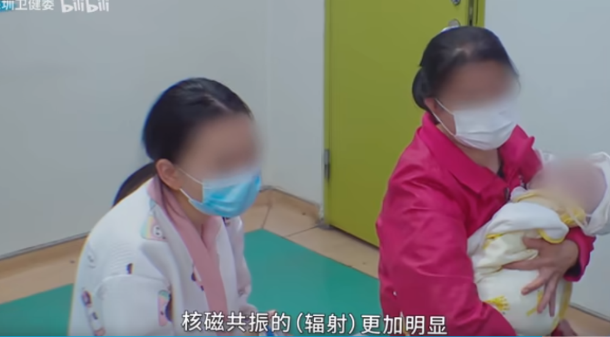

# “能不能不拍片不做检查？”孩子摔倒颅内出血，医生却被奶奶整无语了

近日，深圳卫健委发布的一则儿科医生问诊视频引发网友关注。

视频中，一位妈妈怀抱婴儿，称婴儿从床上掉落，摔到了头骨。医生触摸面诊后判定孩子很有可能颅内出血，并伴有骨折，
**随后建议家长带孩子拍CT检测，并表示虽然有辐射，但不得不拍** 。

面对家长疑问，医生进一步解释称， **这样做是因为孩子比较小，颅内出血及骨折情况临床体征不典型，拍片是为了更加精准地检测孩子受伤状况**
。但孩子奶奶仍在犹豫，问“不能不拍啊？”医生斩钉截铁地表示“必须要拍”。

_B站
深圳卫健委 视频截图 下同_

最后，孩子的父母示意奶奶听医生的。但直到离开前，奶奶还一直在问“不拍片可不可以？”

拍完CT，孩子确实颅内出血并有骨折，虽然出血量不大，但谨慎起见，医生建议家长带孩子去找神经外科医生做整体评估。此时坐在一旁抱着婴儿的奶奶再度发声质疑，“你不是说停止（出血）了吗”。

医生见状再次解释， **虽然出血停止了，但还是不能掉以轻心，如果颅内出血，家长很难凭肉眼观察到，孩子有可能在睡梦中出现危险。**
随后医生让家长带孩子去做核磁共振，并明确表示 **“核磁共振没有辐射”。**

但孩子奶奶却置若罔闻，称“核磁共振的（辐射）更加明显”，医生只好再度重申“没有辐射”。孩子奶奶却依旧不满，“干嘛要做核磁？”

医生只好无奈提醒，“老人家，不要觉得什么都没什么，万一没（给孩子）看好......”。所幸孩子的父母最终并没有被奶奶影响，而是遵循医嘱带孩子进行了科学治疗。

**网友热议**

以上片段引发网友热烈讨论。有网友表示，虽然奶奶是出于关心，但真的不能固执己见，要听医生的。

有医生同行表示深有同感，最害怕遇到无知不自知还不听医生建议的家属。

还有网友分享了遇见过的“同款长辈”，因就医不当，导致孩子夭折，令人唏嘘：

**@飞飞曼**
我小的时候，隔壁家一个弟弟和奶奶上楼梯的时候摔了一下，仰过去磕到后脑勺了，当时没在意，揉了揉就回家了，过了会这个弟弟说瞌睡，奶奶就哄他睡了，结果一直睡家人觉得不对劲，到了晚上喊的时候人已经昏迷了，后来送到医院已经晚了，后脑勺头骨都酥了，颅内出血，夭折了……当时才五岁。

**孩子摔到头，头颅CT要不要拍？会不会导致辐射伤害？**

很多家长会问有无必要做头颅CT，纠结 CT
会不会导致辐射伤害？辐射伤害肯定是有的，但要权衡利弊。此时应强调抓主要矛盾，既然医生已经怀疑孩子有颅内出血，那么明确诊断尽快治疗是首要的，CT
带来的潜在伤害是无法比拟的，孰轻孰重，一目了然，家长应该尊重医生按医疗原则行使职责。

来源：正观新闻综合深圳卫健委、纪录片《闪闪的儿科医生》

