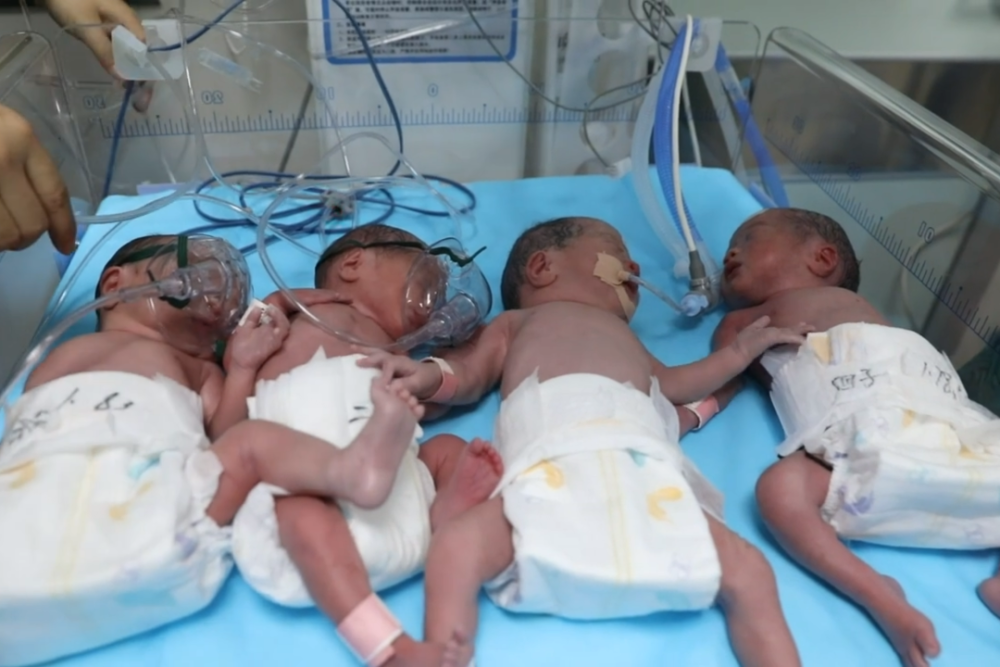

# 一年内两次怀四胞胎，她让70万分之一的奇迹发生两次

**撰文 |燕小六 凌骏**

2022年6月，浙江一名郝女士剖腹产下4胞胎。“每个孩子都长得很好看。”为其接生的武汉大学中南医院产科主任医师李家福告诉“医学界”，今年3月，郝女士全家到武汉，专程上医院致谢。

10个多月后，郝女士在社交媒体称自己又怀孕了，还是4胞胎。

5月9日，“医学界”从郝女士的社交媒体账号上获悉，她“没能留住”，已终止妊娠。据其自述，她找了多家医院进行评估，医生称强行保胎可能出现子宫破裂、大出血等严重并发症。

“此前，她能顺利诞下4个健康孩子，有运气在里面。其他人不能效仿。”李家福表示。

**顺利诞下健康4胞胎，“这就是运气”**

根据郝女士在社交平台晒出的检查单，今年4月24日，她被查出“4个孕囊，孕4胞胎约50天。”此时，距离郝女士上次4胞胎剖宫产，仅过去10个月。

时间回到2021年11月，郝女士被查出孕4胞胎。次月产检时，当地医生告知，要么减两个留两个，要么全部打掉重新怀，要么准备100万资金保胎，但孩子不一定保得住。

郝女士称自己和丈夫商量后，决定保胎。经朋友推荐，她联系上纪录片《生门》的主角，即开文所述李家福教授。

李家福对郝女士印象深刻。“我们医院几乎每年都能遇到1例3胞胎妊娠，双胞胎就更多了。但4胞胎就这1例。”

他回忆，郝女士在孕20多周时，联系到自己、咨询胎儿情况。由于郝女士无法出具有效的大排畸结果，无法给出有效建议。“大排畸”是通过超声检查，查看胎儿的五官、四肢及内部各个器官有无异常，进而排除胎儿是否存在畸形，以及了解生长发育是否符合孕周等。通常，这一检查在孕20-24周完成。

对此，郝女士的解释是4胞胎过于罕见，当地多家医院均表示多胞胎产检经验不足，建议他们到大医院去继续产检和保胎。

李家福得知这一情况后，和医院超声医学科等沟通，获悉可以做4胞胎大排畸，就将此消息转达郝女士。“完成检查后，她对我们医院印象不错，就决定在这里生了。”

据武汉大学中南医院介绍，该院为郝女士安排各项检查，制定预防早产的方案。医院产科、儿科、超声医学科等科室成立“四胞胎护航小组”，并联合手术室、麻醉科进行多次演习。李家福告诉“医学界”，基于郝女士的身体状况，产科认为其需要经剖腹产分娩。

2022年6月26日，怀孕31周的郝女士再度出现早产先兆症状，医护团队做完术前评估后，立即为她进行分娩手术。当日上午10点22分起，一女三男婴接连诞生，体重最大1.78公斤，最轻的为1.5公斤。4个医疗小组分别接管1个孩子。产后评估发现，其生长发育均衡、正常，除早产外，没有任何多胞胎并发症。

在顺利度过呼吸关，感染关、喂养关等考验后，郝女士和孩子顺利出院。李家福完善检查发现，郝女士恢复良好。“这个妈妈的身体很好。一般怀多胞胎，宫颈长度会变短，容易早产。但她就没有。这就是运气。”

_武汉大学中南医院供图_

2022年6月，郝女士在武汉大学中南医院产下4胞胎。

**1年内两怀4胞胎，危险直线上升**

时隔一年、再怀4胞胎，郝女士又在网上分享了经历。伴随而来的是铺天盖地的质疑声。对此，郝女士回应称，此次是意外怀孕，“我们纠结了很久……意外来的宝宝都是来报恩的，想挑战一下自己，给四胞胎一个机会。找一些大医院做评估再做出最终决定。”

根据郝女士在社交媒体的分享，医院评估书面报告显示：“患者剖宫产术后10月，风险较大”。据其分享，风险或来自子宫破裂、大出血等。这可能与其剖宫产史有关。

上海交通大学医学院附属新华医院妇产科副主任医师熊瑛告诉“医学界”，多胞胎不等于非要剖。如果是已经成功顺产过的女性，她的骨盆、子宫收缩等经过考验。如果再次怀孕，即使是多胎，也有顺产机会。需要注意的是，胎儿分娩时间存在间隔。第一胎生完，有时会等一两个小时才生第二胎。在此过程中，胎位可能转变。

熊瑛曾在加拿大访问。她发现，当地多胞胎一般都安排在母胎医学中心产检并在手术室里接生，以便能及时处理横位等问题，或在关键时刻改为剖宫产。

对产科来说，剖宫产后再次妊娠一直是个挑战。一方面，间隔时间太短，子宫疤痕可能没长好，弹性下降、影响子宫收缩。另一方面，孕囊若着床在子宫疤痕处，部分胚胎会像生根一样，长进甚至穿透子宫肌层，还可能长进膀胱里。

这些都可能导致子宫破裂。“不仅有大出血风险，羊水、胎儿、胎盘、脐带还可能漂进妈妈腹腔，母亲抢救成功，对医院的抢救团队协作是很大挑战。”熊瑛说，郝女士再怀4胞胎，胎盘会非常大，几乎肯定会覆盖到疤痕处，手术分娩需要去三甲综合医院的杂交手术室，才能为母儿生命护航。

获悉郝女士本次多胎怀孕已终止，李家福认为有些遗憾。理论上，剖腹产后1-2年怀孕，是安全的。考虑到怀孕不易，现在认为即使术后半年怀孕，也是可以接受的。“核心是看子宫恢复情况。因人而异。”

**生育多胞胎，那是拿命换的**

熊瑛告诉“医学界”，自然受孕多胞胎是“极小概率事件”。

美国生殖医学会患者指南显示，自然情况下，出现三胞胎妊娠的几率约为1/10000，四胞胎妊娠约为1/700000。这和年龄、遗传、此前怀孕史等有关。一般，年龄越大，怀多胞胎的几率越高。35-40岁已生育女性怀双胞胎的几率，就比20岁以下未生育者高3倍。不过，过去几十年，全球多胎妊娠率显著上升，主要原因是辅助生殖技术的普及。

2016年，印度报道了一则案例，一位25岁女性在2年时间里，先后两次自然受孕、顺产多胞胎。第一次是一对双胞胎，第二次是四胞胎。该文回顾性分析了10年间不同国家的公开报道，共记录3胞胎95例，4胞胎7例，5胞胎1例。在这里面，81%的多胞胎报告了受孕方式，但其中仅有28%为自然受孕。

美国还有1对“超能生”夫妻，共育有6胎。除第一二次外，剩下4胎分别是双胞胎、5胞胎、3胞胎、3胞胎。这对夫妇表示，所有孩子都是自然受孕。因经历太过特殊，美国媒体为该家庭制作了一档真人秀《Doubling
Down with the Derricos》，今年5月将播出第4季。

相较于部分民众对“多胞胎=多子多福”的认知，李家福、熊瑛等看到的是风险。

根据美国妇产科医师学会《多胎妊娠临床实践指南（2021版）》（以下简称《指南2021》），多胎妊娠属于高危妊娠，孕妈妈和胎儿出现各类并发症的风险都较高，整个孕期需要不断闯关、打怪。

多胞胎孕妈妈更易出现水肿、妊娠剧吐、妊娠期糖尿病、高血压、贫血、肾盂肾炎和产后抑郁。“她们的孕后期很辛苦。早年，我遇到过一名4胞胎妈妈，晚上根本没法睡觉，怎么躺肚子都是翘起来的。而且，子宫太大了，会挤占胸腔，呼吸都很困难。”熊瑛说。

有研究显示，多胎妊娠的孕妇因并发症住院的几率或增加6倍，还可能出现子痫前期、早产、未足月胎膜早破、胎盘早剥及产后出血等。因为并发症多、住院时间长，多胎妊娠者的住院费用，会比相同孕周的单胎妊娠者平均高40%。

妈妈不容易，宝宝也辛苦。《指南2021》显示，多胞胎总体呈现“两高一低一短”，即早产率高、新生儿死亡率高，但平均出生体重低、妊娠时间短。在4胎情况下，单个胎儿的平均出生体重为1419克，不到单胎儿的一半（3285克）。低体质量和高围产期死亡率相关。既往有学者随访观察1993-2002年间上万例分娩数据，发现围产儿死亡率在单胎仅为1%，双胎为2.8%，三胎高达6.2%。

先天带出来的还有各种疾病。有学者统计，至少一个孩子残障在双胎、三胎、四胎的发生率，分别为7.4%、21.6%和50.0%。针对多胎妊娠的流行病学调查显示，双胎中发生脑瘫的风险是1.5%，三胎和四胎则为8%和近50%。这可能源于双胎生长不一致、双胎输血综合征、多胎之一死亡等多因素，导致胎儿在宫内处于缺氧状态或脑灌注下降，从而增加脑瘫发病率。

基于多胎妊娠的医学困境，产科医生会建议怀3胎以上者接受减胎手术，以提高妊娠质量及新生儿存活率。综合《多胎妊娠减胎术发展现状》等文章，可以根据患者情况，建议减至单胎或双胎。特别是高龄、疤痕子宫、子宫畸形、宫颈机能不全，或合并高血压、糖尿病等疾病的孕妇，多胎妊娠建议减为单胎。

“减胎也存在风险。”熊瑛介绍，减胎多安排在孕11-13周。术前，医生会通过B超、测量胎儿颈项部皮下无回声透明层较厚的部位。这被称为NT检查，能初步评估胎儿生长发育情况，包括有无心脏、染色体异常等。

“在这个阶段，我们缺乏有效手段评估其他多种疾病。那就有可能会减掉发育比较好的宝宝，而留下不太好的。而且，减胎可能影响血供，感染、出血、流产几率会增高。”熊瑛介绍，产科医生对减胎非常谨慎。

李家福感觉，这几年多胞胎做减胎的少了。这是因为，在辅助生殖中，过去为了提高成活率，往往一次多放几个胚胎，但现在大多就放1个。他指出，孕20多周查出畸形，也可以进行减胎。“做得早晚，有利有弊，难度不同。”

他还表示，不管是从健康、经济还是从养育角度，不鼓励人们刻意追求多胞胎。“孩子多了，经济负担上升，对每个子女的教养可能打折。国外很多伦理研究显示，这还可能影响夫妻感情。”

**指导专家**

**李家福** 武汉大学中南医院产科主任医师

**熊 瑛** 上海交通大学医学院附属新华医院妇产科副主任医师

**资料来源** ：

1.多胎妊娠减胎术发展现状. 中华生殖与避孕杂志. 2017,37(3):245-249.
DOI:10.3760/cma.j.issn.2096-2916.2017.03.014

2.美国妇产科医师学会《多胎妊娠指南（2021版）》要点解读. 中国实用妇科与产科杂志. 2021年10月第37卷第10期

来源：医学界

责编：钱 炜

编辑：赵 静

