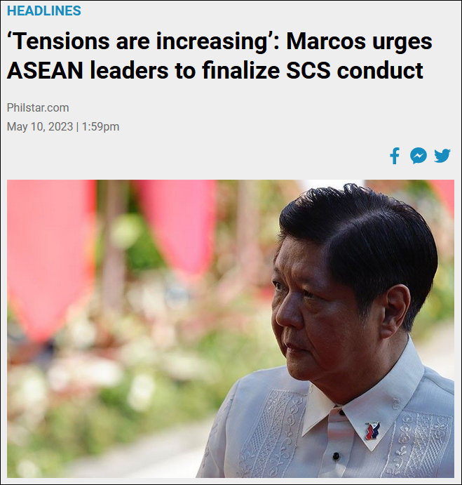
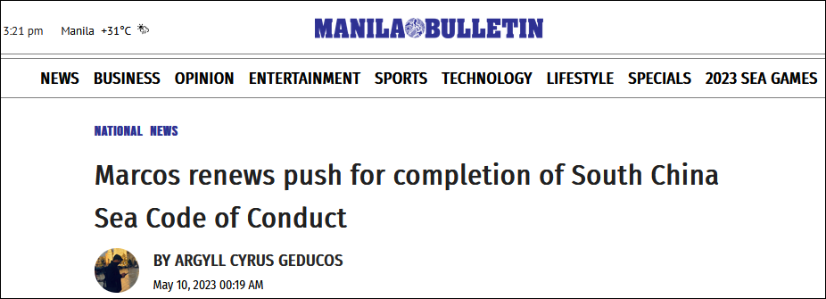
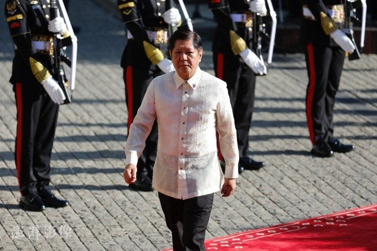
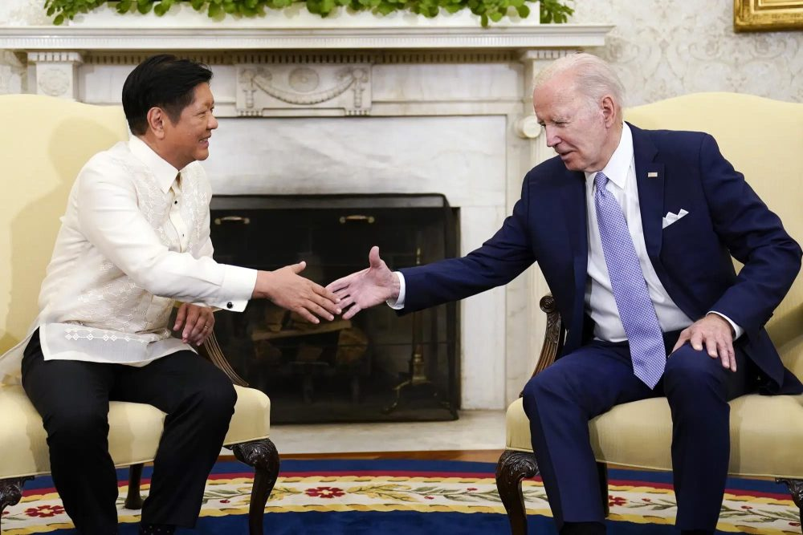

# 东盟峰会前，菲律宾总统马科斯呼吁各方尽快敲定“南海行为准则”

【文/观察者网
熊超然】当地时间5月10日，第42届东盟峰会在印度尼西亚东部旅游小城纳闽巴霍开幕。就在峰会举行前，近期频繁拉着美国涉足南海问题的菲律宾总统马科斯，重点提及了“南海行为准则”这一议题。

据《菲律宾星报》（Philippine Star）、《马尼拉公报》（Manila
Bulletin）报道，马科斯9日晚间在接受菲媒记者采访时，呼吁各国领导人解决文本中存在的问题，加快推进和最终敲定“南海行为准则”，避免紧张局势加剧，他认为这将是解决东南亚国家和中国之间争端的关键点。

近期，除马科斯外，新加坡国防部长黄永宏（Ng Eng
Hen）也曾呼吁中国与东盟加快落实“南海行为准则”，缓和地区局势和发生冲突的可能性。事实上，今年3月初，中国和东盟国家已经在继续推进“南海行为准则”案文磋商，并商定将推动“准则”磋商取得更大进展。

而针对菲律宾同美国近期涉足南海问题的举动，中国国防部发言人已明确表示，当前美方持续强化在南海地区军事部署，刻意推高地区紧张局势，地区国家应对此保持高度警惕。中国军队将一如既往坚决捍卫国家领土主权和海洋权益，坚定维护南海地区和平稳定。

_《菲律宾星报》（上）、《马尼拉公报》报道截图_

据报道，马科斯9日晚间面对菲律宾媒体时表示，他会像去年在柬埔寨举行的上一届东盟峰会上那样，再次把“南海行为准则”提上议事日程。

“你不能停止尝试。所以，是的，我会再次提出这个议题。”马科斯补充称，因为当谈论南海问题时，争端不会停止，直到各方能够达成一项行为准则。

“新的行为准则实际上是所有这些问题的解决方案，这就是为什么我总是提起它。在我参与的每个论坛会议上，我都说我们必须完成行为准则（的敲定）。”马科斯还称，他希望“南海行为准则”越早敲定越好，因为紧张局势正在加剧。

菲媒指出，尽管东盟各成员国同中国都有重大利益和双边协议，但马科斯仍然认为，“南海行为准则”这份文件可以维护南海有争端水域的和平与稳定。然而，有关于这份文件的谈判工作陷入停滞，一方面是因为新冠疫情的影响，另一方面在于文本中的措辞，而马科斯则声称，其中“阻碍力量”还源自中国和南海地区其他国家之间的重叠性协议。

“当涉及到这个问题时，我们必须自己讨论——什么是瓶颈？我们在哪里遇到困难了？你如何解决这个问题……每个人都希望有一个行为准则，所以有什么阻碍，让我们谈谈。”

“情况变得复杂，因为（东盟）成员国与中国之间的双边安排必须解决，我们需要解决这些安排，这样我们才能有一个共同的行为准则。”马科斯补充称，目前“南海行为准则”的文本只敲定了序言部分，该文件将规定各方能做什么，如何运作，如若出现问题将如何解决。

_当地时间5月10日，第42届东盟峰会在印尼开幕，菲律宾总统马科斯抵达峰会现场。图自澎湃影像_

《马尼拉公报》称，数十年来，东盟一直在推动一项具有法律约束力的海洋法规，以决定各国在有争议水域可以采取的行动。上个月，菲律宾外交部长恩里克·马纳洛（Enrique
Manalo）表示，由于很多事项需要考虑，“南海行为准则”不太可能在2023年敲定落实。

除了马科斯之外，当地时间5月3日，新加坡国防部长黄永宏在第13届亚洲国际海事防务展开幕式上也谈及南海问题。他强调，各方须重申集体承诺，维持一个共同参照框架，为海事领域的互动提供指引。他呼吁，中国与东盟在《联合国海洋法公约》的基础上，加速落实实质性的“南海行为准则”。他说：“自中国和东盟2002年首次同意采纳框架以来，这项亟需的协议已经酝酿了20多年。”

“南海行为准则”是《南海各方行为宣言》的增强版和升级版，中国始终是磋商进程的主要推动者。“准则”磋商于2013年9月正式启动，近年来“准则”磋商持续取得进展。事实上，关于“南海行为准则”的谈判工作已于今年3月初在印尼首都雅加达恢复。

中国外交部发言人汪文斌表示，3月8日至10日，落实《南海各方行为宣言》第38次联合工作组会在印尼雅加达成功举行。会上，中国和东盟国家继续推进“南海行为准则”案文磋商，并就落实《南海各方行为宣言》、海上务实合作深入交换意见，各方一致同意在海洋科研、海洋环保、海上搜救等领域举办多个务实合作项目，加强对话沟通，深化互利合作，共同维护南海的和平与稳定。

汪文斌说，各方还商定了今年工作计划，年内将举办多轮落实《南海各方行为宣言》高官会和联合工作组会，推动“准则”磋商取得更大进展。

值得注意的是，与此同时，在马科斯上台执政后，菲律宾和美国之间关系的复苏态势似乎有所加强。

_拜登在白宫会见马科斯 图自美联社_

当地时间5月1日，美国总统拜登在白宫同菲律宾总统马科斯举行会晤，通过这场会晤，美菲再度强调了两国数十年的安全同盟关系。拜登向马科斯重申，美国对菲律宾盟友般的防卫承诺“牢不可破”（ironclad），并声称美国对菲律宾的协防承诺将覆盖到南海地区；而马科斯则声称，在菲律宾地处“目前可以说是地缘政治局势最复杂地区”之时，美国作为其唯一条约盟友的重要性不言而喻。

两人在会后的联合声明中，再度提及台海和南海等的议题，这都被认为是“针对中国”。同时，这份声明还声称，“在太平洋地区对菲任何武装攻击”都将触发《美菲共同防御条约》的共同防御承诺。

今年2月2日，菲律宾国防部同意向美军再开放4个军事基地的使用权限。美菲两国国防部的声明提到，根据美菲两国于2014年签署的《加强防务合作协议》（EDCA），美军被允许进入菲律宾的5个军事基地，加上此次开放的4个军事基地，美军在菲律宾将会拥有9个军事基地。

菲律宾宣布对美国新开放的4处军事基地：3个位于吕宋岛北部，1个位于巴拉望省的巴拉巴克岛。有媒体注意到，其中一处军事基地距离中国台湾仅400公里，这被认为是为美军提供了靠近中国的“集结点”。而就在马科斯访问美国之前，美菲还已完成了两国迄今为止规模最大的联合军事演习，两国空军近期还举行了自1990年以来的首次联合战机演训。

针对有关南海问题，国防部新闻发言人谭克非大校4月27日曾指出，中国对南海诸岛及其附近海域拥有无可争辩的主权，对相关海域拥有主权权利和管辖权。中方在南海岛礁进行基础设施建设，部署必要的防御性力量，是依法行使国家主权，是完全正当合法的，其他国家无权对此说三道四。关于美在菲新增使用军事基地，中方已多次表达严正关切。当前，美方持续强化在南海地区军事部署，刻意推高地区紧张局势，地区国家应对此保持高度警惕。中国军队将一如既往坚决捍卫国家领土主权和海洋权益，坚定维护南海地区和平稳定。

**本文系观察者网独家稿件，未经授权，不得转载。**

