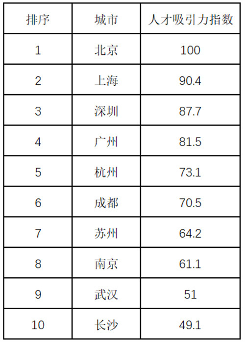

# 中国人才吸引力10强城市出炉：北京拔头筹，东部城市居多

中国经济周刊-经济网讯（记者 王红茹）

人才是富国之本、兴邦大计。中国人才吸引力城市谁最强？《中国经济周刊》记者根据泽平宏观和智联招聘5月10日发布的数据梳理发现，中国人才吸引力10强城市分别是：北京、上海、深圳、广州、杭州、成都、苏州、南京、武汉和长沙（见图表）。其中京沪深居前三。分地区看，得益于雄厚的经济基础和较高的战略定位，东部城市人才持续集聚，共有7座上榜，中部有武汉和长沙上榜，西部仅有成都榜上有名。

2021年最具人才吸引力城市10强

北京人才吸引力拔得头筹。泽平宏观研究显示，近年来，北京因严控人口、疏解产业，人才净流入占比逐年下降，直至2020年有所回升，2021年继续创新高，主要原因是收入水平最高而且2021年人才引进政策放宽。

从收入水平看，根据中国社会科学院公布的《2021年我国人均月收入、人均年收入30强城市排行榜》统计数据，北京市表现抢眼，以人均月收入21554元，人均年收入258648元，排名全国大中城市中排名第一位。

从人才引进政策看，力度较大。2021年北京市人社局发布的《北京市引进毕业生管理办法》，在放宽年龄和门槛的情况下，不占引进指标的毕业生范围增加：“清华大学、北京大学、复旦大学、上海交通大学、浙江大学、中国科学技术大学和南京大学的本科及以上学历毕业生符合一定条件可直接办理落户……”

上海人才吸引力位居第二位。泽平宏观研究显示，上海2021年人才净流入占比重回榜首且创近五年新高，主因上海新经济促进政策初见成效且落户政策放宽；此外，2021年上海代替天津，成为北京人才流出第一目标城市，人才从北京净流向上海。

深圳人才吸引力排名第三位。近两年深圳人才集聚明显，主要原因是经济发展速度快、创新发展水平高，但是由于人口承载力有限，近年也开始控制人口有序增长。

广州人才吸引力位居第四位。深圳和广州互为人才外流目标城市的第1位，人才从广州净流向深圳；广州2017-2021年人才净流入且持续稳定增长，主要原因是广州经济发展速度快、生活成本在一线城市中最低。

排名第五到第十位的是二线城市。杭州2017-2021年人才净流入占比始终为正且逐年攀升，人才吸引力排名稳居第五位，主要原因是杭州电商等产业发展迅速且平均薪酬超越广州在重点城市中位列第四。

成都人才吸引力排名第六位。2017-2021年成都人才净流入呈现由负转正的趋势，主要原因是成都经济发展活跃、创新产业发达，并且“筑巢引凤”吸引人才。

苏州人才吸引力排名第七位。2017-2021年苏州人才净流入占比呈上升趋势，主要得益于苏州经济实力雄厚、2021年GDP增速位列重点城市之首，同时离上海最近、区位优势明显。

南京人才吸引力排名第八位。2017-2021年南京人才净流入始终为正且较稳定，主要原因是高技术产业发展迅速且南京“宁聚计划”实施、落户政策宽松。

武汉人才吸引力排名第九位。2017-2021年武汉人才净流入占比呈现上升趋势，主要原因是“学子留汉”政策实施效果好，落户门槛宽松。

长沙人才吸引力排名第十位。2017-2021年长沙人才净流入占比较稳定，人才流入的主要原因是长沙生活成本低、文娱产业繁荣。

一审：郑扬波 二审：王新景 三审：周琦

