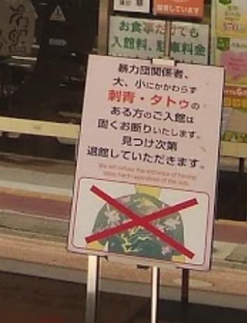
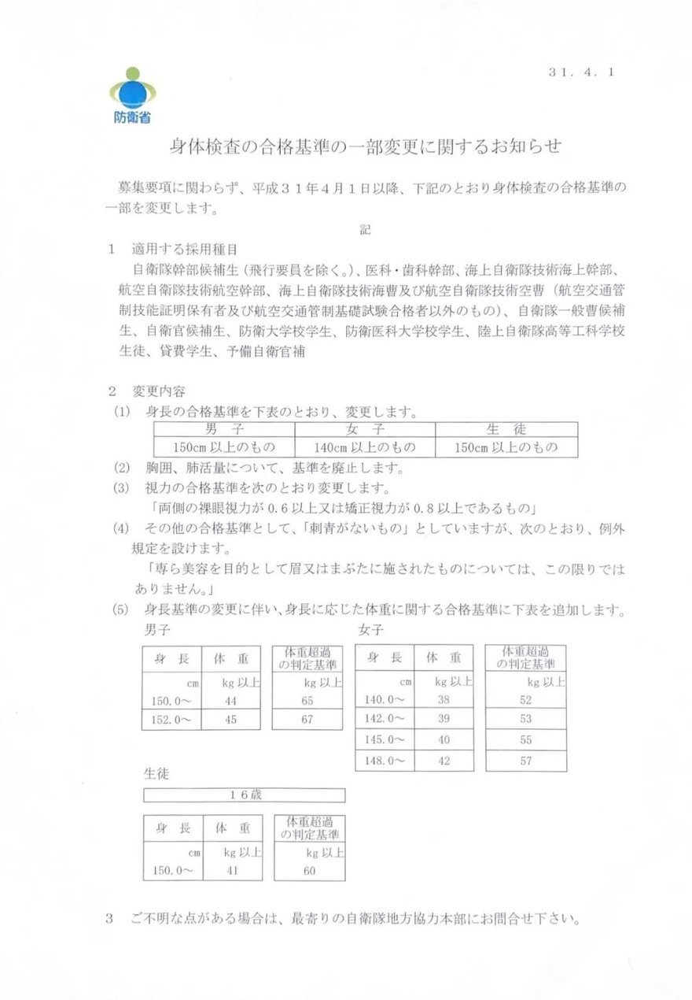

# 为应对员额不足问题，日本自卫队考虑允许招募文身者，有民众表示担忧

（观察者网 讯）招募难一直是近年来困扰日本自卫队的重大问题之一，日本官方也一直为此寻求解决办法，日本防卫省甚至将主意打到有文身人员的头上。

据日本共同社昨天（9日）报道，在当天的参议院外交防卫委员会上，防卫省提出了一项大胆的考虑，即允许自卫队招募有文身的应募者。报道援引退役前自卫队干部、自民党议员、军事评论家佐藤正久的观点称，在目前的少子化、老龄化背景下，有必要采取措施保障自卫队的员额（数量充足）。

佐藤正久声称，如今有许多年轻人开始为了时尚而进行文身，大多文身图案只是一些花或者名字之类的内容，就加强自卫队人力而言，因有这一类文身而拒绝录用是一个严重问题。

_然而日本社会中，大部分人对文身的印象仍然如图所示
日本搞笑艺人志村健节目截图_

在日本社会中，对文身的宽容程度一直很低，虽然《公众浴场法》中没有规定，但日本绝大多数温泉、大型公共浴场，都谢绝接待有文身的顾客，尽管由于这种习惯“劝退”了很多西方国家游客，一定程度上影响了旅游收入并引起了外方不满，但却仍然作为行业普遍做法延续至今。

另一方面，日本的风俗行业也基本拒绝有文身者从事风俗服务工作。究其原因，是因为长期以来，日本社会中进行文身的人群多以各类黑道组织、暴力团成员为主。以广岛县广岛市为首，从2004年起开始，日本各地方自治体（都道府县）纷纷开始制定“暴力团排除条例”或类似规定，以在日常生活中排除或限制黑道、帮派人员的活动。酒店、温泉浴场等依规实行了暴力团禁入原则，但在执行上基本以是否有文身作为判定依据。

_日本温泉、大型公共浴场外常见的告示牌，图中这块告示牌中写明：暴力团相关人员、刺青/文身（不论文身图案、大小）者“坚决拒绝入场”，一旦发现，将被“请出”此处
图片来源：社交媒体_

除了文身，更加劲爆的是日本海上自卫队的另一则消息。

《产经新闻》昨天报道称，在去年年末对修订“国家安保三文件”的讨论工作中，甚至出现了采用外国人担任海上自卫队舰艇舰员的提议，这一“极端的人力保障方案”，可以说是海自乘员严重不足的又一侧面佐证，尽管在陆、海、空三支自卫队中，海上自卫队的满员率已是相对最高。

_尽管相对充足率最高，但海上自卫队仍然受困于缺乏舰艇乘员（去年3月31日数据）
图片来源：产经新闻_

这些消息自然也在日本社会掀起了相当程度的讨论，如日本知名国防记者小笠原理惠就在社交媒体上发帖表示“招募文身者、外国人等措施，看起来简直就是为在自卫队进行暴动或者政变（原文：クーデター）做准备，反倒是如果能够将整个自卫队成员的年收入统一提高100万日元的话，搞不好（应募员额）倒是能马上凑齐”。

不少普通日本网民也批评称“与其鼓吹允许文身者进入自卫队，不如先解禁文身者进入温泉、公众浴场的权利”、“在美国确实普通人都会纹身，但在日本大部分普通人仍然不会，如果文身者进入自卫队，那么自卫队健全的形象将会受损”，还有人表示“如果不能判断某人的文身是否不合时宜（如暴力团等反社会性质），我认为还是（将招募标准）设置为禁止更安全”，也有人担忧“自卫队招募带文身的人，会让父母更加不愿意将孩子送进自卫队”。

而这早已不是近年来自卫队首次降低招募标准，2019年4月1日，防卫省发布公告，自卫官招募的体检合格标准进行部分调整，虽然在该轮调整后仍然原则上存在着“没有刺青（文身）”这一规定，但已经有“允许专门以美容整形目的在眉毛或眼睑上进行的不在此列”的小幅放宽。当时的调整中，最为重要的，当属体检身高标准的调整，男性由不低于1米55调整至不低于1米50、女性由不低于1米50调整至不低于1米40，另外废止胸围、肺活量测定，视力调整为双眼裸眼0.6、矫正视力0.8以上即可。

_2019年4月1日，日本防卫省发布公告，调整自卫队招募体检标准
图片来源：日本防卫省_

然而，调整已近4年后的今天，自卫队的员额问题仍然未能得到明显改善。

**本文系观察者网独家稿件，未经授权，不得转载。**

