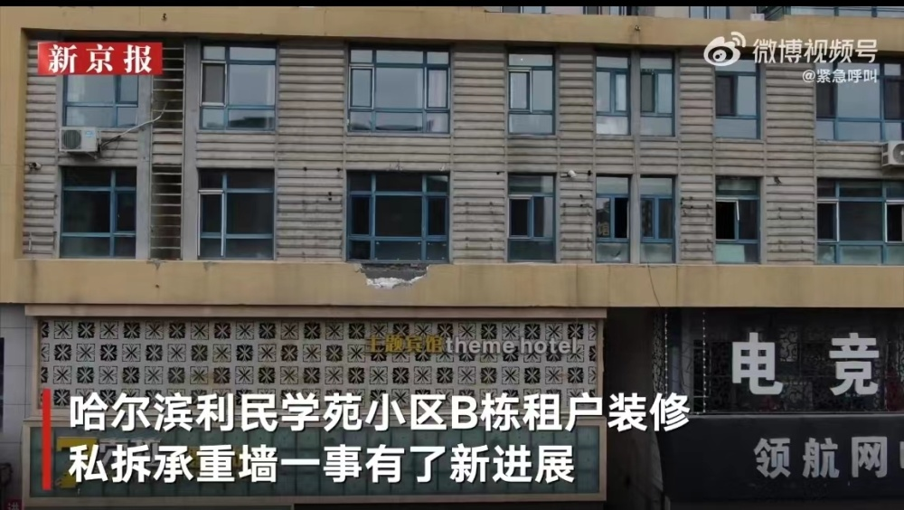
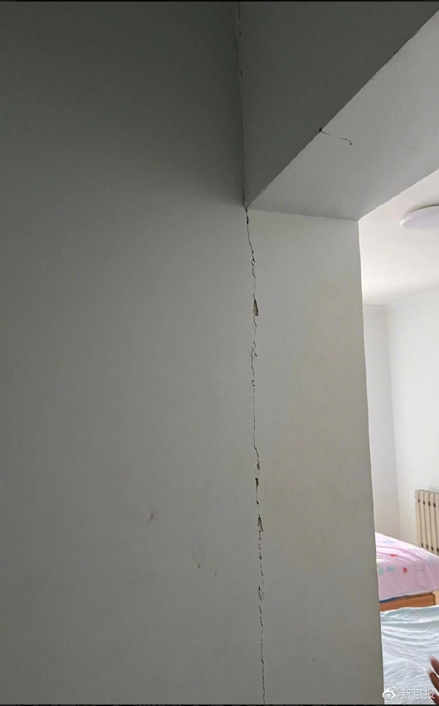

# 判决书里的“承重墙之争”：因果关系认定难，经济损失需评估

“哈尔滨居民私拆承重墙”事件持续引发热议。据央视新闻报道，5月9日，公安机关已依法对4名相关责任人采取刑事强制措施。

此前媒体报道，哈尔滨市松北区利民学苑小区一租户在3楼装修时砸掉承重墙，导致大楼从下往上出现裂缝，楼内二百余户居民被紧急撤离，临时安置到酒店。5月9日，哈尔滨市松北区政府发布消息，哈尔滨市委市政府成立事件调查组，市区两级组建工作专班，连夜对该事件进行调查处置。同时，委托国家和省级权威检测机构开展调查、鉴定、处置等全面技术工作。根据检测机构和专家组意见，对拆改的墙体采取局部支护等应急处置措施，防止结构构件损伤及变形进一步发展。

类似私拆承重墙导致建筑体损坏并不少见。近日，广州市白云区岭南新世界一业主在网络求助表示，同楼204房业主私自打拆承重墙，导致楼上房屋出现墙体裂纹、地板下沉等问题。白云区住建交通局已于2023年4月立案。

装修时私拆承重墙引发的安全隐患、责任纠纷与经济损失等问题成为公共安全的“不可承受之重”。部分私拆承重墙的案例造成楼栋垮塌、人员伤亡等严重后果的，相关责任人被判追究重大事故责任罪等刑责。在民事案件中，以相邻关系纠纷、排除妨害纠纷等案由最为常见。涉及经济赔偿方面，证明房屋损失与破坏承重墙的因果关系是判决的重点和难点。

通过对过往案例梳理，新京报记者发现，被破坏的承重墙能通过维修、加固等手段进行修复，这将极大降低经济损失。民事纠纷中，原告可获得的经济赔偿费用大体在800元到40000元之间，赔偿名目以房屋修复费、在外租房过渡的租金损失和房屋受损鉴定费为主。

此次哈尔滨私拆承重墙事件中网传的1.6亿元损失尚未得到有关部门的证实，经济损失需要由专业机构进行评估鉴定。此前造成比较严重后果的破坏承重墙案例中也尚未出现过如此巨大的金额。

_哈尔滨利民学苑小区受损楼栋。视频截图_

**私拆承重墙导致建筑坍塌，租户与装修人员均获刑**

因为破坏承重墙导致建筑受损、坍塌的情况时有发生，新京报记者以“装修”、“破坏（或拆除）承重墙（或剪力墙）”等词在中国裁判文书网上检索发现，千余份判决书中，仅有五份是因装修破坏承重墙而被提起公诉的刑事案件，其共性都是业主或者租户指使不具备相关资质的设计施工团队拆除承重墙，因而发生重大伤亡事故或造成房屋倒塌等严重后果。

上海市普陀区人民法院2017年一份刑事判决书显示，2016年1月，被告人占某某承租上海延长西路一栋楼准备经营旅馆，在未确认房屋原有构造的情况下，指使无施工资质的仲某某拆除该楼二层、三层部分墙体。

仲某某按照占某某的要求安排无施工资质的个体装修工人违规拆除承重墙，严重破坏了房屋原有承重系统，且未采取任何必要的加固措施。同年2月13日，上海市延长西路XXX号XXX号楼北侧二、三层部分房屋发生倒塌，残余房屋处于不安全状态，不宜继续使用，坍塌事故亦造成光缆通讯中断，造成房屋重置费、光缆抢修费共计人民币200余万元的经济损失。

法院认为，被告人占某某、仲某某在施工作业中违反有关安全管理的规定，因而发生重大安全事故，造成其他严重后果，其行为均已构成重大责任事故罪，依法均应予处罚。根据判决结果，占某某与仲某某均犯重大责任事故罪，被判处有期徒刑六个月，缓刑一年。

律师胡胜利告诉新京报记者，破坏承重墙导致严重后果可能涉嫌以危险方法危害公共安全罪、过失以危险方法危害公共安全罪、重大责任事故罪，具体须根据案件事实进行认定。

根据《中华人民共和国刑法》（以下简称《刑法》）第一百一十四、第一百一十五条，以危险方法危害公共安全，尚未造成严重后果的，处三年以上十年以下有期徒刑。致人重伤、死亡或者使公私财产遭受重大损失的，处十年以上有期徒刑、无期徒刑或者死刑；过失以危险方法危害公共安全的，处三年以上七年以下有期徒刑；情节较轻的，处三年以下有期徒刑或者拘役。

《刑法》第一百三十条指出，在生产、作业中违反有关安全管理的规定，因而发生重大伤亡事故或者造成其他严重后果的，处三年以下有期徒刑或者拘役；情节特别恶劣的，处三年以上七年以下有期徒刑。

什么情况属于“后果特别严重”？《最高人民法院、最高人民检察院关于办理危害生产安全刑事案件适用法律若干问题的解释》指出，造成死亡三人以上或者重伤十人以上，负事故主要责任的；造成直接经济损失五百万元以上，负事故主要责任的或是其他造成特别严重后果、情节特别恶劣或者后果特别严重的情形，具备以上情况之一的，对相关责任人员处三年以上七年以下有期徒刑。

而在此次哈尔滨市松北区利民学苑小区租户私拆承重墙事件中，公安机关已依法对4名相关责任人采取刑事强制措施。

_哈尔滨利民学苑小区被破坏的承重墙。视频截图_

**房屋损失与破坏承重墙的因果关系认定是判决难点**

由于建筑体的公共性和复杂性，破坏承重墙也常常导致邻里之间民事纠纷。新京报记者梳理裁判文书发现，其中相邻关系纠纷的案由最多，既有一对一的民事诉讼，也有多户业主起诉某一户业主的情况，涉及经济赔偿方面，证明房屋损失与破坏承重墙的因果关系是判决的重点和难点。

比如天津市滨海新区人民法院（2021）津0116民初38816号民事判决书显示，原告住在5楼，被告住在3楼。原告的家中墙壁、屋顶等多处出现较大裂缝，他认为是同单元楼的被告装修房屋破坏承重墙所导致，原本50万的房子因现在受损只能卖40万，直接经济损失有10万元。

两家协商赔偿事宜未果，也打过市民专线并找到物业管家处理，均未能解决问题。矛盾越来越深，原告向法院提起诉讼，并向法庭提交了用手机拍摄的房屋受损部位的照片，证明被告因装修破坏承重墙，导致原告房屋受损，出现墙体裂缝的情况。

天津市滨海新区人民法院认为，原告房屋的受损是否因被告的装修房屋所导致，缺少证据予以证明。对于原告房屋受损的原因，应由专业机构的专业人员进行勘查判断。而且因为原告未申请进行房屋损害与房屋装修是否存在因果关系的司法鉴定，以及其主张的10万元经济损失缺少证据和依据，对此法院也不予确认。

鉴定需要由有资质的安全鉴定机构出具，但有时候鉴定并不指向唯一原因，房屋受损可能是多因一果。

比如上海市普陀区人民法院2019年的一份民事判决书中，经原告申请，法院委托了上海房屋质量检测站对原告房屋损坏原因以及损坏是否与被告装修时拆除102室、103室承重墙体存在因果关系进行鉴定。

其鉴定意见显示，被鉴定受损房屋平顶、墙面及楼面存在的开裂损坏主要与房屋自身沉降变形、材料环境温度变形变化以及老化失修有关，不能排除楼下拆墙振动对上述裂缝扩展影响的可能。

最后，法院根据鉴定意见书中的修缮建议及原告房屋20年前简易装修和对原告房屋裂缝扩展影响等实际情况，酌情确定被告应赔偿的数额。被告被判赔偿原告因拆除承重墙等造成的房屋拆墙振动对原告房屋原有裂缝扩展影响修复费人民币3500元，以及原告房屋修复期间的在外居住费人民币1500元。

胡胜利告诉新京报记者，对民事案件中的因果关系认定，司法实务中一般采用“相当因果关系说”，要求“条件上的因果关系”和“相当性”：一、若无此行为，即不会产生损害；二、根据社会公众的通常观念进行判断，若有此行为，则通常均会产生此种损害后果。涉及此类案件的因果关系认定，不能一概而论，需要综合专业鉴定机构的判断与一般民事案件的因果关系认定标准，存有一定难度。

**物业、房东是否承担责任需要视具体情况而定**

新京报记者注意到，在多起有关承重墙破坏的案件中，原告业主将物业公司和房东告上法庭，主张物业公司对赔偿款负连带赔偿责任，但在实际案例中很少获得法院支持。

在某起承重墙破坏的纠纷案件中，法院审理认为，物业公司仅与砸墙业主签署装修申请表、房屋装修管理规定等书面资料，对该业主的装修拆除行为监督不力，对纠纷有一定责任。法院认为，不论被告业主维修、加固或是原告自行维修、加固，物业公司均应积极配合、参与、监督。

胡胜利认为，对于其他各方追责需要考虑具体情况，就物业公司而言，相关法律法规仅规定了制止与报告义务，若物业公司明知该拆除行为而放任，未履行制止与报告义务，则不排除其承担责任的可能。

《物业管理条例》第四十五条规定：“对物业管理区域内违反有关治安、环保、物业装饰装修和使用等方面法律、法规规定的行为，物业服务企业应当制止，并及时向有关行政管理部门报告。有关行政管理部门在接到物业服务企业的报告后，应当依法对违法行为予以制止或者依法处理。”《最高人民法院关于审理物业服务纠纷案件适用法律若干问题的解释》第一条规定：“业主违反物业服务合同或者法律、法规、管理规约，实施妨碍物业服务与管理的行为，物业服务人请求业主承担停止侵害、排除妨碍、恢复原状等相应民事责任的，人民法院应予支持。”

就房东而言，如果其对该私拆承重墙的行为知情而未予阻止，则需要共同承当相应责任，具体还要根据租赁合同中的双方约定。因为房东作为房屋所有人，对房屋负有安全保障义务。反之，如果房东对私拆承重墙的行为并不知情，则由房东担责则会有失公平。具体还需根据事实进行责任认定与划分。

律师孟博认为，在保证装饰装修工程质量和安全这个问题上，物业管理单位不能失位。装修人在住宅室内装饰装修工程开工前，应当向物业管理企业或者房屋管理机构申报登记。装修人，或者装修人和装饰装修企业，应当与物业管理单位签订住宅室内装饰装修管理服务协议。物业管理单位应当按照住宅室内装饰装修管理服务协议实施管理，发现装修人或者装饰装修企业有擅自变动房屋承重结构行为的，应当立即制止。

对于已造成事实后果或者拒不改正的，应当及时报告有关部门依法处理。物业管理单位发现装修人或者装饰装修企业有违反本办法规定的行为不及时向有关部门报告的，由房地产行政主管部门给予警告，可处装饰装修管理服务协议约定的装饰装修管理服务费2至3倍的罚款。就具体案件而言，相关部门在明确物业管理单位所需承担的法律责任时，会综合分析其过错、损害后果等多重因素。

_哈尔滨利民学苑小区受损楼栋承重墙破坏导致同楼其他业主家出现裂痕。受访者供图_

**天价经济损失如何赔偿？**

在哈尔冰私拆承重墙这起事件背后，舆论最关注的是号称1.6亿的赔偿费用。这个数字来源于有业主在接受媒体采访时表示，他们当年买房子花了近80万元，希望得到赔偿。以200套房、平均每套房80万元计算，如果全额赔偿，总赔偿额高达1.6亿元。

新京报记者检索数百篇判决书后发现，在过往造成比较严重后果的破坏承重墙案例中尚未出现过如此巨大的金额。通常情况下，被破坏的承重墙是通过维修、加固等手段进行修复，这将极大降低经济损失，只有极少案例是将危房拆除。

对于经济损失的认定，需要由专业机构进行评估鉴定。比如，2016年4月11日，上海松江区佘山镇西霞路61号三层楼房因为私拆承重墙导致垮塌，并且致使一名女性和儿童受伤。相关判决书提到，该案经上海国衡房地产估价有限公司估价，房屋重置成本价格为人民币2,481,465元，现场处置费用为人民币646,000元，这个数字并非受损房产的市场价格简单相加。

新京报记者梳理了约500份相关民事判决书发现，原告获得的经济赔偿费用在800元到40000元之间，赔偿名目以房屋修复费、在外租房过渡的租金损失和房屋受损鉴定费为主。

胡胜利认为，最终的责任承担，须根据最终调查结果来认定责任承担主体，共同分担责任比例。目前尚无官方报道涉案楼房具体损失金额，后续房屋处置、能否加固继续居住等问题尚不明确。若真如现在网上所传，涉案损失为1亿余元，那么单靠租户与施工方承担责任，即便赢得胜诉判决，到执行阶段也难以完全执行获偿。所以，该事故需要多方面综合的处理方式，而非简单地向租户及施工方追责。

胡胜利告诉新京报记者，此类案件近些年屡见不鲜，有业主及租户安全意识淡薄、施工主体缺乏资质、物业公司监督管理不到位等诸多方面的原因。要防止案件发生，需要严格落实室内装饰装修的流程机制，尤其是施工方的资质水平，大多数案件都是因施工方不具备相关资质所导致，故需要业主方、施工方、物业方以及住建等部门多方共同完善实施与监督机制。

引入保险是一个很好的风险防控手段，但碍于现实生活中，较多的施工主体都无相应资质，且风险意识较差，便更不会额外支出保险费用。

新京报记者 李照 实习生 杨蕊

编辑 陈晓舒

校对 李立军

