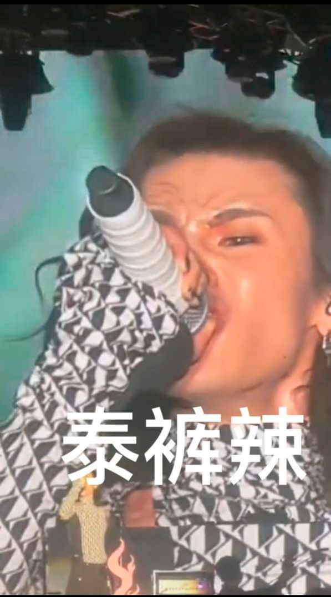
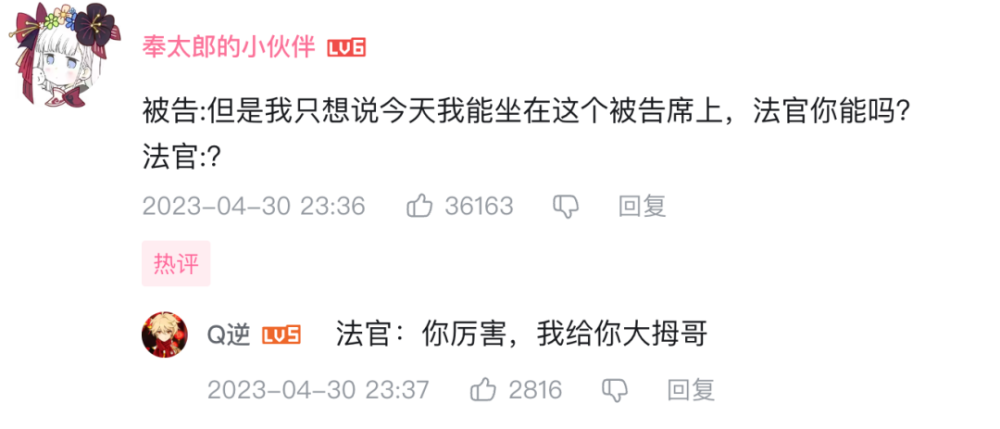

# 华语乐坛死了？它死的很快乐！

今天是来代班的小白。

被“鸡你太美”轰炸多年的你，想必对下面这张背景图十分熟悉，这里就是华语乐坛的刷怪点，鬼畜区的最终归宿。

四年啊！蔡徐坤称霸了互联网烂梗圈整整四年！竟然连一个对手都没有。

但就在最近，撼动“鸡你太美”地位的天选之子终于出现，那就是：

**泰裤辣！**

自从此句话横空出世，我感觉连空气都飘着这三个字。

你也许会觉得很无聊，但无奈它的应用场景实在太广了。

有人炫富？泰裤辣！

辣妹出街？泰裤辣！

吃火锅？泰裤辣！

如果你和我一样，一听有人说泰裤辣就有种想揍人的冲动的话。

那可真是泰裤辣！

可比起泰裤辣的传播度，它的创作者却鲜为人知。

这个词出自“小鬼王琳凯”，知道你也和我一样，不知道他是谁。

虽然他的歌极其不著名，但他在音乐节的一段演讲，不止于震撼人心。

“我是一个特别固执的人，我从来不会在意别人跟我说什么，让我去做，让我去怎么做，我不管。

如果你也可以像我一样，那我觉得这件事情——”

—— **泰裤辣！！**

舞台下的粉丝嗷嗷尖叫，看着视频的我被雷得里嫩外焦。

前面的慷慨激昂也就还好，到最后只憋出个这三个字谁能想到？

仿佛我等了半天压轴菜，最后给我端上了一碗大米饭。

其实这句话只要稍微改变一下，格局就能打开。

让我们把主语换成和他造型神似的董明珠小姐：

“如果你也喜欢格力，那么我觉得家电下乡这件事——泰裤辣！”

话说回来，小鬼也许没有太大的格局，但固执是始终如一的。

在最近的一档音乐综艺里，小鬼的表演被评委老师毒舌diss了一番。

但小鬼是个固执的人，从来不在意别人说什么，于是他对评委说出了新的传世名句：“我能站在这，老师，你能吗？”

我真的好想分他一点我的自卑。

也许他本来以为能把评委怼的哑口无言，结果评委一脸夏虫不可语冰的表情。

我的脚指头开始房地产建设。

一瞬间，我想了很多种他的回应，包括耍酷不服谦虚接受，可万万没想到是：

“你厉害，我给你个大拇哥。”

懂了，以后小菌子训我，就用这句话怼回去。

哪怕你根本不占理，一说出这句话，尴尬立即迎刃而解。

憋屈的只有对方。

恐怖如斯，不愧是华语乐坛 **新四大天王** 之首。

其他三个，我们等会一一细说。

众所周知，四大天王原本指的是佛教里四位护法天神，魔礼青魔礼红魔礼海魔礼寿。

都得会点法术。

这一点上，新四大天王，比张学友刘德华之流强到不知道哪里去了。

就说小鬼王琳凯，掌握着一手强大电流操控术。

可也许是还不咋精通，在摇滚时电到了自己，致使内裤着了火。

即使如此，他还释放了表情操控术，成功让身旁的吉他手大哥绷不住辣。

这一头红发，这深深的眼影，越看越像《火影忍者》中的我爱罗。

再加上两人都释放过水遁术……

两厢一对比，我怀疑他真的参加过忍界大战。

你以为这就是巅峰了吗？

有请“新四大天王”的第二位——Capper（他的名字就是这个）。

代表作为《雪 Distance》，一段怒怼质疑者的发言比小鬼的演讲还要慷慨激昂：

可我并不关心他说了什么，视线直接被他的演出服吸引了。

这是啥？肩膀上长了两个瘤子？

和谐的肩膀和头三权分立，是在Cosplay奥特曼？

还是海绵宝宝中的大反派？

看了一圈，汤姆猫大概是最接近的答案。

无论它在致敬谁，这种过于超前的艺术，已经开始了人传人。

把阳气过重的男生宿舍改造成了阴曹地府。

不要小瞧了这群小伙子的修炼。

突破天际的肩膀，可是拯救地球的秘密武器。

闹剧之后，终于专业人士搬出了博物馆的馆藏，道出实情：这都是Capper为复兴传统说唱造型的一片良苦用心。

据介绍，东汉时代在巴蜀地区就流行说唱艺术，这尊雕像传递出古人乐观、开朗、包容的精神。

龟龟，原来里面还有这番曲折，是咱僭越了。

于是我带着好奇心，重新点开这首《雪 Distance》。

不能只有我一个人听，来，一起。

听到一半发现Capper这哥们真的能处，别人都这么骂他了，他还祝福别人再也写不出这样的歌。

囫囵吞枣的唱腔，让我始终在猜他说的是哪个星球的语言？

看了字幕，我十分艰难地确认他用的是中文，但即使有完整的歌词，其中的遣词造句还是我这本科学历理解不了的。

让我来考考你，里面这句“可是雪飘进双眼，看不见你桥牌的谎言”里的“桥牌”，代表着什么意思？

请把你们的答案写在评论区。

那么问题来了，还有谁能写出这般没有被知识污染的纯真歌曲呢？

这就不得不提，同样贵为“新四大天王”之一的姜云升了。

《真没睡》。

值得表扬的是，我能听的清楚这首歌在说什么了。

坏消息是，还不如听不懂呢。

无他，歌词主打一个下三路说唱，不是在种草莓，就是在出轨大波妹。

唱法有如念咒，不带一点感情，歌词却像没念过书，全是塑料爱情。

深读下去，我发现我错了。

真正打动人的音乐，必然是有创作者从生活中提取的与人共鸣的力量。

关注外地本地的婚恋歧视问题、衣服包包的消费主义陷阱的姜大师，才是真正的智者啊！

但还差一点。

要知道新四大天王，也有鄙视链。

那个傲立在新四大天王顶端的男人；

那个华语乐坛都跟他姓的男人；

快喊出那个人的名字——

平心而论，华晨宇的水平其他三大天王绑一块也不一定是对手。

奈何他也承认了自己是“华语乐坛永远的神”……

正所谓，老四大天王各有各的魅力，新四大天王各有各的魔力。

真的是这样吗？

伴随着对四大天王的各种吐槽，老生常谈的“华语乐坛完蛋”又开始了，不少人怀念起曾经的老歌。

时间就像是滤网，最后留下来的都是金子，怀旧时总是会带上一层磨皮滤镜，把所有的不美好统统磨平。

也许未来随着流量退潮，后来人也会把记忆镶金镀银，怀念起听到上面这些歌时的感动。

哪怕是新四大天王，也都有属于自己的高光时刻啊。

谁说在鬼畜区的高光不是高光？

一代人有一代人的玩法，更何况现在的竞争比以前还激烈。

他们四个的地位并不稳固，还有王子异、丁泽仁等一众老牌选手虎视眈眈着新四大天王的名额。

但我提醒你，他们之中，只有一个神。

也许有人可以接近，但是神永远只有一个。

现在，准备好道歉了吗？

