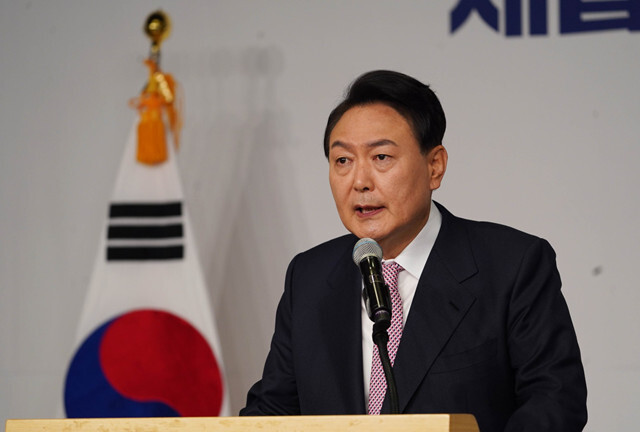

# 尹锡悦就职一年好评率仅剩33％，排在韩历任总统倒数第二

一年前的5月10日，时任韩国最大在野党国民力量党候选人的尹锡悦在韩国第20届总统选举中，以不到1个百分点的微弱优势，战胜了时任执政党共同民主党候选人的李在明，开启了5年的总统任期。

一年后,“韩国盖洛普”的最新民调显示，韩国总统尹锡悦的施政好评率为33%，差评率为57%。基于这一民意结果，当初以48.6%的投票率当选总统的尹锡悦，在一年内支持率下降了约15个百分点。在今年4月的第二周甚至一度跌至低谷27%。这也使得尹锡悦成为除韩国前总统卢武铉外，上任一年后支持率最低的韩国总统。

**外交争议不断**

韩国盖洛普此次的民调对象为18岁以上的1000位韩国民众。在此前历任韩国总统中，文在寅上任一年后支持率最高，为78%；紧随其后的是金大中（60%）以及朴槿惠（57%）。

据韩媒报道，尹锡悦9日在就任一周年前夕发表感言，认为过去一年发生最大变化的就是韩国外交和安保。就在执政一周年前，尹锡悦接待了日本首相岸田文雄。在誓言重启韩日“穿梭外交”之际，他表示“有责任让韩日关系更胜从前”。

日韩关系的此次转变还要追溯到3月初。此前，“二战时期韩国原被征劳工诉讼问题”被视为横亘在日韩间的最大障碍。3月6日，韩方公布了解决方案，即由韩方设立一个公共赔偿基金，从韩国私人领域筹措资金，向1910年至1945年间被日本殖民者强征为劳工的韩国受害者支付赔偿。该方案得到了日方的欢迎。尹锡悦也在此后立即访问日本。

不过，无论是尹锡悦先访问日本，还是日方回访，不少韩国学者认为并无实质内容，日方也并未在韩方最关注的历史问题上表示道歉、谢罪或者负责等。在岸田访问韩国的两天中，韩国多个社会团体来到韩国总统府前举行抗议。

上述民调显示，在不支持尹锡悦的理由中，32%的受访者认为尹锡悦外交领域的表现“逊色”。在韩美关系中，42%的受访者认为尹锡悦3月26日对美的国宾访问“有助于国家利益”；但也有42%的受访者认为此行“无助于国家利益”。

对于一年来，尹锡悦颇为看重的在外交领域的两大重要“政绩”，韩国学者金恩俊（音译）告诉第一财经记者，与前任总统文在寅在外交上采取的“战略模糊”策略相比，如今尹锡悦政府已明确外交方向和重点，尤其是在经济安全领域紧跟美国。

**全球贸易“金丝雀”哑了？**

综合其他多家民调的结果显示，在给予差评的领域中，尹锡悦政府的经济表现被认为最糟糕。

韩国央行今年2月发布的《经济展望更新报告》，将2023年实际国内生产总值（GDP）增长预期从原先的1.7%下调至1.6%。2000年以后韩国GDP增速低于2%的年份只有2020年（-0.7%）和2009年（0.8%）。

韩媒将经济差归因为出口不景气。在国际贸易领域，由于韩国的贸易数据一定程度上可以作为全球经济的领先指标，因此韩国也被称为全球经济的“金丝雀”，同时其出口也是全球商业和技术需求的主要晴雨表。

截至4月，韩国出口额连续七个月下跌，这是三年来韩国出口持续时间最长的颓势。同时，韩国产业通商资源部最新数据显示，韩国今年4月的贸易收支再次出现逆差。4月韩国出口额为496亿美元，同比减少14.2%，跌破500亿美元大关；进口额为522亿美元，同比减少13.3%，贸易逆差为26亿美元。

这已是韩国连续第14个月出现贸易逆差，创下了1997年5月之后26年来的最长纪录。显然，以出口为“名片”的韩国经济正在面临严峻考验。

韩媒认为，占据韩国出口半壁江山地位的半导体产品出口不振，是出口下滑的主要原因。同时，韩国两大半导体巨头企业今年一季度的表现也差强人意。其中，三星公司一季度营业利润同比暴跌95%；SK海力士4月26日发布的一季度业绩数据显示，公司营收同比下降近60%，连续两个季度出现亏损。

此前，标普全球发布的最新供应链报告称，全球对半导体的需求仍然低迷，而复苏要到今年晚些时候。

更让尹锡悦政府糟心的是，韩国楼市在过去一年大跌。在美联储史无前例地加息节奏下，受制于韩国特有的“全租房”制度，韩国楼市已进入下跌通道，部分地区房价跌幅高达30%~40%。即便在房价“坚挺”的首尔地区，今年2月的平均房价也下跌了20%，仁川下跌了21.5%。

所谓“全租房”，即租客一次性交给房东房屋价值60%~70%的押金，就可以“免房租”在此居住。房东往往将这笔押金用作投资或其他用途，因此租约到期后经常无法按照约定全额返还租客押金。有的房东需要通过租客的押金来偿还名下其他房产的房贷，甚至个别房东直接就将有欠贷问题的房屋租给住户。当资金断裂，银行将相关房产进行抵押拍卖，租客只能被迫搬离。

在房价不断走低下，深受冲击的不仅仅是房东，还有租客。金恩俊介绍道，韩国政府已在去年底意识到这一问题，也在想尽办法救楼市，比如发布了《2023年经济政策方向》，对房地产政策大幅松绑，大幅下降了持有多套房的税率，放松多套房持有者的贷款限制，下调住房交易税率等。“但这些政策并没有能够有效遏制房价下跌的趋势，最近几个月时间韩国的房价仍然持续下跌，而且未来还有可能进一步下跌的风险。”他说道，“毕竟过去几年在韩国全民炒房的大背景之下，韩国楼市已经积累了巨大的泡沫。这一问题得不到很好解决，也可能为日后尹锡悦政府执政埋下隐患。”

