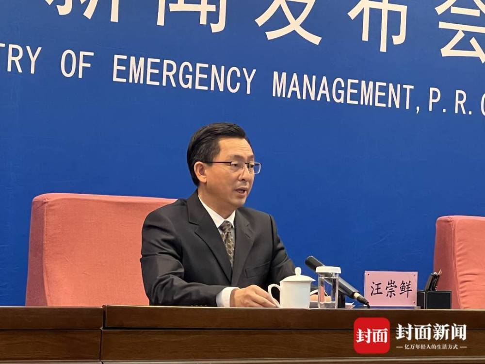

# 应急管理部：北京丰台长峰医院事故严重冲击人民群众安全感和幸福感

5月10日，应急管理部举行新闻发布会，介绍全国重大事故隐患专项排查整治2023行动有关情况。应急管理部安全协调司司长汪崇鲜表示，从4月底开始在全国范围组织实施重大事故隐患专项排查整治行动，围绕切实提高风险隐患排查整改质量、切实提升发现问题和解决问题的强烈意愿和能力水平，坚决扭转重特大事故多发的被动局面。

_应急管理部安全协调司司长汪崇鲜。封面新闻记者
代睿 摄影_

汪崇鲜表示，2023年以来，虽然事故总量、较大事故继续保持下降，但随着疫情防控平稳转段后企业全面复工复产，各种不确定因素明显增多，发生了多起重特大事故，当前全国安全生产形势异常严峻复杂，
**特别是内蒙古阿拉善左旗“2·22”露天煤矿坍塌事故以及北京丰台长峰医院“4·18”火灾事故，造成重大人员伤亡，严重冲击了人民群众的安全感和幸福感。**

据介绍，在此背景下，国务院安委会办公室、应急管理部迅速行动，提请国务院安委会审议通过并报经李强总理审定后，于4月底印发了《全国重大事故隐患专项排查整治2023行动总体方案》，立即在全国范围组织实施重大事故隐患专项排查整治行动。

汪崇鲜介绍，此次专项排查整治行动分为动员部署、企业自查自改和部门帮扶、部门精准执法、总结提高四个阶段，主要任务是一体推进企业主体责任、部门监管责任和地方党委政府领导责任落实。与以往相比，这次专项行动有“四个突出”：一是突出“重大隐患”开展排查整治。聚焦煤矿、非煤矿山、危险化学品、交通运输、建筑施工、消防、燃气、渔业船舶、工贸等重点行业领域，紧盯易造成群死群伤的重大事故隐患开展针对性排查整治，不搞“大而全”，避免眉毛胡子一把抓。二是突出“关键少数”狠抓全员责任落实。牢牢把握企业作为事故隐患排查整治的责任主体，充分发挥主要负责人“第一责任”主导作用，带动全员安全生产责任落实。三是突出“先礼后兵”提升排查整改质量。先请各企业集中开展全面自查自改，政府部门强化帮扶指导，然后再开展精准严格执法、强化责任倒逼，避免与监管部门搞“躲猫猫”游戏，便于摸清底数、共同发力。四是突出“机制创新”提升发现问题和解决问题的强烈意愿和能力水平。建立先学习培训后监管执法、安全监管执法责任倒查、主流媒体专栏曝光、匿名举报查实重奖等工作机制，有效防范监管执法查不出问题或查出问题后不跟踪整改等情况，推动排查整治取得实效。

据介绍，目前，各地区、各有关部门和企业已迅速部署行动，结合本地区、本领域实际细化完善有关任务分工，确保专项整治各阶段压茬推进。国务院安委会办公室也建立了有关工作机制，定期调度掌握排查整治进展情况，加大工作推进和督导检查力度，确保取得实实在在的成效。

封面新闻记者 代睿

（来源：封面新闻）

