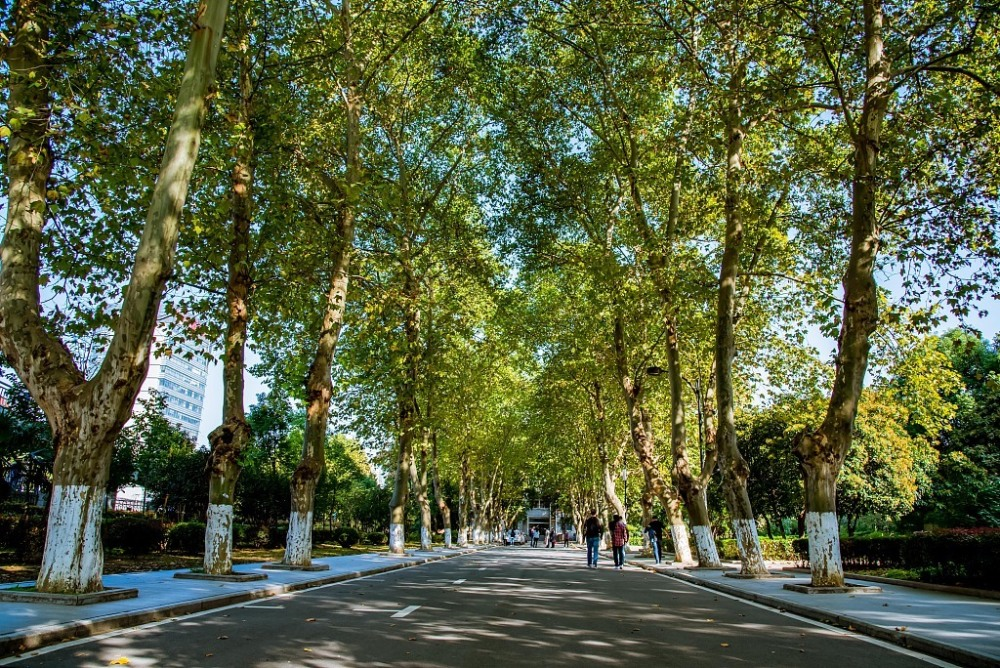

# 当年，大学校园可以自由进出

_视觉中国 资料图_

这两天看到一则“游客进深圳大学参观被拦质问保安：纳税人为什么不让进？校方回应”的新闻，很是感慨。视频里家长的情绪很激动，“为什么不让进？”道理是这么个道理，但每所高校也都有具体的管理措施，确实需要互相理解。

上个月我出了一趟差，也就顺道回了母校。心想坐地铁都不用戴口罩了，大学应该开门了吧？结果到门口发现还是进不去。保安说我可以申请校友认证，但那会儿已经下午五点了，当天肯定来不及。长叹一口气，只好作罢，我上次回母校已经是五年前了。

我很怀念曾经大学校园随意进出的时光。我上大学那会儿，几乎每一所学校都可以随便进出，避开寒暑假、或是登记一个身份证也就没什么问题了。

现在想来，都是很美好的回忆。去别的学校找同学玩，参加笔试、面试，或者就是闲逛都很方便。我甚至去隔壁学校做过一个牙科手术，就因为听说有位医生手法老道。

校园开放有什么好处？我想说一个我个人的例子。我曾经在学校里被一位中年模样的人拦住，他穿着又大又宽松的厚西装，蓬头垢面，戴着一个牛奶瓶底那么厚的眼镜，拿着一个公文包，用一口浓重的方言问我，历史学院怎么走。

我问他有什么事，他说想考研，想去学院咨询一下。我就带着他去了历史学院的一个办公室，他全程都很忐忑，和老师说话的时候只敢看着地面，老师倒是很热心地介绍了情况，让他回去好好准备。

我不知道后来他怎么样了，到底考上了没有。但我想，或许这就是他一次改变命运的机会，能走进一个校园，也就有可能抓住了一次机会。亲身走进过历史学院，见到了这里的老师，这种激励和在官网看招生简章是完全不同的。

高校文化的熏陶功能，或许就体现在这里。感染、影响不是虚幻的，它就在眼前，如果能亲眼看到梦想中的教学楼，如果能和未来的学长学姐说上两句话，这其中产生的能量是不言而喻的。

有部日本电影《垫底辣妹》，说的是一位学渣女生如何在短时间内发奋图强考上庆应大学的故事。在电影中，女生一度想放弃，后来她妈妈真的带她去了一趟庆应大学，她看着学校里的一草一木，看着那句“天不生人上人，亦不生人下人”的名言，斗志重燃，把梦想又捡了起来。

在现实中，不知道有多少人曾被这样激励，有多少人是在看到高悬的校徽时，默默在心底种下梦想？即便不是学生，或许来到校园，亲身体会到学术殿堂的崇高，才会有“虽不能至，心向往之”的感性认识。

说实话，我上大学的时候，我也从来没觉得外来的人对正常的校园生活有什么影响。现在有些人担心的影响教学秩序云云我一次也没遇到过，依靠教学楼的门禁卡就能解决很多问题。相反，校园里的“外人”还给我留下很多有意思的回忆。

我记得那会儿在学校踢球，有一个中学生总是和我们一起。他父母就是学校门口卖炒栗子的，他放学了就来踢球。也正是从他那我才知道，原来炒栗子那么赚钱，还开玩笑说以后不请他喝饮料了。

我想，让一个大学生所谓了解社会生活，没有比这更鲜活的素材了。可见，校园开放的好处是双向的：对于这位中学生，他天天徜徉在学校，他的人生也许会不一样；而对于大学生来说，一个开放的大学，其实也相当于打开了观察社会的一扇窗，他们由此看到了一个更大的世界。

我不知道大学是否就该是“一方净土”，只要“专心读书”就行了。我只能说，从我的经验来看，这真的会损失很多乐趣，也会乏味很多。我相信，被过度保护的校园，不会比烟火人间更有趣，那里或许嘈杂喧嚣，但却真实而深刻。

别让一道门拦住了游客，也拦住了世界。

