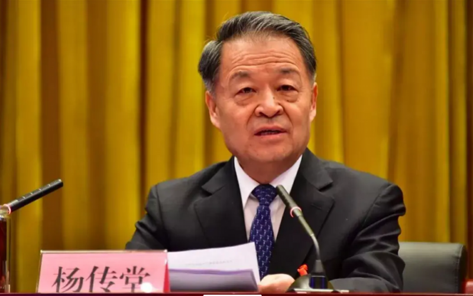

# 李小鹏任交通运输部党组书记，任职逾十年的杨传堂卸任书记

交通运输部党组书记调整。据交通运输部官微，2023年5月10日，中央组织部有关负责同志出席交通运输部领导干部会议，宣布中央决定：杨传堂同志不再担任交通运输部党组书记职务，李小鹏同志任交通运输部党组书记。

官方履历显示，63岁的李小鹏，曾任山西省委副书记、省长，2016年起担任交通运输部部长、党组副书记。现任交通运输部部长、党组书记，第十四届全国政协常委。

杨传堂今年69岁，曾任青海省长和西藏自治区党委书记，2012年任交通运输部党组书记、部长，2016年交通运输部实行“双首长制”，杨传堂卸任部长，担任党组书记。2018年3月，杨传堂任十三届全国政协副主席，交通运输部党组书记，跻身副国级。

自2012年直至此次调整，杨传堂任交通运输部党组书记逾10年。

目前交通运输部领导结构中，党组书记、部长李小鹏，副部长有3位，分别是戴东昌、徐成光、付绪银。

_2019年3月5日，交通运输部部长李小鹏在全国两会“部长通道”接受采访。
新华社发_

**李小鹏：曾任山西省长，曾说“要想富先修路”没过时**

据交通运输部官网，李小鹏，男，汉族，1959年6月出生，四川成都人，1985年5月加入中国共产党，1982年8月参加工作，大学学历，高级工程师。

自1982年从华北电力学院毕业后，李小鹏曾长期在电力系统工作，曾任电力科学研究院电力技术经济研究所所长，1991年起在华能国际电力开发公司任职，2002年任中国华能集团公司总经理、党组书记兼华能国际电力开发公司董事长。2008年李小鹏调任山西，历任山西省委常委、副省长，省委副书记、代省长，省委副书记、省长，省政府党组书记。

8年后，2016年8月李小鹏从地方调任交通运输部党组副书记，1月后任交通运输部部长、党组副书记，负责交通运输部业务和行政管理工作。李小鹏是十八届中央候补委员，十九届中央委员，党的十七大、十八大、十九大、二十大代表，十一届、十二届全国人大代表。2023年3月当选第十四届全国政协常委。

“‘要想富先修路’这句话没有过时。”在2020年5月的国新办发布会上，李小鹏说，“我们还要继续努力，小康路上，决不让任何地方因为交通而掉队。”

在今年2月出席国新办“权威部门话开局”主题新闻发布会时，李小鹏介绍，2020年底实现了具备条件的乡镇和建制村通硬化路、通客车，历史性解决了农村地区行路难的问题。他表示，下一步将推动“四好农村路”高质量发展，加快完善现代化农村交通运输体系，更好地服务全面推进乡村振兴和农业农村现代化。

面对经济下行压力，去年以来，国务院出台稳经济一揽子政策和接续政策，交通运输部落实，适度超前开展交通基础设施投资。去年完成交通固定资产投资超过3.8万亿元，同比增长超过6%，再创历史新高。扩大交通投资是保民生促发展的重要举措，也是促投资稳增长的有效抓手。“今年我们还将继续保持交通固定资产投资的高位运行，继续为经济发展作出贡献。”李小鹏说。

党的十九大以来，交通运输系统一共完成固定资产投资超过17万亿元，建成了全球最大的高速铁路网、全球最大的高速公路网和世界级的港口群，截至2022年底，全国综合交通网络的总里程超过600万公里。铁路运营的里程是15.5万公里，其中高铁里程4.2万公里；公路通车的里程是535万公里，其中高速公路通车里程是17.7万公里，等等。当前中国正在加快建设交通强国。李小鹏指出，下一步将制定实施《加快建设交通强国五年行动计划（2023-2027年）》，重点抓好基础设施建设、运输服务质量提升、服务好乡村振兴和区域协调发展、推动交通运输绿色低碳转型，数字化、智能化和网联化等工作。

_杨传堂。资料图_

**杨传堂：曾在西藏、青海工作十余年，网约车管理备受关注**

官方履历显示，杨传堂，男，汉族，1954年5月出生，山东禹城人，中共党员，大学学历。

杨传堂曾在西藏和青海工作了十多年，1993年11月起历任西藏自治区党委常委、政府副主席，党委副书记、政府常务副主席，党委常务副书记兼党校校长；2003年9月起历任青海省委副书记、副省长、代省长、省长；2004年12月任西藏自治区党委书记。2006年5月进京，历任国家民族事务委员会副主任（正部长级）、党组副书记、党组书记，2011年8月任中华全国供销合作总社理事会主任、党组书记。

2012年7月，杨传堂调任交通运输部党组书记，1月后任交通运输部党组书记、部长。当时的任命文件介绍杨传堂时说，他经过多岗位特别是复杂艰苦环境的锻炼，领导经验丰富，熟悉党务和经济工作。此外，杨传堂思路清晰，组织领导和驾驭全局的能力比较强。敢于负责，处事果断，推动工作力度大，事业心强，工作热情高，重视调查研究。

2013年3月的政府机构改革方案中对交通运输部作出了重大调整，铁路实行政企分开，国家铁路局由交通运输部管理，交通运输部对有关职责和机构编制也进行了调整。“我们要以壮士断腕的勇气，齐心协力坚决打好这场职能转变攻坚战。”同年3月28日，时任交通运输部部长杨传堂主持召开部机关机构改革和职能转变动员会。他强调，要加大简政放权力度，向市场放权、向社会放权。要放宽市场准入条件，激发交通活力，促进行业繁荣发展。要转变管理方式，加强宏观管理，多思考、多研究影响交通运输行业发展的重大问题，把工作重心放在战略规划、政策法规和制度设计上。

在交通各项改革中，出租汽车行业管理备受关注。2016年全国“两会”期间，杨传堂就“深化出租汽车改革与发展”相关问题介绍，交通运输部于2014年11月份正式表明了对网约车发展鼓励和包容创新的态度。他指出，改革的导向，一是要提升传统出租汽车服务水平，二是鼓励网约车新业态的创新和规范发展。针对网约车的管理，暂行办法主要明确了四个方面的核心内容：一是明确发展的定位。按照高品质、差异化的经营原则，有序发展网约车。二是在现行的法律框架下，对网约车经营者、驾驶员和车辆实行许可管理。三是规范网约车的经营行为。四是建立多部门的联合监管机制，加强事中事后监管。

据悉，2016年7月《关于深化改革推进出租汽车行业健康发展的指导意见》《网络预约出租汽车经营服务管理暂行办法》两个文件正式出台。其中，网约车管理方面，整体来看，将更加尊重市场机制，同时对专车安全性、司机从业资格有更严格的要求。南都记者注意到，关于网约车的规范和发展，政策在不断根据形势进行调整。近年来有关网约车等新业态反垄断监管，合规化发展，新业态从业者权益保障等议题也备受关注。

2016年交通运输部实行“双首长制”，杨传堂卸任部长，担任党组书记。李小鹏担任部长。

2018年3月，杨传堂任十三届全国政协副主席，交通运输部党组书记，跻身副国级。

在此番调整前，交通运输部是为数不多实行“双首长制”的国家部委之一。自2012年直至此次调整，杨传堂任党组书记逾10年，负责交通运输部党组工作，负责干部人事、教育培训和巡视工作。分管人事教育司（党组巡视工作领导小组办公室）。联系大连海事大学、部党校（管理干部学院）。

南都记者搜索交通运输部官网，上一次杨传堂以党组书记身份主持召开交通运输部党组会是2021年6月。此后是由交通运输部部长、部党组副书记李小鹏主持党组会、部务会。

采写：南都记者 陈秋圆 发自北京

