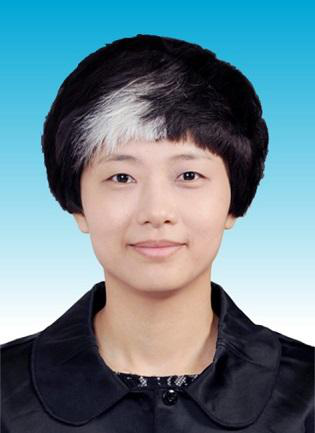
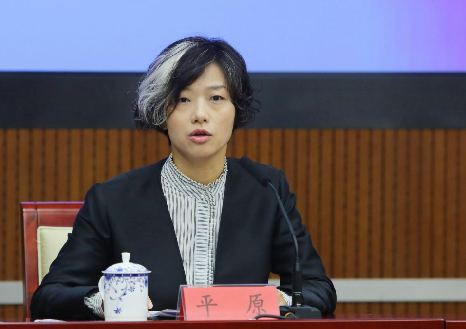

# 深圳一女副区长因“白色发型”引发热议，官方回应：不是染的

近日，深圳市龙岗区副区长平原，因“白色发型”引发网友热议。

_平原（来源：深圳市龙岗区政府官网）_

有网友认为，这是年轻人所钟爱的“挑染”，即只挑某一处头发进行局部染白，以显得时尚；也有网友觉得，这可能不是染白的，是为工作操劳白了头。

5月10日上午，深圳市龙岗区政府办一名工作人员向“政事儿”表示，
**“这是自然长成的，而非染的。平时，我们与平原副区长接触很多，很熟悉，也都认为这是很自然的现象，这种情况很正常。”**
他还表示，前几日，平原已对此进行了回应。

_平原（资料图）_

公开信息显示， **平原出生于1976年7月** ，经济学硕士。她曾任深圳市龙岗区工业和信息化局局长等职，2021年10月当选龙岗区副区长。

