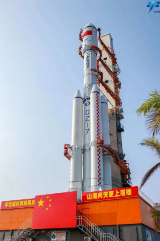

# 现役运力世界第一！天舟六号货运飞船发射任务取得圆满成功

腾讯科技讯（乔辉）据中国载人航天工程办公室消息，北京时间2023年5月10日21时22分，天舟六号货运飞船升空，目前已顺利入轨，发射取得圆满成功。执行本次发射任务的是我国长征七号运载火箭。

天舟六号飞船整体分成两个部分，下面较小部分为推进舱，上面较大部分为货物舱，飞船整体长10.6米，总重13.5吨。天舟六号与此前的天舟系列货运飞船不同，经过升级改造后，有效装载容积扩大了20%，载货能力由原来的6.9吨提升到了7.4吨，现役运力最强。

_图注：天舟飞船在轨示意图。_

**天舟六号运送了什么物资？**

根据官方说法，天舟六号运送的物资种类和过去相差不大，主要包括服装、食品、饮用水等。其中新鲜水果的重量约70公斤，是天舟五号携带水果重量的约两倍，这些水果将同时保障神舟十五号和未来神舟十六号航天员乘组的食用需求。相比天舟五号，天舟六号将原先的非密封后备段更改为密封舱，扩大了密封装的装载空间，提高了货物的运载能力。

**长征七号运载火箭**

长征七号是中国载人航天工程为发射货运飞船而全新研制的新一代中型运载火箭。长征七号采用“两级半”构型，箭体总长53.1米，芯级直径3.35米，捆绑4个直径2.25米的助推器。近地轨道运载能力不低于14吨，700公里太阳同步轨道运载能力达5.5吨。

长征七号运载火箭于2016年6月25日从中国文昌航天发射场首次成功发射，这也是文昌航天发射场的首次发射任务。预计将来逐步替代现有的长征二号、三号、四号系列，承担中国80%左右的发射任务。

长征七号采用无毒无污染的液氧、液氢和煤油作为推进剂。开头我们也提到，火箭第一级、第二级和四枚助推器都是采用无毒污染的液氧/煤油作为推进剂，第三级则采用更加高效的液氧/液氢作为推进剂。

我们知道，液氧的沸点是零下183摄氏度，而液氢的沸点更是惊人的零下253摄氏度，仅高于绝对零度20度（绝对温度为零下273摄氏度），是名副其实的“冰箭”。

处于低温状态的液氢和液氧像是难以驯服的怪兽，大型低温火箭的研发难度是非常高的。当然，氢氧火箭的优点也是非常明显的，那就是比冲非常高，能够用更少的火箭燃料把更多的载荷送入太空，无论燃料本身，还是燃烧生成的水蒸气，都是完全绿色无污染的。

**火箭发射的圣地：文昌航天发射场**

海南文昌发射场位于海南省文昌市龙楼镇境内，是我国首个滨海发射中心，也是世界上为数不多的低纬度发射场之一。
该发射中心可以发射长征五号系列火箭和长征七号运载火箭，主要承担地球同步轨道卫星、大质量极轨卫星、大吨位空间站和深空探测卫星等航天器的发射任务。

文昌航天发射中心作为低纬度滨海发射场，能够借助接近赤道的较大线速度，使火箭燃料消耗减少，据悉，同型号火箭运载能力可提升10%。除此之外，该发射中心还有利于通过海运解决大型火箭的运输难题并提高残骸坠落的安全性。

