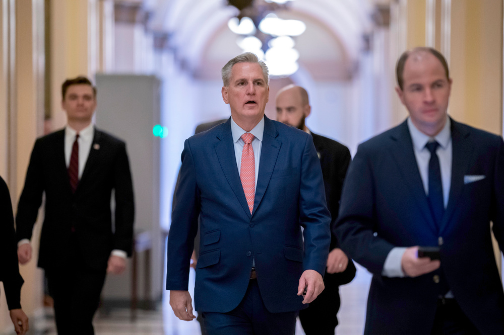

# 白宫与国会就债务上限问题谈判无进展，拜登：如谈不成，会取消亚洲行

每经编辑：毕陆名

当地时间5月9日，美国总统拜登在白宫与国会两党党团领袖就提升债务上限展开谈判。
**谈判持续了不到一个小时，由于民主、共和两党的立场分歧依然很大，当天的谈判没有取得任何进展。**
在会议开始之前，当被问及是否会将债务上限短期延长至9月30日时， **美国众议院议长、共和党人麦卡锡称，他拒绝短期延长债务上限的提议。**

据环球网5月10日消息，美国总统拜登当地时间9日表示，他可能会取消本月晚些时候的亚洲之行。

拜登：谈不成就不去了

据环球网5月10日援引法新社消息称，美国总统拜登当地时间9日表示，如果与共和党在美国债务上限问题上的僵局得不到解决，并让美国面临有史以来第一次违约，他可能会取消本月晚些时候的亚洲之行。

报道称，拜登在与国会共和党高层会晤后对记者说，“如果到了最后一刻我们仍没有解决这个问题……我就不会去（亚洲）。”

白宫网站早些时候发表声明称，拜登将于5月19日至21日参加在日本广岛举行的七国集团（G7）领导人峰会。另据路透社补充，拜登随后将在前往澳大利亚参加四方领导人峰会途中在南太平洋岛国过境停留。

据央视新闻报道，当地时间5月9日，美国总统拜登将与美国众议院议长、共和党人凯文·麦卡锡就债务上限举行会议。

凯文·麦卡锡在白宫就债务上限问题与总统拜登举行会议后表示，这次会见并未就解决债务上限问题达成任何有益意见，自己和国会其他几位党团领袖将于12日再次与总统拜登会面。

_美国众议院议长、共和党人凯文·麦卡锡（图片来源：视觉中国）_

拜登则表示，就债务上限问题与国会领导人举行了颇具成效的会议；美国不会出现债务违约；将于周五再次与国会领导人会面；美国政府可以削减支出及财政赤字；但麦卡锡提议的减支方案将损害美国民众利益；必须排除让美国违约的这个选项。

据海外网援引美国《国会山报》网站报道，当地时间5月8日，美国政府雇员集体对美国白宫及美国财政部提起一项诉讼，反对美国政府执行国会设定的债务上限，并阻止债务上限给雇员带来的停薪、裁员或休假风险。

信贷紧缩拉响衰退红色警报

据21记者观察，在银行业危机的冲击下，美国正在加速步入衰退。美联储警告称，对经济前景、信贷质量和融资流动性的担忧可能导致银行和其他金融机构进一步收缩对经济的信贷供应，信贷供应的急剧萎缩将推高企业和居民融资成本，进而拖累经济活动放缓。

_图片来源：视觉中国_

与此呼应的是，美联储5月8日发布的高级贷款官意见调查报告（SLOOS）也显示，一季度全美银行收紧了对家庭和企业的贷款标准，银行对商业和制造业企业的贷款以及许多家庭的贷款审批要求变得更加严格。与大型银行相比，中型银行收紧贷款的范围更广。

此外，信贷需求降至2009年以来的最低水平。第一季度，报告大中型企业商业和工业贷款需求疲软的银行比例上升至55.6%，创下2009年以来的最高水平，去年四季度这一比例仅为31.3%。

事实上，美国的银行早在去年就收紧了放贷标准，2月初发布的SLOOS显示，去年第四季度，所有种类的贷款均出现了需求疲软和标准收紧，为2009年一季度以来首次发生。

伯克希尔-哈撒韦公司2023年年度股东大会6日在美国内布拉斯加州奥马哈市落下帷幕。伯克希尔-
哈撒韦董事会主席沃伦·巴菲特在会上表示，美国政府就近期美国银行业危机所做的信息披露不力，导致储户信心难以恢复。针对近期备受关注的美国银行业危机，巴菲特表示，如果人们对存在银行的钱表示担心，那么经济运行就会不太好。巴菲特说，政府就银行业危机所做信息披露“非常糟糕”，导致储户信心难以恢复。巴菲特还表示，应该“惩罚”那些对银行管理不善负责的董事和高管。

据央视新闻5月7日消息， **德国安联集团首席经济顾问穆罕默德·埃尔-
埃利安认为，目前美国银行业正处于其体内的“癌细胞”不断扩散的阶段，这场银行业危机或将进一步恶化。**

德国安联集团首席经济顾问穆罕默德·埃尔-
埃利安：我们经历的第一阶段是由于美联储加息周期处理不当，从什么都不做到突然激进加息，以及糟糕的金融监管和银行管理不善，导致四家银行倒下。现在，我们进入了第二阶段，银行业危机开始有传染性，尤其是当人们看到日前第一共和银行年内股价累计暴跌97%，官方的应对有多失败之后，大家现在就变得非常不安。因此，在这第二阶段，那些自身管理并不是很糟的银行，突然也变得脆弱起来。第三阶段就是广泛的金融传染，我希望这不会发生，但信贷紧缩正显著上升。虽然目前大银行没有被卷进这场危机，但银行业体内的“癌细胞”已经开始扩散，我们必须密切关注。

每日经济新闻综合环球网、央视新闻、21世纪经济报道

每日经济新闻

