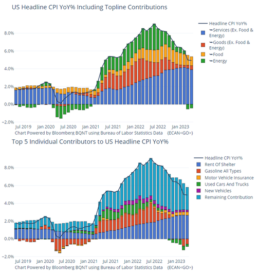

# 美国4月CPI连续第10次下降，为美联储“暂停加息”增加更多确定性

美国4月CPI同比涨幅低于预期，核心CPI放缓，交易员进一步减小6月加息的押注。

5月10日周三，美国劳工统计局的数据显示，
**美国4月CPI同比上升4.9%，连续第10次下降，为2021年4月以来最小同比涨幅，预期5%，前值5%；CPI环比上涨0.4%，预期值0.4%，前值0.1%。**

不包括波动较大的能源和食品的核心CPI较上月小幅放缓，同比上升5.5%，与预期持平，前值5.6%；环比上升0.4%，预期0.4%，前值0.4%。

美联储最爱“超级核心通胀”，除住房外的核心服务CPI同比放缓至5%，其中交通运输和医疗服务费用环比下滑。

此外，通胀连续25个月超过美国人实际工资涨幅。

美国4月CPI数据公布后，美元指数短线下跌逾30点，现报101.55。美股期货短线拉升，纳斯达克100指数期货涨0.5%。现货黄金短线拉升约15美元，现报2044.81美元/盎司。

机构分析认为， **对4月份CPI价格上涨贡献最大的是住房。但这是一个滞后指标——统计学家现在只是将几个月前发生的利率变化纳入其中。**
数据发布后，互换交易降低了美联储6月加息25个基点的可能性。

能源指数继续下降 住房指数呈见顶趋势 二手车价格指数上行

具体来看，能源（和汽油）是下行的主要动力，而住房成本仍然很高。

能源指数同比下降了5.1%，而食品指数在过去一年中增长了7.7%，4月份扣除食品和能源的所有项目的指数环比上升了0.4%，与3月份相同。

**住房指数是扣除食品和能源的最大贡献项，4月份环比上升了0.4%，此前3月环比上涨0.6%，住房指数显示见顶趋势。**

其中，4月份的租户租金指数环比上升了0.6%，而业主等价租金指数环比上涨0.5%，离家住宿的指数在4月份环比下降了3.0%，此前连续四个月上行。

不过，业主等价租金同比增长了8.1%，创下新的记录，为下行趋势增加一些混乱。

在4月份其他上升指数中，二手车和卡车的指数同比上升了4.4%，机动车保险的指数上升了1.4%。娱乐、家庭设备和操作、个人护理、服装和教育的指数也有所上升。

4月份的下降指数中，航空票价下降了2.6%，降幅最大。此外，新车指数下降了0.2%，通信指数下降了0.1%。医疗保健指数在4月份没有变化，而在上个月下降了0.3%。医疗服务指数在3月份下降0.4%后，4月份上升0.5%。4月份的处方药指数上升了0.3%。

为“暂停加息”增加更多确定性

4月通胀数据促使交易员进一步押注美联储将在下个月暂停加息周期，并最早可能在9月转向放松政策。

**美国4月CPI数据公布后，CME“美联储观察”工具显示，美联储6月维持利率不变的概率从79.9%增至87.4%，加息25个基点的概率从20.1%降至12.6%。**
市场价格体现6月再次加息的概率降至10%左右，且交易员预计年底前联邦基金利率将从本周的5.08%降至4.38%左右。

野村此前指出，如果核心服务通胀，特别是剔除租金外的核心服务通胀放缓， **会支持“5月加息是当前紧缩周期的最后一次加息”的观点**
，这与美联储所暗示的一致。此外，核心商品通胀往往更具波动性，美联储可能会对二手车价格导致的核心商品价格上涨不予考虑。

Annex Wealth Management首席经济学家Brian
Jacobsen表示，4月份的通胀数据与预期相符。信贷市场的紧缩可能只会对经济增长和通胀产生渐进的影响。
**通货膨胀仍然太高，因此美联储不太可能改变其措辞** 。他们会坚持他们无意降息的说法。不过，他们的观点可能会随着风向和数据而改变。

值得一提的是，在美联储6月再次召开FOMC会议之前，将会再发布一份CPI报告，也就是说在美联储下次作决定前会有两份CPI报告参考，此外也会有更多重要经济数据发布供美联储参考。

