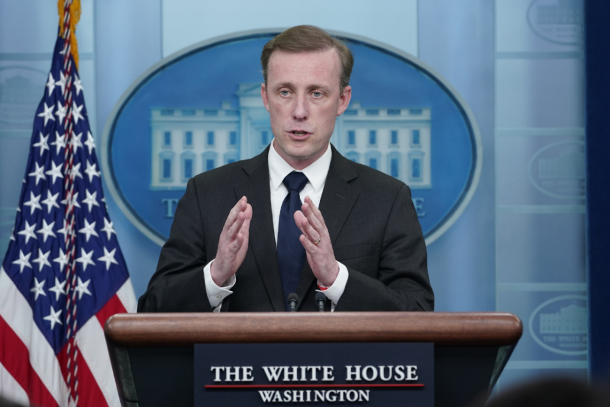
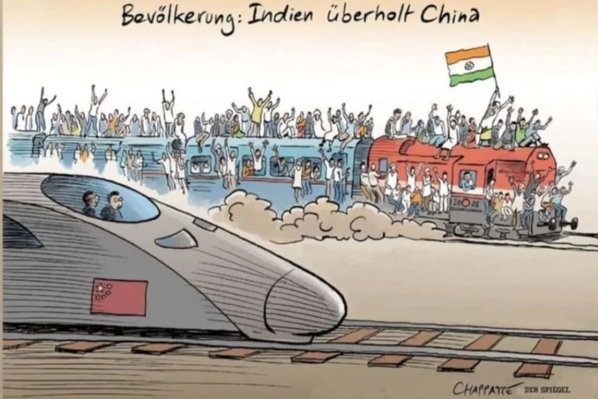
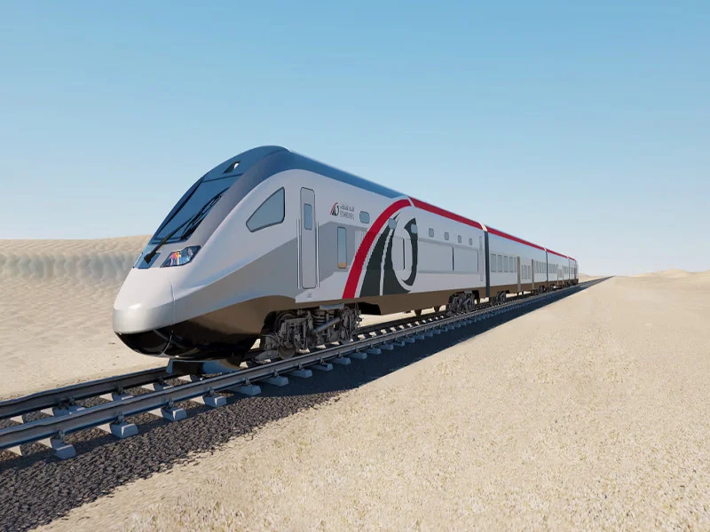
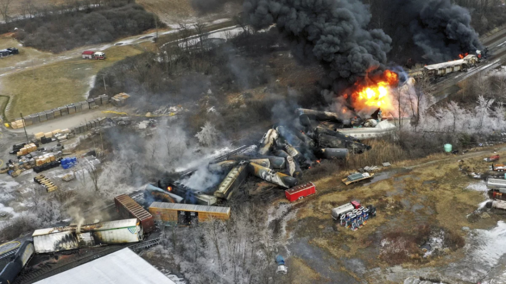

# 美国要在中东修铁路“对冲中国”，项目人士：可以利用印度的专业知识

美国总统国家安全事务助理杰克·沙利文日前访问沙特。美国、印度等国的媒体在报道中均提及，沙利文此行是为了推进一个连接阿拉伯国家和印度的铁路项目，以对冲中国在中东地区的影响力。

据沙特阿拉伯国家通讯社报道，沙特王储兼首相穆罕默德在沙特红海海滨城市吉达会见了沙利文，双方讨论了沙特与美国的各种战略关系，如何加强这些关系，以及共同关心的地区和国际议题。此外，沙利文、穆罕默德还与印度国家安全顾问阿吉特·多瓦尔以及阿联酋国家安全顾问塔农·阿勒纳哈扬举行了联合会谈。

_沙利文（资料图）_

值得注意的是，在各方见面之前，美国媒体Axios率先披露，一项重大联合基础设施项目或将成为此次沙利文访问沙特讨论的众多议题之一。该媒体援引消息人士的话表示，这一铁路网络将连接中东地区的阿拉伯国家，并通过该地区的港口再以水路连接印度。

“尽管没有人大声说出来，但从第一天起，（这个设想）就是针对中国的。”一名直接参与该项目早期讨论的前以色列高级官员向Axios表示。这人还说，在此类大型基础设施项目上可以利用印度的专业知识。

这里旺财想插一句，印度在铁路上的专业知识？这位以色列人是认真的吗？远的不提，就说前两天，联合国预测印度人口或于年中超过中国，德国《明镜》周刊为此刊登了一幅漫画，结果惹怒了全印度。

这幅漫画题为“人口：印度（将）超过中国”，画中展示出两辆不同的列车：一列是超载的火车，车上挤满坐着、站着甚至攀挂着的人，列车顶上的人举着印度国旗；另一列是车身印有中国国旗的“子弹头”列车。《明镜》周刊配发的一篇文章称，印度经济发展越来越好，是全球经济发展的重要驱动力量。

结果，印度国内就炸了。有政客和网民说，这体现了西方对印度的蔑视，是不折不扣的种族主义视角，其目的就是为了让印度失望、讨好中国。要让旺财来说，《明镜》怎么能这样啊，瞧不起谁呢，就不能讲点政治正确吗？

话说回来，印度的铁路专业知识暂且不提，印度对美国推动的这个铁路项目似乎兴趣不小。沙利文此次访问沙特，印度媒体的相关报道可能是最多的。《印度快报》还引述德里的消息人士解释说，印度方面热衷于参与该项目，因为它实现了三个战略目标：

首先，北京通过斡旋中东扩大了其在西亚地区的政治影响力，比如让沙特和伊朗关系破冰令印度措手不及。而修建连接中东和印度的铁路，从长远来看，将加快原油运输速度，并将印度的成本降至最低。

其次，该项目将帮助印度在铁路领域打响名声。《印度快报》说，印度国内拥有强大的铁路网络，也有信心在海外建设铁路网络。在中东参与建设基础设施，也将对“一带一路”形成对冲。

第三，印度政府认为，长期以来，由于巴基斯坦对陆路交通的封锁，印度与西方邻国的联系一直受到限制。因此，德里希望利用海运路线到达西亚港口。

可以说，印度方面想得确实挺“美”的，也挺“美国”的。作为美国媒体，Axios也说，中东是中国共建“一带一路”倡议的关键部分，随着中国在中东地区影响力扩大，白宫希望在中东推动诸如联合基础设施项目等关键举措对冲中国的影响力。

不过在美国国内，对拜登政府去海外修铁路不乏反对声音。据美国福克斯新闻网报道，一名美国铁路机械师做客该媒体节目时吐槽说，拜登政府只顾海外搞项目，却不管国内铁路早已落后的现实。“美国的铁路系统就像一个科技博物馆。如果你想进入时间机器，看看10年前的（铁路）技术是什么样的，去美国的任何一条铁路（都能见到）。”

美媒说，美国每天大约有3次火车出轨，但通常不是大灾难。

中国现代国际关系研究院中东研究所所长牛新春对《环球时报》记者表示，最近几年美国提出不少针对“一带一路”的计划，企图削减中国的经济影响力，但到目前为止都没有什么大动静。这次美国想和印度、沙特等国在中东修铁路的计划也未必能落实下来，首先是因为在海湾地区修铁路很不容易，多年以来能修成的很少；其次，基础设施建设历来是投资大、利润低、见效时间长，能否坚持下去还要打上问号。

