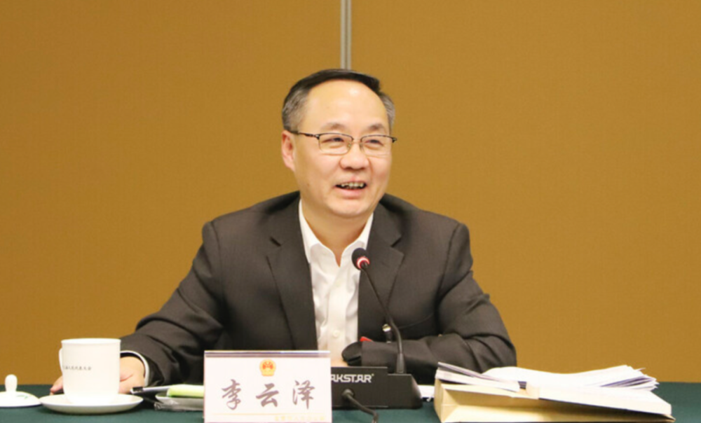

# 金融监管总局党委书记到任，他成为首位“70后”正部级“一把手”

**撰文 | 董鑫 李岩**

中国银保监会官微消息，2023年5月10日下午，国家金融监督管理总局召开领导干部会议。中央组织部有关负责同志宣布了中央决定：李云泽同志任国家金融监督管理总局党委书记。

**长期任职银行系统**

出生于山东烟台的李云泽是一位“70后”官员，现年53岁。

简历显示，李云泽先后在天津大学、中国社会科学院研究生院求学，研究生学历，经济学博士，高级经济师。

走出校门的第一份工作，李云泽进入银行系统，任建行天津和平支行下设储蓄所干部。

而后，他在建行任职超过20年。历任天津市分行计划财务处副处长、处长、天津市分行行长助理、天津市分行副行长。2008年调回总行，担任战略规划与股权投资部总经理。2015年，李云泽调任建行重庆市分行行长、党委书记。

2016年7月，李云泽离开建行，出任中国工商银行副行长、党委委员，直至2018年9月调任四川省政府副省长、党组成员。

公开报道显示，在离任工行副行长之际，工行发布的离任公告如此评价他的工作：
**恪尽职守，勤勉尽责，在本行业务发展与管理、转型创新、智慧银行建设、大零售战略和综合化战略推进等方面做出了重要贡献。**

赴四川任职前不久，2018年3月，李云泽以工行副行长职务出席当年岭南论坛谈及金融风险和监管。

他表示，金融科技的本质仍是金融，必须对风险进行有效防范，包括保障储户利益，降低账户风险等。金融科技在国内蓬勃发展，可使一个小机构在短时间内聚集大量资金，如果把控不好，容易诱发系统性风险，
**“所以互联网金融、金融科技、科技金融，无论哪种说法，归根到底还是金融，必须要实施监管”。**

四川省政府官网显示，在四川任职期间，李云泽主要负责外事、国防科工、发展改革（粮食和物资储备、能源）、财政税务、统计、金融、应急管理、安全生产、机关事务、综合政务服务等工作。

人民网披露，5月8日，李云泽仍以四川省常务副省长身份公开出席活动。

**“70后”部委“一把手”**

根据最新公布的《党和国家机构改革方案》，国家金融监督管理总局在中国银行保险监督管理委员会基础上组建，作为国务院直属机构，统一负责除证券业之外的金融业监管。

中国政府网“国务院组织机构”一栏显示，目前国务院共有26个组成部门、1个直属特设机构和14个直属机构。

政知见梳理发现，此番履新意味着，在上述部门和机构中，李云泽成为唯一一个“70后”一把手。同时，李云泽也是全国范围内首位“70后”正部级官员。

说回此轮机构改革。今年3月16日，《党和国家机构改革方案》正式印发。

根据方案，在党中央机构改革方面，组建中央金融委员会、中央金融工作委员会；在国务院机构改革方面，组建国家金融监督管理总局、深化地方金融监管体制改革、中国证券监督管理委员会调整为国务院直属机构、统筹推进中国人民银行分支机构改革。

其中，新成立的国家金融监督管理总局是国务院直属机构，统一负责除证券业之外的金融业监管。

国家金融监督管理总局在中国银保监会基础上组建，将央行对金融控股公司等金融集团的日常监管职责、有关金融消费者保护职责，证监会的投资者保护职责划入国家金融监督管理总局。不再保留银保监会。

这次改革也意味着，我国金融监管体系迎来新一轮重构，形成“一行一局一会”的新结构，即央行、国家金融监督管理总局、证监会。

《经济日报》报道指出，此次金融监管机构改革的主要目标之一，就是要实现对各类金融活动的全面监管，提高金融监管质效，有效防范化解金融风险，牢牢守住不发生系统性风险的底线。

3月28日，银保监会发布《2023年度国家金融监督管理总局（银保监会）部门预算》。其中明确，国家金融监督管理总局（银保监会）2023年收支总预算1063081.87万元。

这是银保监会首次以国家金融监督管理总局名义公开发文。

**资料 ｜ 新华社 央视 经济日报 21世纪经济报道**

**【版权声明】本文著作权归政知新媒体独家所有，未经授权，不得转载。**

