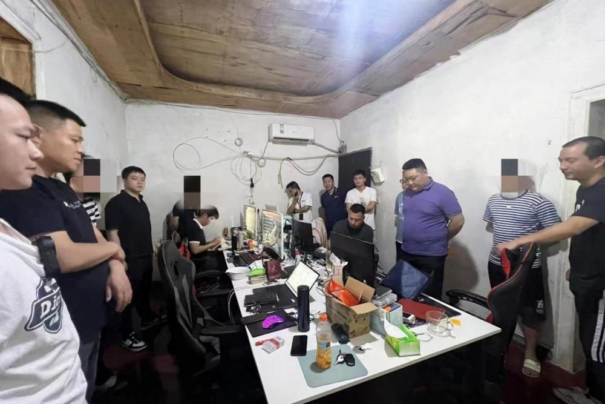
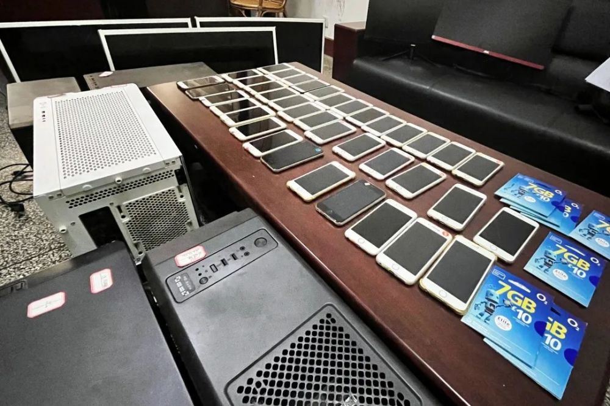
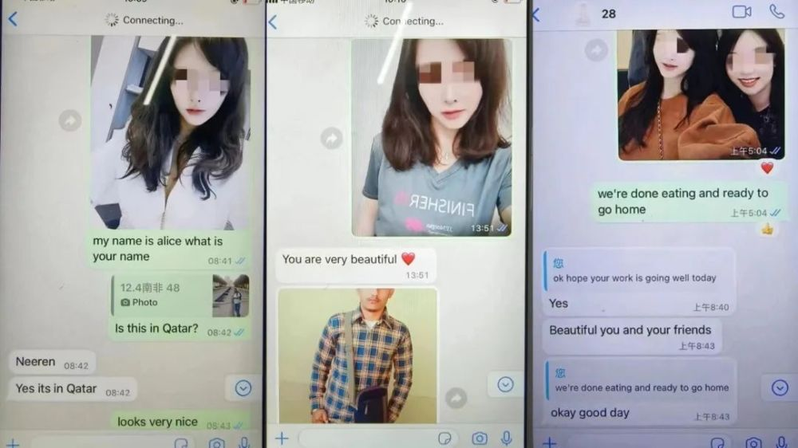
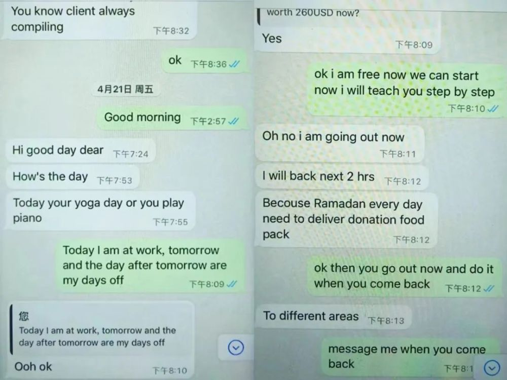
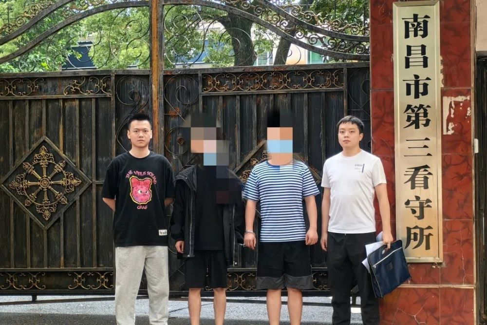
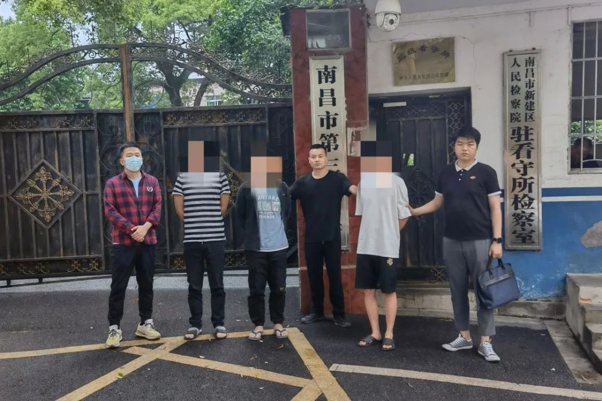

# 5名男子冒充“白富美”专骗老外：每天上班到凌晨 “从来不骗中国人”

法治日报全媒体记者 黄辉 周孝清 通讯员 姚轲

“我们都是找境外的人进行诈骗，从来不骗中国人……”

近日，江西省南昌市公安局新建分局在辖区内某小区成功捣毁一个“杀洋盘”诈骗窝点，被抓获的犯罪嫌疑人王某等人的话语让人哭笑不得。

**案件回顾**

5月5日，新建公安分局成功侦破一起针对外籍人员的电信诈骗案件，抓获犯罪嫌疑人5名，查获作案手机39台，电脑5台，外籍电话卡9张，总涉案金额90余万元。

2023年4月，新建公安分局民警经侦查发现，在新建区新建大道附近出现外籍电话卡信号，并且持续时间集中、稳定，疑似一诈骗窝点。

民警经过多日乔装蹲守进一步发现，在新建区新建大道一批发部所在自建房的二楼民房内有五名年轻男子聚集。通过分析研判确认五名男子身份，该五名男子聚集时间相对规律，一般在下午13时许至次日凌晨1时许，与外籍电话卡信号出现时间非常吻合。

民警趁五名男子不在房间时，从外围对房间内部进行观察，发现该房间内有多台电脑、手机等物品，由此初步确定该处为一诈骗窝点。

5月6日，在南昌市公安局统一指挥下，新建公安分局果断收网，将该诈骗团伙一举抓获，当场查获作案工具若干。

经查，该团伙于2022年6月至今，针对中东巴林王国民众，伪装成家境较好、长相貌美的女性，并对自己的社交账号进行前期包装，利用翻墙软件及whatsapp聊天软件，用复制好的话术与对方沟通，通过发送生活照、嘘寒问暖等各种方式博取好感后，诱导对方投资虚假黄金平台，而黄金平台可人为操控涨跌、提现，以此种方式对巴林王国民众实施诈骗，总涉案资金90余万元。

据办案民警介绍，实际上，犯罪嫌疑人甚至连一句外语都说不出来，只能借助翻译器、翻译软件与境外受害人交流。

目前，该诈骗团伙5名成员已被公安机关依法刑事拘留，案件正在进一步侦办中。

**警方提示**

所谓“杀洋盘”，是一种电信网络诈骗方式。指诈骗分子假扮“白富美”“高富帅”等各类高端身份，利用翻译软件、聊天软件与外国人恋爱、交友为手段获取被害人信任后，引导被害人进行“投资”、刷单、赌博等，最终骗取钱财。

切勿急功近利参与诈骗行为或帮助实施诈骗，不要轻信“骗外国人不犯法”的谬论。无论是诈骗中国人还是外国人，只要触犯法律，都将受到法律严惩。广大群众在日常工作生活中，如发现他人从事“杀洋盘”等违法犯罪行为，可及时向公安机关举报。

