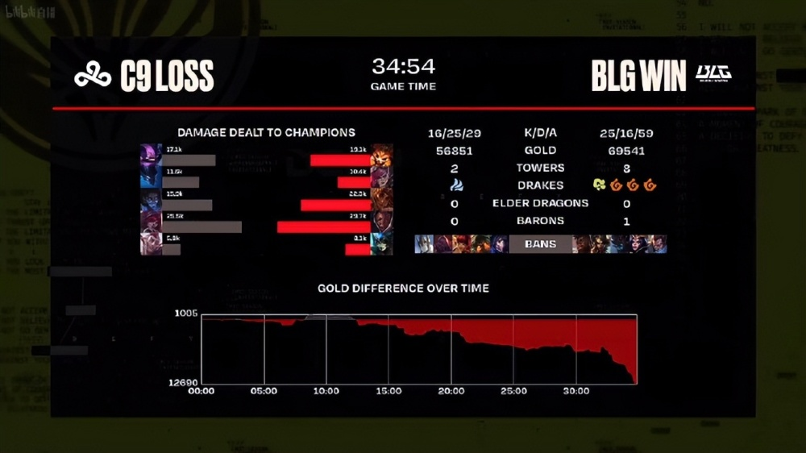
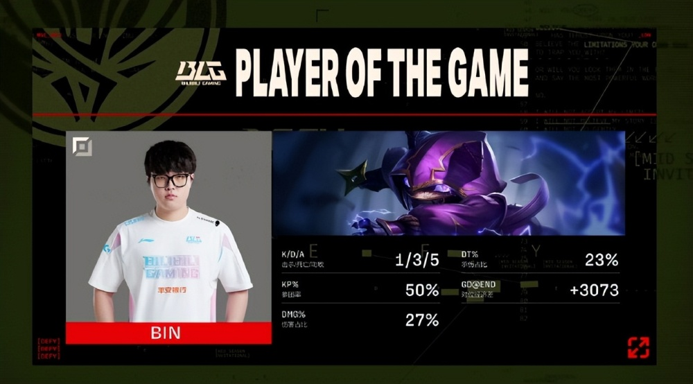
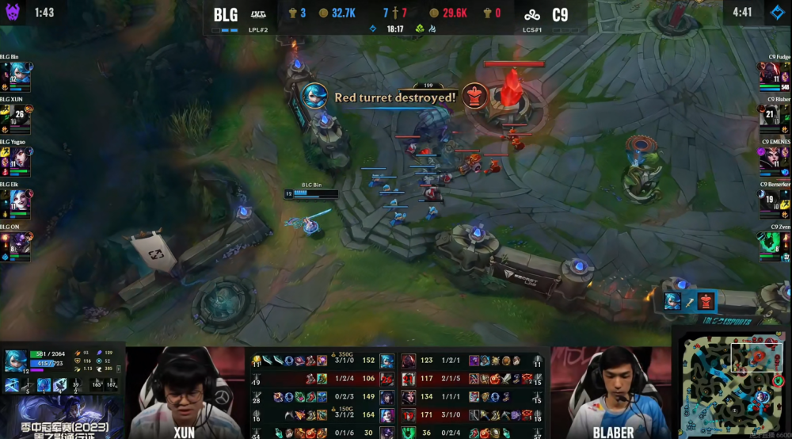

# BLG3-0横扫C9，晋级下一轮！bin发挥出色，3局乱秀

MSI正赛BLG和C9的比赛，双方大战3局之后，BLG成功以3-0的战绩击败了C9，拿下了比赛的胜利，晋级下一轮。

第一局C9上单凯南，打野梦魇，中单塞拉斯，下路洛与霞；BLG上单纳尔，打野蔚，中单岩雀，下路卢锡安加娜美。6分钟ELK卢锡安失误被洛W到，C9下路双人组追击，xun蔚也赶来，BLG反打成功打出一波1换2，ELK路线拿下了一血。12分钟BLG推掉了上路一血塔。前期BLG经济领先1K。中期23分钟BLG拿下听牌龙。后期31分钟BLG在龙坑团灭C9，拿下火龙魂。32分钟C9在上路抓死牙膏岩雀，之后fudge凯南TP失误被秒，BLG追击击杀C9三人后，拿下了第一条大龙。最终34分钟，C9在中路先手开团，但是没能击杀BLG队员，BLG反打团灭C9后，拿下了第一局的胜利。首局输出如下，ELK卢锡安打出了全场最高伤害，C9这边伤害最高的是霞。

第二局C9上单赛恩，打野千珏，中单加里奥，下路洛与霞；BLG上单凯南，打野蔚，中单辛德拉，下路路线加娜美。4分钟下路2V2对拼，随后双方中野都赶来，C9下路操作失误，反而是ON娜美击杀zven洛，BLG拿下了一血。前期BLG经济领先1K。中期18分钟，C9拿下第二条小龙，BLG则是推掉了2座防御塔。24分钟C9在野区抓死牙膏辛德拉，随后选择打大龙，结果xun蔚轻松抢下了第一条大龙。后期30分钟，C9想要在中路开团，但是被BLG拉扯，BLG反打成功团灭C9，拿下了第二局的胜利。MVP给到了Bin凯南。

第三局BLG上单格温，打野猴子，中单狐狸，下路金克丝加牛头；C9上单赛恩，打野盲僧，中单妖姬，下路厄斐琉斯加锤石。开局C9上中换路，2分钟C9打野盲僧抓上，但是Bin格温1V2先击杀妖姬，拿到了一血，随后自己被换掉。前期双方经济基本持平。中期18分钟双方争夺小龙，bin格温绕后，配合队友先击杀fudge赛恩，之后BLG疯狂拉扯击杀C9三人后，拿下了小龙，而bin则是带着峡谷先锋推掉了C9中路高地塔。22分钟BLG拿下第一条大龙，随后双方团战爆发，但是被C9打出了团灭。29分钟C9想要秒ELK，但是ELK金身规避，反而是BLG击杀了C9盲僧，随后拿下第二条小龙。后期30分钟C9拿下听牌龙。最终33分钟，BLG在高地击杀C9三人后，一波结束了比赛。

那么，对于这场比赛，你们有什么想说的吗？欢迎在评论区留言探讨。

