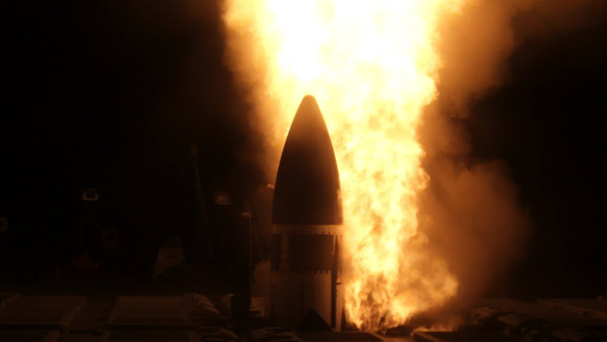

# 为防“中朝威胁”，美国五角大楼开始在关岛建设反导能力

【观察者网 讯】据美国海军学会新闻网（USNI
News）当地时间10日报道，美国导弹防御局局长乔恩·希尔周二（9日）在参议院的一次小组会议上表示，五角大楼方面正在“采取初步措施”，为关岛提供一个“持久的360度导弹防御系统”，以抵御“中国和朝鲜的攻击”。

在美国参议院军事战略小组委员会上，希尔表示环保局和美国陆军方面正在对已经选定的十余个地点进行相关环评工作，根据5月5日的一份联邦公报，最终报告将包含“评估拟议部署的雷达传感器和导弹发射系统及指挥控制设施对环境的影响、基础设施的建设和运营以及相关空域的管理”等内容，美国方面于5月2日就这一事项通报了当地政府。

希尔公开表示，2024财年预算申请中已包含关岛的（陆上）宙斯盾系统研发及发射系统装备的采购，以及军用设施选址设计、规划和建设的资金，另外由于人员轮换服役期限上限从一年提升至了三年，美国陆军方面则希望在关岛为军人及家属提供相关住房资金。

希尔称，该能力一旦部署完成，将对巡航导弹、弹道导弹、机动攻击和高超声速武器攻击形成“分层防御”，作为系统的一部分，导弹防御局正在与海军合作，以设计制造和部署“标准”SM-3
blockⅠB/ⅡA反导拦截弹及额外的“宙斯盾”战舰升级。

_2020年11月，“阿利·伯克”级导弹驱逐舰DDG-113“约翰·芬恩”号试射“标准”SM-3
BlockⅡA反导拦截弹 图片来源：美国导弹防御局_

美国国防部负责太空政策的助理部长约翰·普拉姆强调称，关岛和其他所有美国海外属地都被视作美国国土的一部分，他们致力于在关岛部署导弹防御系统，关岛目前有一个主要的空军基地和正在扩建的海军支援设施，普拉姆表示，五角大楼方面在2024财年中将申请15亿美元，为关岛这一所谓“印太地区”的关键作战中心加强导弹防御能力，美国国防部还按照相关法规，指定了一名高级官员来统筹管理关岛的导弹防御事务。

今年3月，希尔在五角大楼一项109亿美元预算申请的新闻发布会上详细介绍了用于关岛导弹防御的指挥控制传感器架构和发射装置工作原理，在介绍中希尔表示，关岛将部署四面用于综合防空和导弹防御的相控阵雷达AN/TPY-6，该雷达与一套分布式的“陆上宙斯盾”进行联接，“宙斯盾”系统还能在简单层面上与岛上的美国陆军综合空中导弹作战指挥系统协同工作。希尔在提交的书面文档中表示，目前处于开发关岛国土防御雷达（指AN/TPY-6）和宙斯盾系统的早期步骤，这些系统可以提供持续的远程/中段识别、精确跟踪，导弹的交战和命中评估，从而保护关岛，关岛将部署导弹垂直发射系统和可移动发射架，“宙斯盾”系统具备一定拦截高超声速导弹的能力，不过美国陆军的末端高空区域防御系统（即“萨德”）尚未进行此类测试。

_未来关岛的导弹防御体系演示图_

另一方面，希尔还被问及如何保护航空母舰“免受高超声速导弹攻击”，他表示“宙斯盾”驱逐舰能够在上升段或末端飞行中“提供这种保护”，而“滑翔段拦截器”（GPI）则仍处于科学试验和工程开发阶段，不过在书面回应中，希尔表示“导弹防御局将继续发展和完善GPI能力，并利用‘宙斯盾’武器系统，目前防御局已经为美国海军提供了初步的末端防御能力”。希尔还在会上声称“尽管中国经常宣布各种导弹试验，但我们只是没有全部公布（而不是没有监测到）”。

**本文系观察者网独家稿件，未经授权，不得转载。**

