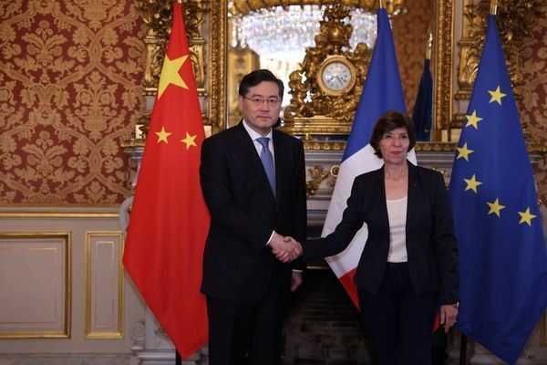

# 秦刚同法国外长举行会谈：中欧关系不针对、不依附、也不受制于第三方

新京报讯 据外交部网站消息，当地时间2023年5月10日，国务委员兼外长秦刚在巴黎同法国外交部长科隆纳举行会谈。

秦刚表示，马克龙总统对中国的国事访问取得圆满成功。中方愿同法方一道，落实好两国元首达成的重要共识，加快推进各领域交流合作，推动紧密持久的中法全面战略伙伴关系不断发展。双方要密切高层交往，扩大各层级交流，不断探索新的合作领域；加大市场相互开放，打造更具韧性的中法供应链；加强国际事务合作，携手应对全球性挑战。中国推进高质量发展和高水平开放的决心坚定不移，愿与法国等世界各国一道做大合作蛋糕，共享发展机遇。

秦刚表示，中国始终视欧洲为全面战略伙伴，一贯旗帜鲜明支持欧洲加强战略自主、在国际舞台发挥积极作用，主张中欧关系不针对、不依附、也不受制于第三方。中法、中欧应在扩大双向开放中实现共赢合作，构建更加稳定互信的中欧供应链伙伴关系。

科隆纳表示，马克龙总统访华期间同习近平主席深入交换意见，加深了对中国的理解，访问非常成功。法中关系至关重要，两国元首已明确方向，双方应共同努力推动两国关系取得更大发展。建议双方全面重启各领域合作机制，加强在气候变化、生物多样性、能源转型等领域的合作。法方重视对华经济关系，认为这种关系是互相依存、互利互惠的，也是互补、开放和透明的。法方不搞阵营对抗，认为各国应和谐相处，共同发展。中国为世界和平稳定发挥着重要作用，法方愿就乌克兰等重大国际地区问题同中方加强沟通，寻找更多共同点。

秦刚介绍了中方在乌克兰问题上的立场和所做工作，强调习近平主席提出四个应该，是中方看待和处理乌克兰危机的出发点。中方致力于推动危机的政治解决，同各方保持着沟通，将继续为此发挥建设性作用。

双方还讨论了其他国际和地区问题。

当天，秦刚还会见了法国总统外事顾问博纳，就中法关系及乌克兰危机等问题交换了意见。

编辑 陈艳婷

