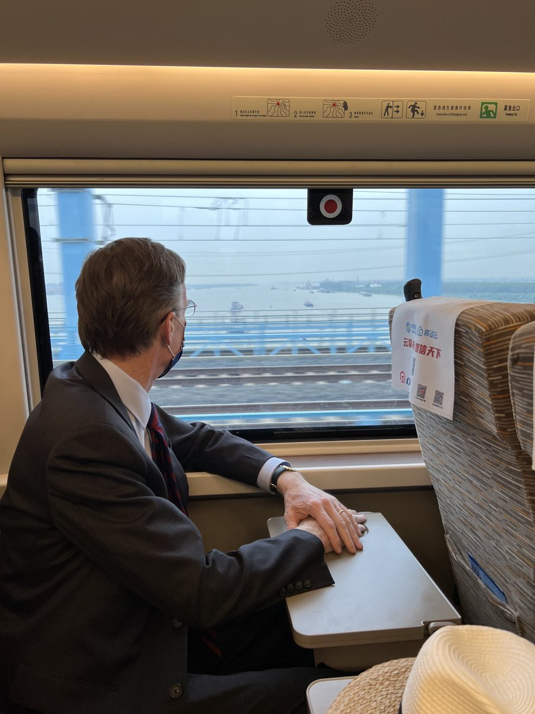
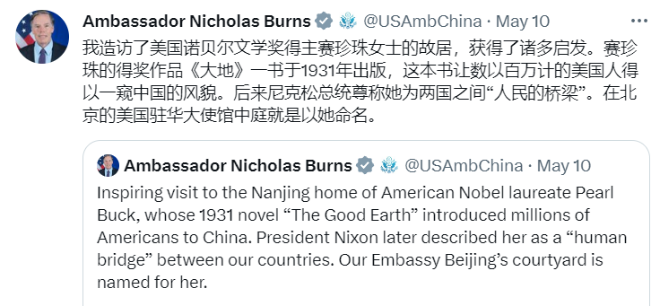

# 美国驻华大使的画风变了，但又似乎没变

5月11日，商务部部长王文涛应约会见美国驻华大使伯恩斯。中国商务部指，双方就中美经贸关系和各自关注的经贸议题交换了意见。

外界注意到，这是自5月8日与中国国务委员兼外交部长秦刚会见以来，伯恩斯3天内再次与中国政府进行高层级接触。

5月8日，秦刚对伯恩斯强调，当务之急是稳定中美关系、避免螺旋式下滑，防止中美之间出现意外，这应该是中美之间最基本的共识，也是国与国、特别是两个大国相处必须要守住的底线。

“不能一方面讲沟通，一方面却不断对中国打压遏制。不能说一套做一套。必须尊重中方的底线红线，停止损害中国的主权、安全、发展利益。”

秦刚还表示，希望伯恩斯大使在中国多接触、多交流、多思考，作中美间的纽带桥梁，作出建设性努力。

当天伯恩斯在其官方推特@USAmbChina上写道，与国务委员兼外交部长秦刚举行了会晤，“我们讨论了美中关系中的挑战，以及稳定关系并扩大高级别沟通的必要性”。

**直新闻注意到，以5月8日为界，伯恩斯的推文前后开始出现某种“画风变化”。**

作为美国驻华大使，此前伯恩斯的账号高度关注美国在中国以外的事务和政策，频繁转发美国总统拜登和国务卿布林肯的推文，对寥寥一些中国议题也流于美国视角；而在过去几天里，伯恩斯则聚焦于中国，在很多细节上试图描述中国和中美关系的积极面。

5月10日，伯恩斯来到南京福特汽车工程研究中心，他在推文中表示，福特早在1913年就进入了中国市场，“很高兴看到福特在中国发挥自己的优势”。

同日，伯恩斯在推特中上传了一张乘坐高铁的照片，配文“搭乘复兴号北上，跨越长江的瞬间”。这是自去年8月以来，伯恩斯再次以直观的方式对外展现中国高铁。此前，他曾写道：时速可以达到308公里的复兴号令他感到“印象深刻”。

5月11日，伯恩斯又来到南京航空烈士墓，向四位“在二战时期捐躯的美国飞行员”献花。值得注意的是，其中一位飞行员罗伯特·肖特（Robert
Short）牺牲于1932年，是中国十四年抗日战争中第一位牺牲的外国飞行员。2014年，罗伯特·肖特被国家民政部收录在第一批著名抗日英烈和英雄群体名录之中。

当天，伯恩斯还登上明长城，他在推文的最后用了八个字：屹立不摇，极为壮观。

除此之外，在伯恩斯大使过去几天的推文中，外界还能看到他记述“很高兴见到”自己的母校约翰斯•霍普金斯大学与南京大学合办双语教学项目；转发了塞内加尔大使锡拉向国家主席习近平递交国书的推文；以及前往赛珍珠女士（Pearl
S. Buck）故居，尊称其为“两国之间‘人民的桥梁’”，称自己“获得了诸多启发”。

有观点认为，伯恩斯大使代表了美国希望与中国恢复广泛且全面对话的努力。5月2日，在华盛顿智库史汀生中心的网络座谈会上，伯恩斯称美国已准备好与中国进行高级别会谈，认为两国必须建立更深层次的沟通渠道。

但遗憾的是，无论伯恩斯大使如何释放信号，至少目前而言， **拜登政府的对华政策仍然停留在竞争性对抗的轨道之上。**
事实上，伯恩斯本人5月2日就指出，中美在某些科技领域的合作会“增强中国军事和情报能力”，而美国完全没理由这么做，“因为我们正与中国进行一场重大竞争”。

伯恩斯称，美国不希望与世界第二大经济体脱钩，但必须要“降低来自中国的风险”。他表示：“我们没有想要将这两个经济体分隔开来，但在某些领域我们这么做了，而且将继续采取措施来保护我们国家安全利益。”

伯恩斯指，只有对中国的某些产业采取“有限且常识性的限制措施”，才“符合美国的国家安全利益”。伯恩斯没有就什么是“有限且常识性的限制措施”进行解释，但就过去一年拜登政府的动作来说，那意味着限制中国发展高科技产业的能力，意味着在国际层面寻求限制对中国“关键产业”的投资，例如明确“让中国的芯片开发陷入停滞”。

伯恩斯在对华政策上的解读并没有实质性的变化，美国仍在寻求一种选择性的脱钩，这与伯恩斯所表达出的“善意”也不是矛盾的。美国某种意义上仍愿意与中国做朋友，但前提是中国不能超越美国，而中国则认为两国之间是平等的，各自凭本事安身立命。

**中国也愿意和美国做朋友，正如同中国愿意与任何国家做朋友，只不过中国首先更想做自己。**
伯恩斯看似放下了身段，目的还是在试图让中国吞下新时代的“中美商约”，但总有一天，包括伯恩斯在内，所有华盛顿的决策者会认识到，15年前中国拒绝接受美国G2分工的狂想，今天以及未来就更不会接受。

如果伯恩斯想要在任何程度上恢复与中国广泛且全面的对话，想要在任内成为他所尊敬的赛珍珠女士那样又一座“两国之间‘人民的桥梁’”，那他要做的，也应该像当年的赛珍珠女士一般，去认识中国人民的想法，去承认中国人民的想法，以及最后，尊重中国人民的想法。

作者丨章海北，深圳卫视直新闻特约主笔

编辑丨谭珺文，深圳卫视直新闻主编

排版丨卓依紫，深圳卫视直新闻编辑

