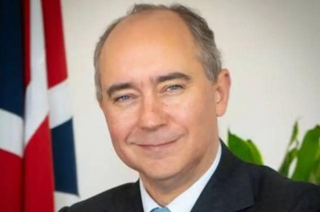

# 英大臣5年来首次正式访香港，专家：看到欧洲与中国走近，英不甘落后

【环球时报驻英国特约记者纪双城环球时报特约记者燕东海环球时报记者王佳琳】英国商业和贸易部国务大臣多米尼克·约翰逊8日抵达香港，展开为期2天的访问。路透社称，这是五年来英国高级官员首次正式访问香港。不过，英国国内有些人却对约翰逊的香港之行颇有微词，认为这是向中国“卑躬屈膝”。中国人民大学国际事务研究所所长王义桅10日接受《环球时报》记者采访时表示，现在的英国一直在所谓安全意识及市场规律之间摇摆，因此约翰逊此次访港可以视作英国钟摆效应的一个回摆，也属于一个试探动作。至于未来中英关系的进一步发展，需看英国实际的行动。

_英国贸易大臣多米尼克·约翰逊
资料图_

据路透社报道，约翰逊8日发推文称，他此次访港是为了促进英国成为香港投资和贸易的主要目的地。据了解，香港特区政府财经事务及库务局局长许正宇与商务及经济发展局长丘应桦均与约翰逊有过会晤。在会晤中，许正宇欢迎包括英国在内的各个经济体到香港和粤港澳大湾区发掘及拓展商机，并表示各个领域的合作都不应该受政治因素阻碍。他强调，香港回归后，英方在《中英联合声明》中的权利及义务已全部履行完毕，英方对香港并无主权、治权及监督权，不存在任何所谓“责任”。

香港《南华早报》9日刊登了约翰逊的署名文章。他在文章中表示，香港的成功和经济实力很大程度上归功于“高度自治”。繁荣的香港对中国、英国和世界都有好处。英国政府已确定了一个对中国一致、连贯和稳健的政策方向，将继续与中国和中国香港保持积极和建设性的接触，因为我们的利益是一致的。不过，他在行前讲话和文中都扬言，英国不会对香港“自由受损”视而不见。

对于英国官员访港一事，香港特首李家超9日表示，欢迎任何国家官员来港交流。他同时指出，有些国家出于政治因素，做出一些举动来满足自身政治利益，希望大家能实事求是，合作推动好政策，让双方关系循着正途发展。

约翰逊访港招致英国保守党人的非议。前保守党领袖邓肯·史密斯批评约翰逊的香港之行“令人难堪”，并称“这是‘跪地磕头’工程”。但同时积极的声音亦在英国占据重要地位。英国外交大臣克莱弗利上月借出席伦敦金融城复活节庆祝活动晚宴的机会，呼吁与中国建立“稳健和建设性”的新型双边关系，而非在一场所谓的“新冷战”中孤立中国。卫生大臣尼尔·奥布赖恩则认为，在保持警惕的同时，保持与中国的外交关系非常重要。“我喜欢我们总是和他们交谈。就像苏联存在时我们所做的那样，我们必须继续与他们对话。”

北京外国语大学国际关系学院教授王朔10日告诉《环球时报》记者，此次约翰逊到访香港正是克莱弗利表态的后续。英国看到整个欧洲都在与中国走近，自己也不甘落后。王朔说，欧洲很多国家都有内部政治分化的状况，而英国政党分裂斗争则表现得更为激烈，在各自背后利益的驱使之下，“中国问题”变成了炒作工具。对华合作派希望英国加强与中国的合作，而亲美派也有自己的利益。目前，英国对华始终没有找到一个较为成熟的战略思维，所以经常还在“对手”与“伙伴”的身份上摇摆。

王朔表示，中英之间的关系务实性较强，贸易投资合作空间非常大，且竞争关系非常少，双方有不错的合作前景。但英国在“脱欧”之后，更加依赖美国，已经被美国绑在围堵中国的战车上。所以在未来，还会有声音推动中英合作，中国只要有机会，英国还会来，但这种正常的经贸活动一定会受到泛政治化的反复影响，不断受到中美之间政治关系的冲击。

