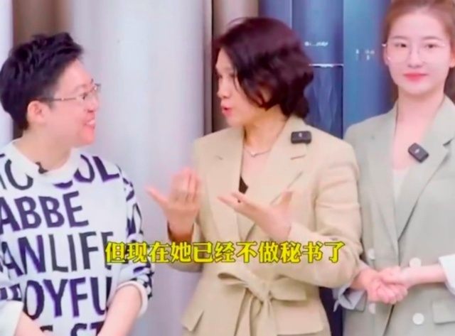

# 董明珠“接班人”孟羽童回应离职：此前的言论与格力无关，将继续读书

5月11日，孟羽童在社交平台上发视频称：我已经从格力顺利毕业了，没必要把这一件事当成消极的事情，它只是我们人生中的某一个阶段的选择而已。

至于“靠别人不如靠自己”的言论，孟羽童表示是看到了亲密关系的帖子有感而发，觉得女孩子一定要自立自强，完全没有说公司的意思。

“我当然知道没有格力的平台，没有董总，我什么都不是。刚毕业，普普通通的学生就来到了格力这么好的平台。有很多成长空间和机会，又受到了很多关注。”孟羽童说。

孟羽童称自己是发自内心的感激。“最重要的是在董明珠身边工作，不光是教会了我怎么去做事，更教会了我怎么去做人”。

孟羽童还称自己下一个阶段的任务是继续去读书，申请研究生了。

最后，孟羽童回忆起刚刚来到格力面试的心情，“记得小工位、第一张名片、第一场直播和第一次接待、第一次对接媒体和第一次主持发布会”，孟羽童说，直播前的紧张焦虑，第一次和老板出差的期待兴奋，自己第一次做大项目落地的成就感，也会记得作为格力人深深的骄傲和自豪。

“会记得刚入职董总跟我说的话，也会记得刚毕业时22岁那个眼里有光的自己。江湖路远，山高水长，我们人生的下一个阶段再见。”孟羽童说。

5月9日，有网友发现格力直播间和视频号删除了孟羽童的视频，“明珠羽童精选”也已经改名为“格力明珠精选”。该直播间曾经的头像是董明珠和孟羽童的合照，而现在头像只剩董明珠一人。

当日，孟羽童曾发文称，“我的人生信条：靠别人永远不如靠自己。”

据蓝鲸财经4月7日报道，在明珠羽童精选直播间。董明珠表示，“羽童刚来的时候在我身边做秘书，但是她现在已经不做秘书了，她现在做视频去了”。

董明珠称，孟羽童找到了自己喜欢合适的岗位。“因为她很幸运是一眼被我认识了，我是希望能把她培养起来，但她后来觉得自己更喜欢做自己热爱的事情。那我说你先到直播去体验去。”

据媒体报道，孟羽童曾两次对外表示，工作强度太大。其中，今年4月初，她曾表示，已经连续两个月没有完整休息的周末；4月16日则提到，当天工作时长超过21个小时。

孟羽童在被保送进入浙江大学之后，曾多次参与综艺节目。

2021年7月，在《初入职场的我们》节目中，孟羽童获转正名额，并得到董明珠盛赞， **称其符合接班人标准。** 最终，也被董明珠收入麾下，成为她的秘书。

2021年12月，一段格力电器董事长董明珠和秘书孟羽童一同现身中国制造业领袖峰会的视频曾引发人们关注和热议，董明珠在活动现场表示，
**“要将孟羽童培养成第二个董明珠。”**

关于此事，网友议论纷纷，也有几次传出孟羽童被解雇的消息，而她和董明珠均予以否认。

不过，再三地否认，也并未打破公众的疑虑。

当当创始人李国庆曾在一次直播中直言：“这是一场炒作，目的是为了直播带货，孵化自己的网红。”

**【来源：九派新闻综合当事人账号、红星新闻、蓝鲸财经、央视财经、九派财经】**

