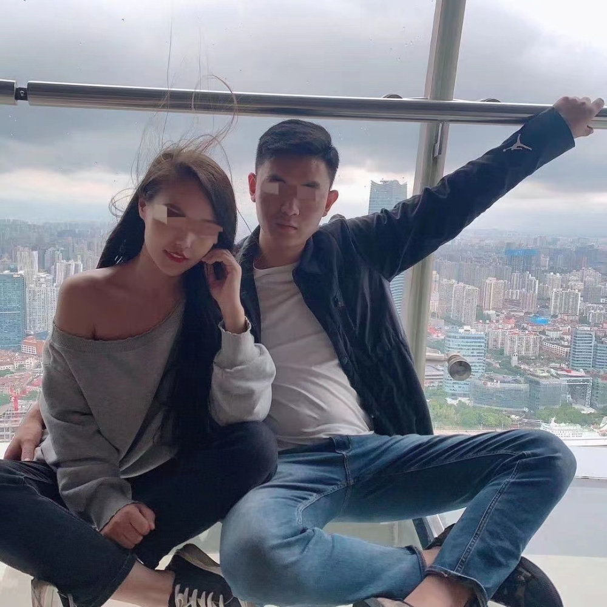

# 重庆姐弟坠亡案二审判决书：15条上诉理由及辩护意见，法院均不予采纳

5月11日上午，重庆市高级人民法院对张波、叶诚尘故意杀人上诉一案进行二审公开宣判：裁定驳回上诉，维持原判，对张波、叶诚尘的死刑裁定依法报请最高人民法院核准。

_张波（左）、叶诚尘_

澎湃新闻获得的该案二审判决书共有46页，其中重庆高院就张波、叶诚尘及辩护律师提出的15条上诉理由和辩护意见一一回应，均不予采纳。

如关于叶诚尘的辩护人提出叶诚尘有家族精神病史，叶诚尘本人患有精神分裂症的辩护意见，重庆高院认为，叶诚尘具有现实的作案动机和自我保护意识、反侦查意识，庭审中精神状态正常，思维清晰，且完成了大专文化教育并在企业中工作，故该辩护意见不能成立。

关于叶诚尘提出杀害二被害人是张波提出的，其没有多次催促和逼迫张波作案的上诉理由，重庆高院认为，叶诚尘得知张波育有子女后仍与张波交往，多次催促和威逼张波实施杀人行为、案发前一天因张波未作案而心生不满的事实，有客观证据微信聊天记录、张波在侦查、审查起诉、一审阶段的供述以及叶诚尘在侦查阶段的供述等证据证实，证据确实、充分，足以认定。

关于张波、叶诚尘的辩护人提出原判认定张波构成故意杀人罪事实不清、证据不足，本案不能排除有其他人作案或意外高坠合理怀疑的相关辩护意见，重庆高院认为，张和叶的微信聊天记录、张波供述、现场勘验及相关鉴定、证人证言等证据相互印证，足以认定张波直接实施了杀死二被害人的行为，足以排除其他人作案或意外高坠的合理怀疑。

**以下是二审判决书中重庆高院对张波、叶诚尘上诉理由及律师辩护意见的评判：**

**1、关于二上诉人及其辩护人提出公安人员存在刑讯逼供、疲劳审讯、诱供等违法取证行为的相关上诉理由和辩护意见。**

经查，讯问张波、叶诚尘的同步录音录像显示，二人在讯问过程中神情自然，公安人员没有殴打、威胁等非法取证行为，讯问结束后，二人对讯问笔录自行核对修改并签名摁印予以确认，叶诚尘的讯问笔录上还有其亲笔修改的痕迹并摁印予以确认。张波在侦查阶段的供述与批准逮捕、审查起诉和一审期间的供述基本一致，二人的供述彼此对应，与在案的其他主客观证据相印证，也与通过技术手段恢复的微信聊天记录相吻合。

本案侦查程序合法，公安机关对叶诚尘调换羁押场所符合规定，没有安排相关人员在看守所监舍内对叶诚尘实施诱供。综上，二上诉人在侦查阶段的供述可以作为定案依据，上述上诉理由和辩护意见均不能成立，本院不予采纳。

**2、关于上诉人张波的辩护人提出公安人员使用《传唤证》对张波非法拘禁的相关辩护意见。**

经查，公安人员于 2020年11月10日 18 时至次日
15时将张波传唤到办案地点进行讯问、传唤时间未超过24小时的事实有经张波签名摁印确认的《传唤证》《讯问笔录》等证据证实。公安人员的上述传唤行为符合《中华人民共和国刑事诉讼法》第一百一十九条的规定。该辩护意见不能成立，本院不予采纳。

**3、关于二上诉人的辩护人提出手机提取程序严重违法，涉案手机及对手机作出的《检验报告》、 手机搜索记录应当予以排除的相关辩护意见。**

经查，案发当日，公安机关以张波涉嫌过失致人死亡立案侦查。次日，公安人员对张波进行调查中发现张波案发当日行为异常，且张波与其女友叶诚尘的微信聊天记录全部删除，不符合常理，通过查看张波的手机发现其曾通过手机搜索过“2娃同时摔到楼地”的内容，遂对张波的手机进行提取扣押，并对随后通知前来接受调查的叶诚尘的手机进行提取扣押，符合《中华人民共和国刑事诉讼法》第一百四十一条“在侦查活动中发现的可用以证明犯罪嫌疑人有罪或无罪的各种财物、文件应当查封、扣押”的规定。虽公安机关扣押张波、叶诚尘的手机没有出示《扣押决定书》并让二人签名确认，扣押程序存在瑕疵，但公安人员制作了《提取及封存笔录》并全程录音录像，二人未表示异议并签名确认。在没有见证人的情况下，对相关侦查活动进行全程录音录像证明合法性符合法律规定。公安人员提取叶诚尘手机时未对其进行人身搜查，由男性公安人员提取不违反法律规定。《最高人民法院关于适用

**4、关于上诉人张波的辩护人提出第一次讯问时没有让张波阅读《犯罪嫌疑人诉讼权利义务告知书》的相关辩护意见。**

经查，2022年11月11日张波在《犯罪嫌疑人诉讼权利义务告知书》上勾选了“本权利义务告知书我已看过”的选项并签名摁印。该辩护意见不能成立，本院不予采纳。

**5、关于上诉人张波的辩护人提出审查起诉阶段公诉人讯问张波时没有进行同步录音录像，该笔录不能作为定案证据的相关辩护意见。**

经查，《中华人民共和国刑事诉讼法》第一百二十三条关于对讯问过程录音或录像的规定，是针对侦查人员在侦查阶段讯问犯罪嫌疑人作出的要求，相关法律或者司法解释对公诉人在审查起诉阶段讯问被告人，并未要求必须进行录音或者录像。上诉人张波在审查起诉阶段的供述与其侦查阶段、一审期间的供述基本一致，可以作为定案依据。该辩护意见不能成立，本院不予采纳。

**6、关于上诉人张波的辩护人提出未对张波适用认罪认罚从宽程序严重侵犯其诉讼权利的相关辩护意见。**

经查，张波在侦查阶段签字确认的《犯罪嫌疑人诉讼权利义务告知书》和审查起诉阶段签字确认的《认罪认罚从宽制度告知书》中，均明确犯罪嫌疑人或被告人如实供述自己罪行可以依法从宽处理的法律后果。最高人民法院、最高人民检察院、公安部、国家安全部、司法部《关于适用认罪认罚从宽制度的指导意见》第五条明确规定认罪认罚从宽制度是可以适用，而非一律适用，由司法机关根据案件具体情况决定。本案中原公诉机关经审查本案犯罪的事实、性质、情节、后果等，决定对张波不适用认罪认罚从宽制度，符合法律规定。故上述辩护意见不能成立，本院不予采纳。对辩护人调取重庆市人民检察院第五分院对张波不适用认罪认罚制度、不予从宽处理的决定书的申请，依法予以驳回。

**7、关于上诉人张波的辩护人提出公安机关、检察机关和一审法院均剥夺张波获得辩护的法定诉讼权利的相关辩护意见。**

经查，二审中，相关证据证实，2020年12月1日张波的母亲刘维华委托黄鹏和段晓行律师作为张波的辩护人，黄鹏于2020年12月3日、17日、18日到看守所会见张波，2021年1月29日解除委托，《解除法律事务委托合同协议书》于2021年5月27日盖章，期间张波告知原公诉机关已委托辩护人，原公诉机关曾经联系过黄鹏，黄鹏未向原公诉机关提交辩护意见。相关证据证实，郎小丽于2017年取得执业资格，之后办理过刑事案件，2021年5月28日接受重庆市渝中区法律援助中心的指派为张波提供法律援助，郎小丽律师查阅了本案证据材料，会见了张波，并出庭为张波进行了辩护。《中华人民共和国刑事诉讼法》第三十五条第三款规定“犯罪嫌疑人、被告人可能被判处无期徒刑、死刑，没有委托辩护人的，人民法院、人民检察院和公安机关应当通知法律援助机构指派律师为其提供辩护”，本案侦查阶段张波的亲属为其聘请了律师，审查起诉阶段张波告知检察官已经聘请了律师，张波在一审期间未委托辩护人，一审法院依法通知法律援助机构为其指定了辩护人，其一审辩护人向一审法院递交了律师证复印件进行查验，并通过阅卷、会见和出庭为张波进行了辩护，保障了张波的诉讼权利。故上述辩护意见不能成立，本院不予采纳。对辩护人要求相关人员出庭作证的申请依法予以驳回。

**8、关于上诉人张波的辩护人提出一审法院没有通知张波参加庭前会议侵犯其诉讼权利的相关辩护意见。**

经查，《最高人民法院关于适用

**9、关于上诉人叶诚尘的辩护人提出一审没有告知被告人审判委员会成员违反回避相关规定，应当发回重审的相关辩护意见。**

经查，一审庭审中，审判长根据《中华人民共和国刑事诉讼法》第一百九十条的规定，向二被告人宣布了合议庭组成人员、书记员、法官助理、公诉人、辩护人等名单，并告知其可以申请合议庭组成人员、书记员、公诉人、鉴定人和翻译人员回避，且经审查一审法院审判委员会委员不具有《中华人民共和国刑事诉讼法》第二十九条规定的自行回避情形，一审没有违反回避的相关法律规定。故该辩护意见不能成立，本院不予采纳。

**10、关于上诉人叶诚尘的辩护人提出叶诚尘有家族精神病史，叶诚尘本人患有精神分裂症，不具有完全刑事责任能力，申请对其进行精神病鉴定的相关辩护意见。**

上诉人叶诚尘的辩护人在二审庭审中举示的叶诚尘奶奶的《救助证》、《医学诊断证明书》、《病危通知书》《门诊病历》、证人的询问笔录、叶诚尘姑母的《门诊病历》、《处方》、《抑郁自评量表报告》、《简明精神病量表报告》、《焦虑自评量表报告》、《入院记录》、《病程记录》、手术相关记录、出院相关资料、左手小指伤情图片、证人的调查笔录，拟证明叶诚尘有家族精神病史。经查，首先，上述门诊病历等虽诊断叶诚尘奶奶和姑母患精神分裂症，但同时建议二人到精神专科医院就诊，说明前述诊断并不具有权威性，且叶诚尘奶奶和姑母到上述医院门诊就诊的时间均在本案二审立案之后，前述证据不能证明叶诚尘家族有精神病史。其次，叶诚尘与张波案发前长达数月的微信聊天记录未反映叶诚尘有精神异常之处，叶诚尘长时间与张波共谋并精心策划杀害张波的二名亲生子女，且在与张波微信聊天中还提醒张波撤回信息。案发后叶诚尘删除了其与张波的微信聊天记录，到案后前三次供述均否认犯罪事实。叶诚尘具有现实的作案动机和自我保护意识、反侦查意识。再次，叶诚尘在侦查、审查起诉阶段及一审、二审庭审中，精神状态正常，情绪稳定，思维清晰，回答问题切题。最后，叶诚尘完成了大专文化教育，案发前一直在企业中从事财务工作，其父母和朋友的证言均未提及叶诚尘具有精神方面的疾病或者家族有精神病遗传史。综上，现有证据足以证实叶诚尘作案前后精神正常，具备正常的控制能力和辨认能力，具有完全刑事责任能力。故上述辩护意见不能成立，本院不予采纳。对辩护人提交的上述证据，本院不予采信，并依法驳回其对叶诚尘进行精神病鉴定的申请。

**11、关于上诉人叶诚尘提出原判认定事实不清，张波在已婚并育有子女的事实上对其进行了欺骗，其得知真相后并没有继续与之交往，杀害二被害人是张波提出的，其没有多次催促和逼迫张波作案，案发前一天也没有因为张波未作案而不满，案发当天其曾劝张波放弃伤害孩子的相关上诉理由；上诉人叶诚尘的辩护人提出案发时叶诚尘主动提到“算了嘛”，意图让张波放弃实施犯罪的辩护意见。**

经查，原判认定叶诚尘得知张波育有子女后仍与张波交往，多次催促和威逼张波实施杀人行为、案发前一天因张波未作案而心生不满的事实，有客观证据微信聊天记录、张波在侦查、审查起诉、一审阶段的供述以及叶诚尘在侦查阶段的供述等证据证实，证据确实、充分，足以认定。张波、叶诚尘相互推诿系对方提起杀人犯意，且二人的微信聊天内容及在案其他证据亦不能证实谁先提出犯意，故认定犯意的提起系张波或叶诚尘的证据均未达到确实、充分的证明标准，原判认定叶诚尘与张波共谋杀害二被害人符合证据裁判原则。微信聊天记录证实叶诚尘杀死二被害人的犯意非常坚决，强调必须将两个被害人一起杀害，叶诚尘关于案发当天曾劝张波放弃实施犯罪的辩解，没有其他证据印证，且与证实叶诚尘多次催促和威逼张波作案案发当日13时41分许仍通过微信询问张波其母亲是否离开的证据相矛盾。故该上诉理由及辩护意见均不能成立，本院不予采纳。

**12、关于上诉人张波的辩护人提出原判不予认定叶诚尘以割腕和跳楼自杀威逼张波作案的事实，变相加重张波罪责的相关辩护意见。**

经查，原判根据叶诚尘手腕伤痕的情况，结合其多次供述的内容，认为叶诚尘案发时以割腕自杀相威胁的证据尚未达到确实、充分的证明标准，因此未认定该事实，这是基于对在案证据的综合审查判断作出的认定，符合证据裁判原则。关于叶诚尘以跳楼自杀威逼张波作案，除了张波自己的说法以外，没有其他证据相佐证，反之在案证据证实了张波为实施犯罪积极创造条件，并趁其母亲外出之机杀害二被害人。此外，原判明确认定了叶诚尘通过其他言行威逼张波实施犯罪，张波作为心智正常的成年人，与叶诚尘共谋后亲自实施杀害两名亲生幼童，叶诚尘是否以自杀相威逼，均不影响其罪责。故该辩护意见不能成立，本院不予采纳。

**13、关于二上诉人的辩护人提出原判认定张波构成故意杀人罪事实不清、证据不足，本案不能排除有其他人作案或意外高坠合理怀疑的相关辩护意见。**

经查，案发前张波曾通过手机搜索过“2娃同时摔到楼地”的内容。微信聊天记录证实张波、叶诚尘为扫清障碍以达到结婚的目的，多次共谋策划将张某甲接到张波家中，以便让张波同时将两名幼童杀死，叶诚尘为此多次催促张波作案，并限定作案时间。张波在侦查、审查起诉及一审阶段供认其将两个孩子的双腿抱住同时从卧室飘窗处掀下楼的事实，与《现场勘验笔录》、DNA
鉴定结论、尸体检验鉴定结论证实飘窗窗台上有张波的赤足足印、飘窗处有两名被害人的掌纹痕迹、二被害人系高坠死亡等内容相印证，与证人证实两名被害人同时坠楼的内容相吻合。张波母亲的证言详细描述了案发当日其与二名被害人在家以及张波进出案发现场的过程，与事发楼栋监控视频相吻合，证实案发时除张波及二被害人外没有其他人在家中。张波及叶诚尘在二审之前从未提及案发现场还有第三人。上述证据相互印证，足以认定张波直接实施了杀死二被害人的行为，足以排除其他人作案或意外高坠的合理怀疑。二审庭审中张波关于吃了感冒药记不清楚是否还有其他人在场、记不清楚其听见二名被害人坠楼后前往次卧室过程中是否看见有其他人在场的辩解，明显不符合常理。故该辩护意见不能成立，本院不予采纳。对辩护人要求对案发现场原物提取的毛发、皮鞋鞋印、张波案发前服用的感冒药成分进行鉴定以及对死者张某甲头部的伤情进行侦查实验的申请，依法予以驳回。

本院认为，上诉人张波和上诉人叶诚尘共同故意非法剥夺他人生命，致二被害人死亡，其行为均已构成故意杀人罪。张波与叶诚尘为扫清结婚障碍，二人积极共谋后，决定采用制造意外高坠的方式杀害张波的两名子女，张波从15楼飘窗窗台将正在此玩耍的二被害人掀出窗外坠亡，直接实施故意杀人行为，叶诚尘积极出谋划策，催促和逼迫张波作案，并为张波限定最后作案期限，最终促使张波直接实施杀人行为，二上诉人在共同犯罪中的地位、作用相当，均系主犯。

**14、关于上诉人张波的辩护人提出张波系不作为的间接故意杀人的相关辩护意见。**

经查，张波案发前与叶诚尘积极共谋杀害二被害人，为创造作案机会，先后两次将被害人张某甲接到家中，作案时双手抱住二被害人双腿从15楼掀出窗外，致二被害人高坠身亡，其行为属于积极追求被害人死亡的直接故意杀人，故该辩护意见不能成立，本院不予采纳。

关于上诉人张波的辩护人提出张波具有自首的相关辩护意见。经查，公安人员出具的《抓获经过》证实，在对张波和叶诚尘的手机送检后，恢复了微信聊天记录，发现二人有重大作案嫌疑，公安人员通过电话假意通知二人到派出所领取手机，之后将二人抓获。张波不具有自动投案情节，不构成自首。故该辩护意见不能成立，本院不予采纳。

**15、关于二上诉人及其辩护人提出原判对张波、叶诚尘量刑过重的相关上诉理由和辩护意见。**

经查，张波婚内出轨，叶诚尘明知张波已婚并育有子女，仍与之交往，并多次表示不能接受张波的子女，二人为扫清障碍达到结婚的目的，积极谋划采用制造意外高坠的方式杀害张波的两名亲生子女。张波罔顾人伦、泯灭人性，将自己无辜的亲生子女从15楼掀下，直接实施杀人行为，造成二名无辜稚子惨死，叶诚尘以自己和家人不能接受张波有小孩为由，泯灭人性、丧尽天良，多次催促张波杀死张的两名子女，尤其是在张波犹豫不决的情况下，又以家人不同意二人在一起、分手、不见面等威胁逼迫张波实施杀人行为，并为张波限定最后的作案期限，其主观心态上积极追求二被害人死亡结果的发生，急迫性更甚于张波，对促成张波直接实施杀人行为起到支配、决定性作用。案发后，张波在坠楼现场撞墙痛哭，以掩盖其罪行，并与叶诚尘一起将二人的微信聊天记录删除、统一口径，妄图逃避罪责。二审期间，张波当庭翻供否认其犯罪事实，叶诚尘避重就轻，逃避罪责，二人毫无悔罪之意。张波虽然多次表达了积极赔偿被害人亲属的意愿，但是没有任何实质性的赔偿行为，被害人亲属也明确表示坚决不接受任何赔偿。本案在网络上披露后，引发社会公众高度关注，对二上诉人的行为予以强烈谴责。张波、叶诚尘共同故意杀死张波的二名年幼子女，罔顾国法天理人情，严重挑战法律和伦理底线、践踏社会良知，其作案动机特别卑劣，作案手段特别残忍，犯罪情节特别恶劣，犯罪后果极其严重，主观恶性极深，社会影响极坏，对此种严重侵害未成年人权益、严重侵犯人民群众生命安全、严重危害社会治安秩序的犯罪，依法均应严惩，原判根据张波、叶诚尘犯罪的事实、性质、情节和对社会的危害程度以及二人在共同犯罪中的地位和作用，对二上诉人的量刑适当。故该上诉理由和辩护意见不能成立，本院不予采纳。

