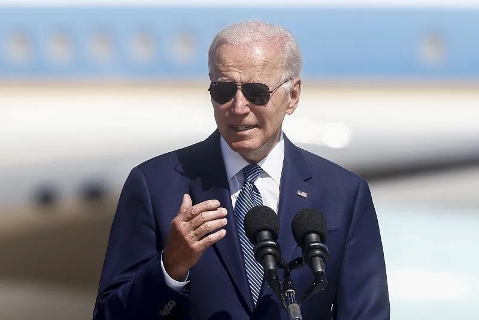
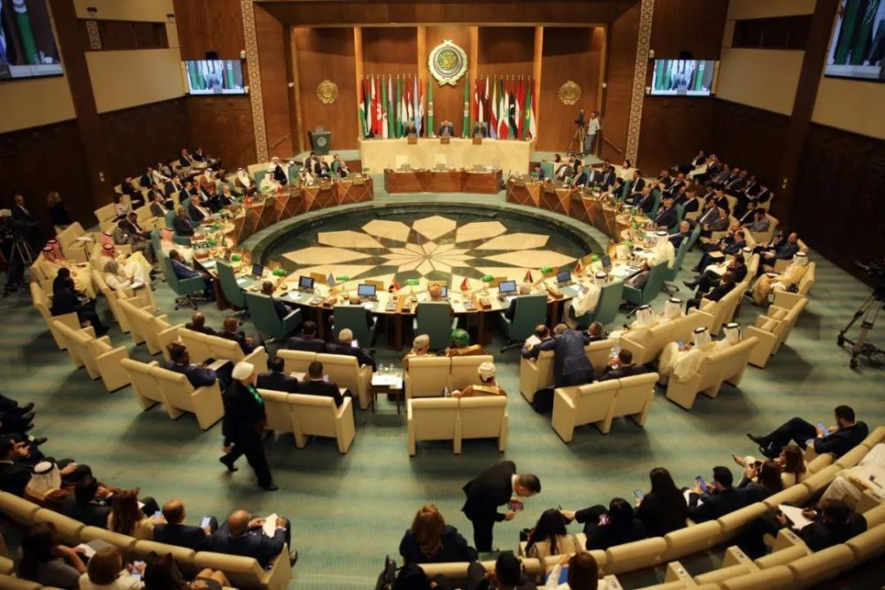

# 针对中国，美国在中东又组建一个“小集团”

一边要在中东“大搞基建”，一边又干预中东国家和解进程，连日来，美国在中东地区事务上频刷存在感，凸显其战略焦虑。

值得注意的是，这其中又有着“抗衡中国影响力”的算计。

美国Axios新闻网透露，当地时间5月7日，正在沙特访问的美国总统国家安全事务助理沙利文，与沙特、阿联酋和印度的负责安全事务的高官会面，其中一项议题，是一个大型的联合基础设施建设项目。

_沙利文资料图。图源：视觉中国_

报道称，这一项目将通过铁路网连接中东地区的阿拉伯国家，并将通过该地区港口的航道连接到印度。

“尽管没有人大声说出来，但从第一天起，（这个设想）就是针对中国的。”一名参与了该项目早期讨论的前以色列高级官员说。

报道还指出，中东是中国共建“一带一路”倡议的关键部分，随着中国在中东地区影响力的增加，该项目是白宫在中东推动的关键举措之一。

长安街知事（微信ID：Capitalnews）注意到，该基建项目背靠的是美国在中东组建的又一个“小集团”——“I2U2集团”，外界将其视为中东地区的“四方机制”。

I2U2成立于2021年10月，成员包括印度、以色列、阿联酋和美国。去年7月，美国总统拜登上任后首次访问中东，并召开了“I2U2集团”第一次领导人会议。

_2022年7月，拜登访问中东。图源：视觉中国_

会后的联合声明称，“I2U2集团”为美、印、阿、以四国特殊的长期战略伙伴关系，聚焦水资源、能源、交通、空间、卫生健康和粮食安全等优先领域的联合投资和新举措，并优先关注促进中东和南亚地区内部和之间的经济合作。

对于“I2U2集团”的前景，沙利文5月4日在演讲中表示，要通过发展经济、技术和外交，将南亚、中东和美国连接起来，已有多个项目正在推进，数月内将迈出新的一步。

一段时间以来，美方试图在全球推动基建计划，以抗衡中国的“一带一路”倡议，中东也不例外。

阿拉伯国家地处“一带一路”交汇地带，是历史上丝路文明的重要参与者，也是共建“一带一路”的天然合作伙伴。

目前，中国已同21个阿拉伯国家及阿盟签署“一带一路”合作文件，中阿在基建、能源等领域实施了200多个大型项目。2022年，中国同中东国家贸易额达到5071.52亿美元。

更受到阿拉伯国家广泛认同的是，中方明确提出，在中东不找代理人、不搞势力范围、不谋求填补真空。

相较之下，美国长期在中东搞“长臂管辖”，不断挑动分裂，煽动颜色革命，试图“以乱谋利”。

今年2月土叙大地震发生后，美国单边制裁直接阻碍了叙利亚72小时黄金救援，令当地灾情雪上加霜。

近日，叙利亚重返阿盟，外界认为这是继沙特与伊朗在北京握手言和之后，中东和解进程的又一里程碑事件。

而美方却谴责阿拉伯国家联盟重新接纳叙利亚，称美不会同巴沙尔政权实现关系正常化，也不支持盟友伙伴采取此类行动。美方同时宣布，自5月11日起，把对叙利亚的单边制裁措施再延长一年。

_阿盟7日在开罗举行的外长级特别会议上决定，同意恢复叙利亚的阿盟成员国资格。图源：新华社_

一段时间以来，美国在中东地区动作不断——轰炸叙利亚境内的伊朗军事设施、派中央情报局局长伯恩斯秘访沙特并施压，在中东部署核潜艇，挑动本已紧张的巴以局势……

“虽然中东地区各方之间存在诸多矛盾，但所有地区国家都希望有一个安全的地区环境。”卡塔尔大学国际关系学院教授凯尔·迪巴特指出，所有地区国家都向往和平与发展，一个没有动乱的中东是所有中东人民的期望。

中东不是谁家的后院，“以乱谋利”也不会长久，美国与其打着基建旗号在中东“抗衡中国影响力”，不如反思其中东政策走向失败的真正原因。

