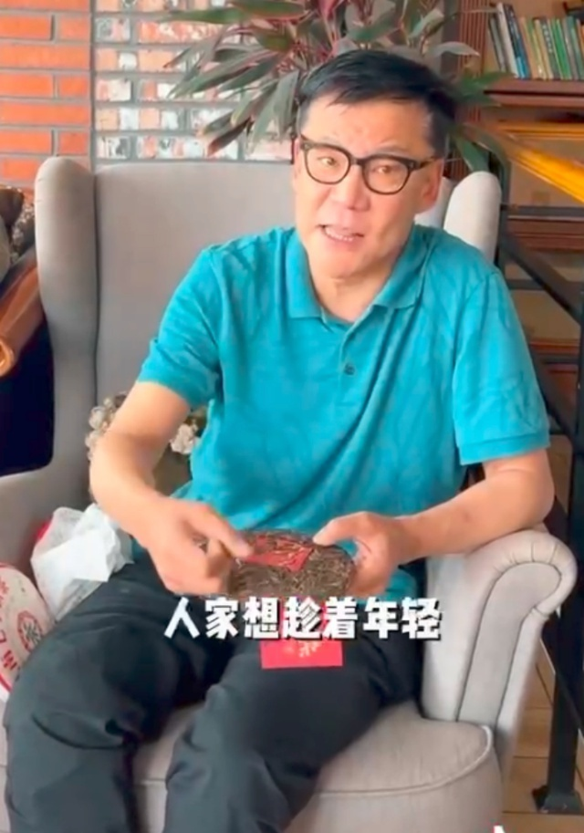
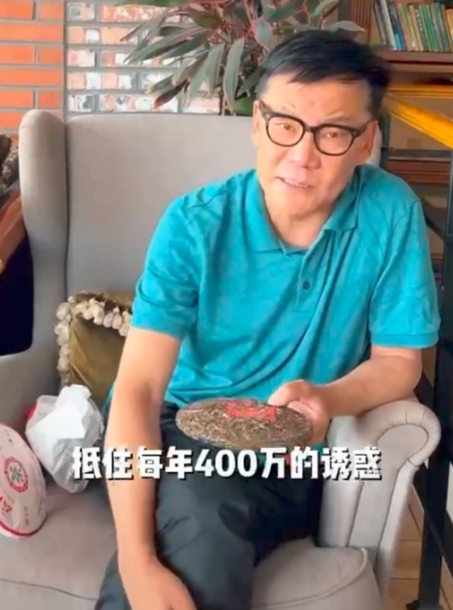
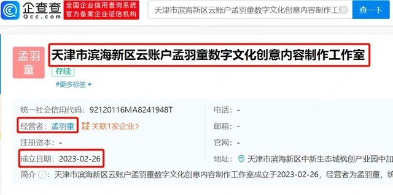
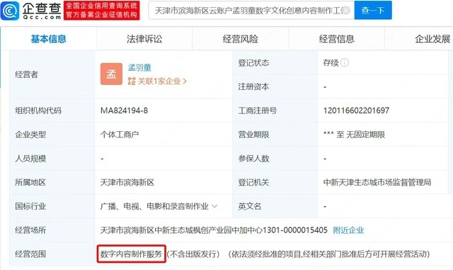

# “董明珠接班人”孟羽童在格力月薪没过万，李国庆称其离职是为赚钱

近日，曾被视为“董明珠接班人”的孟羽童离职格力，引发热议。

5月12日，据界面新闻报道，孟羽童在视频中透露了薪资情况，“其实我的工资和格力应届大学生的水平是一样的，基本上在五千到一万块钱这个区间内。”

此前外界曾传言董明珠对其开出了百万年薪，但只有12万元为基础薪资，其余则是绩效与销售达标后的效益工资。她在视频中否认了百万年薪的说法。

11日，李国庆曾发表对孟羽童离职的看法：她离职是早晚的事，培养孟羽童是董明珠的一厢情愿，当格力的管理层对孟羽童来说职业定位发生了扭曲。

“孟羽童怎么想啊？‘下一个董明珠’怎么也得熬8年，至少3个部门轮岗。格力那种销售铁军不见得是孟羽童能扛得住的。就算她能扛得住，孟羽童没有董明珠，已经上了三四个节目了。”李国庆说。

李国庆还称赞孟羽童是一个网红的好胚子，“人家想趁着年轻、天生丽质，把自己的IP打造出来，来赚钱。”

目前已经有MCN公司找孟羽童签约，以孟羽童的账号签她保底每年400万。李国庆称，“小姑娘就想了，是继续在格力当管培生熬8年，还是到外面去？每年400万的诱惑还可能变2000万，所以这是孟羽童的选择。”

5月10日，格力电器方面就旗下直播间“明珠羽童精选”更名为“格力明珠精选”一事，回应称“孟羽童已离开，不在公司任职。”并表示，人员流动很正常，感谢外界关心。

5月11日上午，孟羽童发布视频回应离职：已经从格力顺利毕业了，将准备申请研究生，继续读书。

据企查查显示，疑似孟羽童成立个人工作室，经营范围包含内容制作。

孟羽童1998年出生，毕业于浙江大学西班牙语专业，曾多次参加综艺节目。2021年7月，孟羽童在《初入职场的我们》节目中得到董明珠盛赞，称其符合接班人标准。最终，孟羽童获得转正名额，并正式入职格力，成为董明珠的秘书。

2021年12月，董明珠在活动现场表示，要将孟羽童培养成第二个董明珠。“也许她有一天真的能接我的位置。”

而入职后，孟羽童也曾多次被曝从格力离职。

2022年11月，有传闻称孟羽童被移出公司通讯录，董明珠对此回应时说，“最近羽童在网上‘被黑’，天天被人说被炒掉了，大家放心，羽童每天都在成长。”孟羽童也附和称：“还在（格力）打工呢。”孟羽童还曾在社交平台发文辟谣：“谁再说我离职了，我真的会揍人。”

对于董明珠与孟羽童，当当创始人李国庆曾在一次直播中直言：“这是一场炒作，目的是为了直播带货，孵化自己的网红。”

**【来源：九派新闻综合界面新闻、当事人账号、九派财经、红星新闻】**

