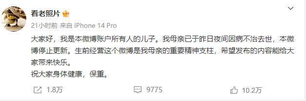
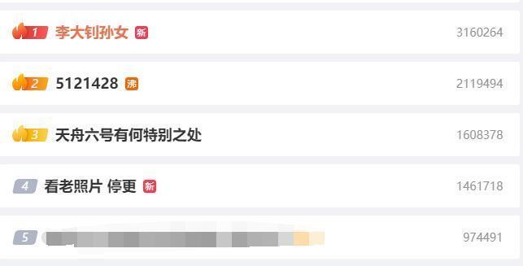
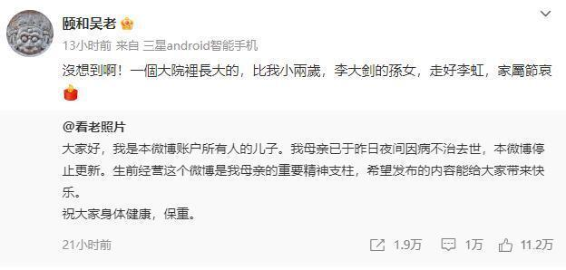
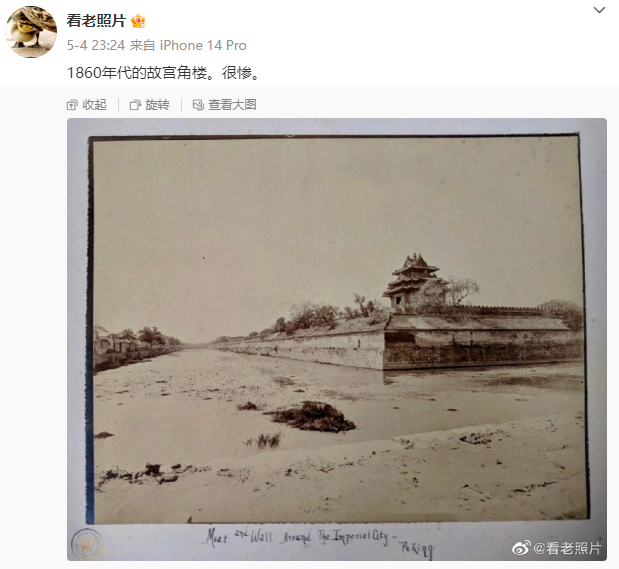
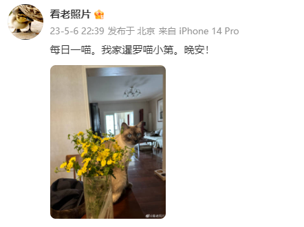
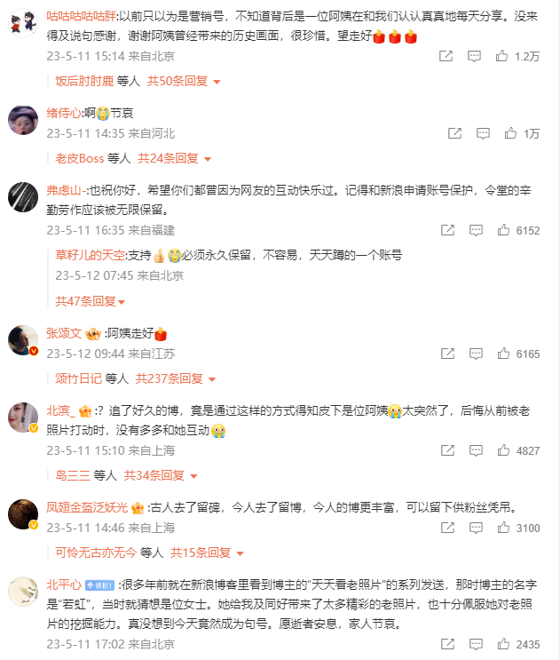

# “谢谢阿姨让我们看到历史” 李大钊孙女李虹微博“看老照片”停更

12日上午，#李大钊孙女#、#看老照片 停更#冲上热搜前五——而这背后却是同一件事。

由李大钊孙女李虹女士注册的历史类微博“看老照片”今天挂出了最后一条微博：

大家好，我是本微博账户所有人的儿子。我母亲已于昨日夜间因病不治去世，本微博停止更新。生前经营这个微博是我母亲的重要精神支柱，希望发布的内容能给大家带来快乐。

祝大家身体健康，保重。

截至5月12日上午11时，这条微博被转发1.8万次、留言9775条，点赞超过10万。而微博话题#李大钊孙女#、#看老照片
停更#则分列微博热搜榜的第一和第四位。

“沒想到啊！一个大院里长大的，比我小两岁，李大钊的孙女，走好李虹，家属节哀。”潮新闻记者联系上了微博网友“颐和吴老”，他向记者确认，“看老照片”账号的确是李虹的微博账号。

已经退休的“颐和吴老”在上世纪五六十年代曾与李虹在同一个大院生活，与李虹的哥哥比较熟悉。

“看老照片”从2010年3月19日加入微博，而“颐和吴老”则是在2011年1月8日加入微博，虽然两位老人都没有进行个人认证，但在后续的私信交流中，“颐和吴老”了解了“看老照片”就是李虹。

李虹，是李大钊幼子李光华的女儿。“看老照片”从2010年3月19日加入微博，已经发布了14943条内容。

微博认证科学科普博主“科学未来人”留言：大概知道阿姨为什么关注我，原来她是李大钊先生的孙女李虹女士。我曾经多次分享李大钊先生的相关老照片、当年媒体报道、其他档案资料。

从微博内容可以了解到，李虹每天分享主题是老照片和萌猫，而发布的时间大多在深夜。

老照片讲述历史，而萌猫负责说晚安。

在网友的留言中很多人都表达了对李虹的感谢。

“谢谢阿姨曾经带来的历史画面，很珍惜。”

“必须永久保留，不容易，天天蹲的一个账号。”

“很多年前就在新浪博客里看到博主的“天天看老照片”的系列发送，那时博主的名字是“若虹”，当时就猜想是位女士。她给我及同好带来了太多精彩的老照片，也十分佩服她对老照片的挖掘能力。”

“转载请注明出处”

