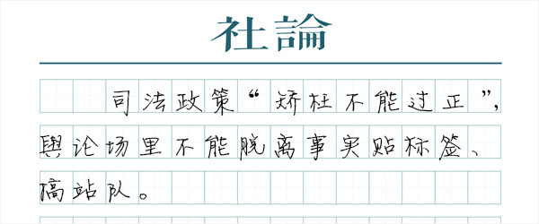

# “高铁掌掴”被定性为“互殴”引争议，媒体：司法政策矫枉不能过正

“高铁掌掴”事件因为被公安机关定性为“互殴”，引发了热议。之后，公安机关做出更详细的澄清，并且公布约4分钟的车厢监控和列车长执法监控视频，但是，关于“正当防卫”“互殴”以及“熊孩子”等的讨论，仍然热度不减。

的确，要反对动辄“各打五十板”的和稀泥式处理，要反对“谁伤重，谁有理”的倒果为因，要反对一刀切地将被打之后回击定性为“互殴”，要为公民行使正当防卫权留下合法空间……

这些关于正当防卫的道理都是对的，但是，具体的事件是不是能支撑起这些道理，还得回归事实、回归证据，而不是用贴标签、搞站队代替说理，别在不知不觉中被情绪绑架，也要警惕流量高热之下的“舆论陷阱”。

如果说，最早的事件信息还是让受众“看字说话”，那么，之后公布的视频则提供了更丰富的事件细节，纠正之前一些自媒体、大V的脑补和演绎。比如，前排女生从落座到和后面一家吵起来，只有3分钟时间，并不是之前网民想象的“熊孩子一路胡闹，熊家人不闻不问，前排女生忍无可忍”；女生还做出怼着孩子拍摄，并宣称“小朋友长这样子，你看啊”；以及，在孩子母亲率先做出道歉后，仍然以言语挑衅。就像律师所称，女生拒绝乘务员调解的建议，继续进行辱骂，具有“防卫挑拨”的性质。

最终事件升级：孩子母亲反手抽了前排女生的耳光，女生又打了对方耳光，并且在乘务人员在劝架时又打了对方。

孩子母亲先动手，明显违法，应受处罚，但是，女生的行动也很难概括成正当防卫，司法机关于“互殴”的定性，是有事实依据的，也是有法律依据的，并不是之前一些网友想象的还手就是“互殴”。

前不久，最高人民检察院、公安部印发《关于依法妥善办理轻伤害案件的指导意见》，其中既明确提出“双方均不能保持克制而引发打斗，对于过错的一方先动手且手段明显过激”，
一般应当认定为正当防卫，同时，也提出“故意挑拨对方实施不法侵害，借机伤害对方的”，一般不认定为正当防卫。

的确，之前发生不少正当防卫被严苛评价的个案，公众在辱母杀人案、昆山反杀案等案中强烈表达了希望全面激活正当防卫制度的想法，司法机关也明确表态“法不能向不法让步”。但是，司法政策“矫枉不能过正”，舆论场里不能脱离事实贴标签、搞站队。

特别是“熊孩子”“坏老人”“小仙女”等成为了刻板印象标签，随时随地成为搞站队、拉仇恨、拼撕扯的咒语，更需要所有人回归事实，放下陈见，就事论事，实事求是。正像一位法学教授所说的，教育就是让你走出知识的舒适区，学习接受自己先前不看惯的东西。对于公共事件也是如此，客观倾听而不是站队，观察事实而不是立场先行，理性思考而不是情绪发泄。

法治，不是和稀泥；鼓励公民正当防卫，但不是鼓励防卫挑拨。要说好“大道理”，也要回归“小事实”。

