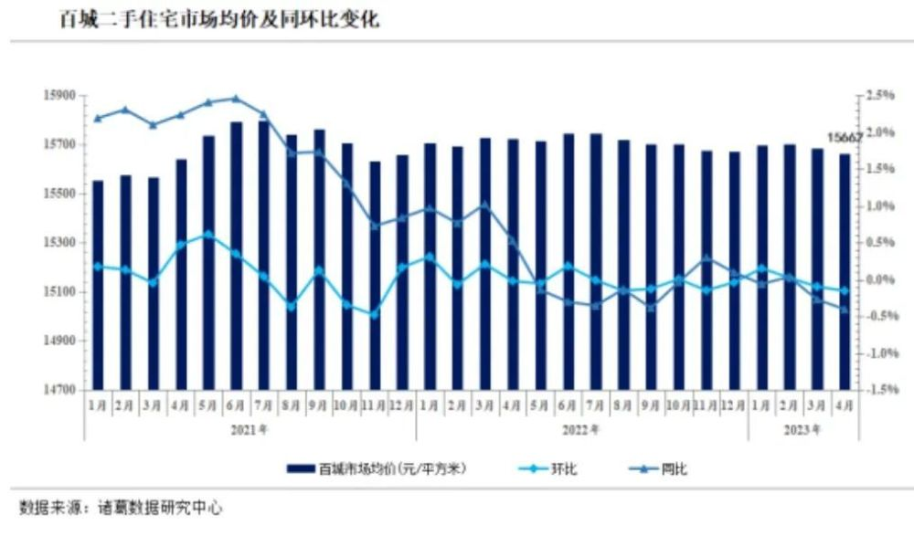
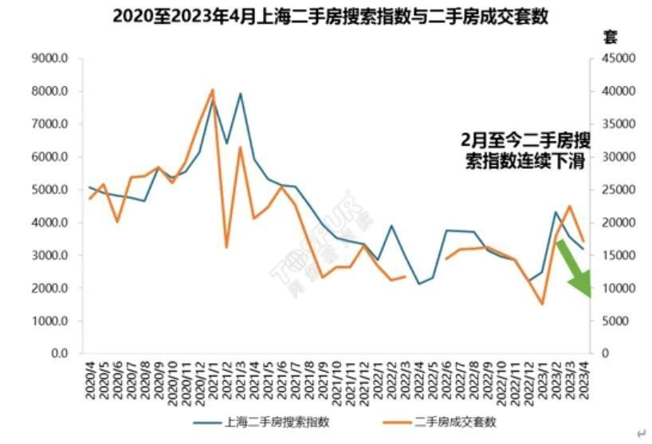
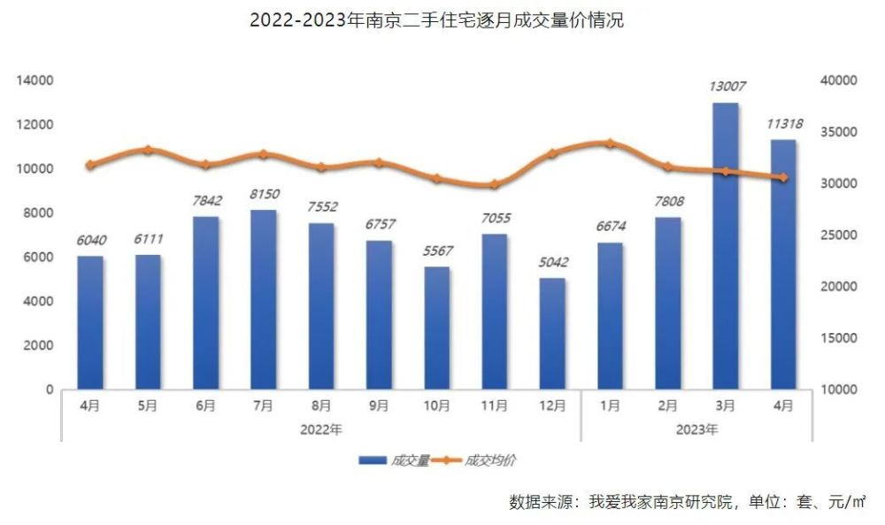
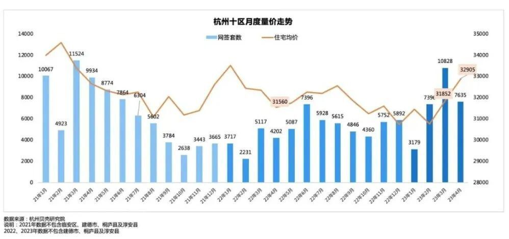

# 上海北京杭州合肥，二手房交易量都大跌 专家：价格仍有回调空间

在经历了“金三”的成交量高位后，多城二手房市场在“银四”出现大幅回落。

公开数据显示，4月份，上海二手住房成交17334套，环比下降26.71%；北京二手房住宅网签13997套，环比下跌37.3%；杭州二手住宅成交5883套，环比下降32.7%；南京二手房成交11318套，环比下跌13%；合肥二手房成交量2127套，环比暴跌40%……

价格方面，据诸葛数据研究中心监测数据，4月100个重点城市二手住宅市场均价为15662元/平方米，环比下降0.15%，较上月扩大0.05个百分点；同比下降0.4%，较上月扩大0.13个百分点。

“一季度，前期积压需求集中释放叠加部分入学购房需求释放，热点城市二手房市场成交快速上升，成交量处在2019年以来同期高位。而4月份受挂牌量持续走高影响，二手房价格承压，多数城市价格环比下跌。”

5月10日，中指研究院市场研究总监陈文静在接受《每日经济新闻》记者微信采访时表示，二手房市场的城市分化较为明显，4个一线城市二手房价格环比均上涨，表现相对稳健；二线城市和三四线代表城市的二手房价格环比分别下跌0.18%和0.22%，价格表现走弱。”

陈文静指出，伴随着前期积压需求的快速释放后，4月份购房者入市动能不足，各城市二手房活跃度普遍回落。整体来看，4月二手房成交量的回落，一方面受季节性因素影响，另一方面也是积压需求带动的高基数下的正常回落。

与此同时，购房者的热情在数据表现上同样直观。58安居客统计显示，4月全国40城二手房购房需求热度出现较大幅度的回落，看房需求热度指数为0.65，环比上月下跌了16.7%。

“在持续保交楼、旧改房票只能购买新房等一系列利好新房市场的政策加持之下，二手房市场相对就冷清了不少。”58安居客研究院研究总监陆骑麟表示，二手房市场景气度指数在4月出现明显拐头向下走势，并且已跌至偏冷和冰封的临界值，主要也是需求不足导致。”

_全国40城二手房看房需求热度走势 数据来源：安居客_

**上海：成交量跌近3成**

**价格连涨14个月**

原本3月份就着急看房的宋女士，如今也有些“笃悠悠”了——每个周末看一两套房，如果楼层朝向不符合自己要求，也就不看了。“帮父母置换房子，既然市场比较稳定，那就慢慢选。”

“小阳春”热情过后，成交量开始显出疲态。来自同策研究院的数据显示，4月份上海二手房成交1.72万套，环比下跌28%。

价格方面，据诸葛找房统计，4月上海二手住宅市场均价为73998元/平方米，环比上涨0.45%，环比涨幅较上月扩大0.06个百分点。至此，上海二手住宅市场均价已连续平稳上涨14个月。

上海中原地产市场分析师卢文曦认为，“4月份二手房成交量虽然比3月下降了约7000套，但还是符合上海二手房交易稳健的基调。尽管没有达到2万套的水平，但还算是在合理的区间内运行。如果低于15000套，那就意味着整个市场真的比较‘冷’了。”

工作在一线的房产中介们，对于上海二手房市场的感受更为直观。

“门店成交量比2月、3月差一点，但也还可以，只比3月份减少了10%左右。带看比较多，很多客户该买还是在买。主要是刚需和置换改善等需求，投资客少。”21世纪不动产上海某门店的李小忆告诉记者。

_数据来源：同策研究院_

相比成交量，4月份上海二手房挂牌量继续高位盘整。据卢文曦介绍，上海每周新增的二手房挂牌量在1.3万套左右，从绝对值来看，依旧处于高位。

“实际上，房东卖了都是要买的，挂牌量大只能说明置换需求大，不能说明供过于求或市场下滑。对于房东来说，挂牌价格都定得比较高，但如果挂了很久卖不出，看着同类房源挂牌多也会降价。目前市场，要楼层好、房型好、没有硬伤的房子，加上定价合理，才具备卖出去的可能。”李小忆告诉记者，“买房人心态很稳，因为价格稳定，一定要挑到自己喜欢的、满意的、性价比高的房子，才会下手。”

卢文曦表示，“从整个二手房市场来看，上半年剩下的时间更多的是需要继续夯实底部，强化交易价格。我个人判断二手房价格还会有一定的回调空间。并不是说一下子会有比较大的折扣，更多的可能是有3%到5%的议价空间，比较稳定的运行。”

**北京：成交量跌超3成**

**短期仍存下降压力**

在3月二手房市场大规模释放下，4月北京二手房成交活跃度下降，同环比双双转降。

据诸葛数据研究中心监测数据显示，4月北京二手住宅成交13928套，环比下降34.65%，同比下降1.2%。不过，从月均成交水平来看，2023年前4月北京二手住宅平均成交14716套，较2022年同期上升15.46%。

在链家购房平台上，海淀区新外大街的一套三居室挂牌价900万元，单价近11万元/平方米。“这套房刚刚登记第4天，大概有12组客人看过。”北京当地中介赵凌峰5月10日对记者说，“这是比较热门的房源，业主置换时已经预定了房子，所以交易周期给不了很长，价格还有空间。”

5月11日，记者再次打开链家APP，发现上述房源价格已经下调至885万元。

“北京现在80%-90%的人买卖房子，都是换房，手里拿着五六百万现金买房的客户群体特别少，所以现在市场上没有太大的价格波动余地，属于一个稳定期。”

3月份，北京二手房成交量22192套，2月份也有15315套，4月成交量快速萎缩，但挂牌量却仍在上升。陈文静分析认为，购房者议价空间变大，二手房成交节奏出现一定放缓趋势，北京“一区一策”试点尚未真正落地，短期存在一定政策优化预期，或对二手房市场活跃度起到带动效果。

另一方面，前4月北京新房市场热火朝天，新建商品住宅成交17931套，同比上涨39.8%。不过，供应却同比下跌33.6%，房山、顺义的多个高性价比刚需盘热销，也抢走了一部分刚需。

“整体来看，短期内北京二手房成交规模存在下降压力，但随着政策优化预期的增强，二手房市场仍有望保持一定活跃度。”陈文静表示。

**南京：学区房降温**

**新增挂牌量降超4成**

据我爱我家研究院数据显示，4月南京全市二手房成交11318套（含高淳、溧水），环比下跌13%。

不过，4月南京二手房新增挂牌量7514套，环比减少42.2%。我爱我家南京研究院认为，一方面是因为部分业主趁年初高峰期已将房源挂出；另一方面也是因为市场预冷，不少业主在观望楼市走势，谨慎挂牌。

位于南京市主城区的云锦美地，目前挂牌量大约90套。“这算是比较正常的量，即使是2018年挂牌量最低谷的时候也有七八十套。南京2月份这波成交量上涨，主要是2022年年底想买又没买的客户，过完年正好交易，所以说2月份有一个小井喷。还有一个原因是很多需要学区房的人，在这个时间点必须要买了。”南京当地房产中介潘莉娜告诉记者。

价格方面，4月南京二手房成交均价达30628元/平方米，相较3月份环比下跌1.9%。我爱我家南京研究院认为，由于3月份处于学区房交易高峰期，学区房价格通常情况下都会高于一般住宅价格，从而使二手房市场交易均价高于通常。4月份价格下降，与学区房交易高峰结束也有着很大关系。“4月新增挂牌房源均价为33637元/平方米，环比下滑5.3%，也是近一年来的绝对低谷值。”

在潘莉娜看来，“正常情况下，房东都不愿意降价很多，除非有特殊需求急卖的情况下才可能大降，这也是有一种互相间的博弈吧。业主也会参考上半年和去年底的成交价格，比如云锦美地这个103平方米的户型，最高峰时可卖到520万元，后来曾有过480万元成交的情况，大部分业主都觉得太便宜不能接受。”

从成交周期走势来看，4月南京二手房客户平均成交周期46.2天，环比减少8.9天；房源平均成交周期188.4天，环比也缩短7.6天。这也说明，当前市场环境下，南京二手房买卖双方的成交意向度都较高，整体成交节奏明显加快。

**杭州：“小阳春”熄火**

**成交量跌破万套**

杭州市场新房、二手房的分化，比其他城市更为明显。

据杭州贝壳研究院数据，包含临安和自主成交数据，4月份杭州二手房成交量为7635套，环比3月份破万套的成交量下跌约30%，不过同比去年4月份增长量达82%。

另一方面，为了缓解二手房去化压力，杭州4月起连续多个区域实行“一区一策”的楼市精准化调控政策。

4月14日，钱塘区的下沙街道和河庄街道加入差异化限购的范围，即外地户籍只需1个月社保即可购买该区域内新房或二手房，本地户籍无需社保，购买二套房不受落户5年限制。至此，杭州钱塘区全域放松限购。4月23日,杭州临平区将临平街道加入临平区限购放宽区域，这意味着外地户籍只需1个月社保即可购买该区新房或二手房。

同时，4月份杭州住房公积金优惠政策再次调整，多子女家庭购买首套普通自住住房且首次申请住房公积金贷款的，贷款额度可按家庭当期最高贷款限额上浮20%确定。

从成交结构上看，杭州4月二手房市场热销楼盘仍以近郊刚需楼盘为主，成交均价多在30000元/平方米以内。这类楼盘普遍为次新房，周边配套较成熟，距离核心区较近且有小户型，总价可控制在300万元以内。而4月杭州新房成交套数TOP10项目，普遍为近郊板块，单价在25000元/平方米左右，套均面积为110平方米左右的刚改项目。

“当前杭州二手房挂牌量处在历史高位，二手房价格下行压力加大，购房者持币观望情绪进一步加重，短期来看杭州二手房成交规模或继续走低。”

陈文静指出，进入二季度，去年积压需求已基本释放结束，但居民收入及就业预期尚未扭转，市场仍面临下行压力。“未来，城市分化仍将是市场主要特征之一，热点城市在政策宽松和需求支撑下，市场有望持续平稳恢复，但多数城市的楼市调整压力仍然较大。”

**合肥：限购松绑满月**

**二手房反而难卖了**

与一线城市不同的是，合肥二手房交易更容易被市场情绪影响。

贝壳数据显示，4月合肥二手房成交量仅2127套，与2月份的3532套相比，暴跌40%。回看近4个月合肥的二手房成交量可以发现，自从2月份成交量份飙升之后，合肥的二手房成交量正在逐月下跌。

近一年合肥二手房价格走势 数据来源：安居客

记者从贝壳APP上看到，合肥4月份二手房新增供应保持平稳，但新增带看出现了非常明显的冲高回落。在2月份，新增带看猛升至33.4万次，到了3月份增速放缓，为36.7万次；而4月份直接降到27.8万次，降幅达24%。

值得注意的是，4月初合肥已经调整了购房政策，对持有安徽省居住证（或电子居住证、安徽省居住证确认单）且居住地址在安徽省合肥市的非本市户籍居民家庭，可在合肥市限购区域购买1套住房。此外，有60岁及以上成员、或有未成年子女的二孩及以上多子女户籍居民家庭，可购买第3套住房。

5月10日，在合肥从事中介行业12年的张晓龙告诉记者，“外地户籍办个居住证就能买房，现在只剩下限购两个字没拿掉了。”

不过，在合肥频频加推新盘、一二手房价格倒挂的背景下，二手房对于刚需和改善型需求的吸引力进一步下降。据不完全统计，仅4月份，合肥就有5342套新房源入市。

据张晓龙介绍，在合肥4月份为数不多的二手房成交中，约50%成交房源是学区房，30%是改善型住房，剩下的20%是刚需。“二手房里面成交主要还是学区房撑起来的。”

“其实政策都已经到底，只是传导到市场还需要一定的时间。但房东现在心态很稳，反正房价已经是跌无可跌了。”张晓龙表示，“当你关注了一个月的房子还在卖；关注了两个月、三个月，这套房子还没卖掉，你肯定觉得不能买，所以现在市场处于胶着状态。”

据安居客统计，近半年合肥二手房价格走势平稳，4月份均价为16222元/平方米，较3月份的16158元/平方米略有上涨；而去年12月，合肥的二手房均价为16265元/平方米。

**记者|** 包晶晶 **编辑|** 魏文艺 卢祥勇 盖源源

**校对|** 孙志成

封面图来源：每经记者 王佳飞 摄

