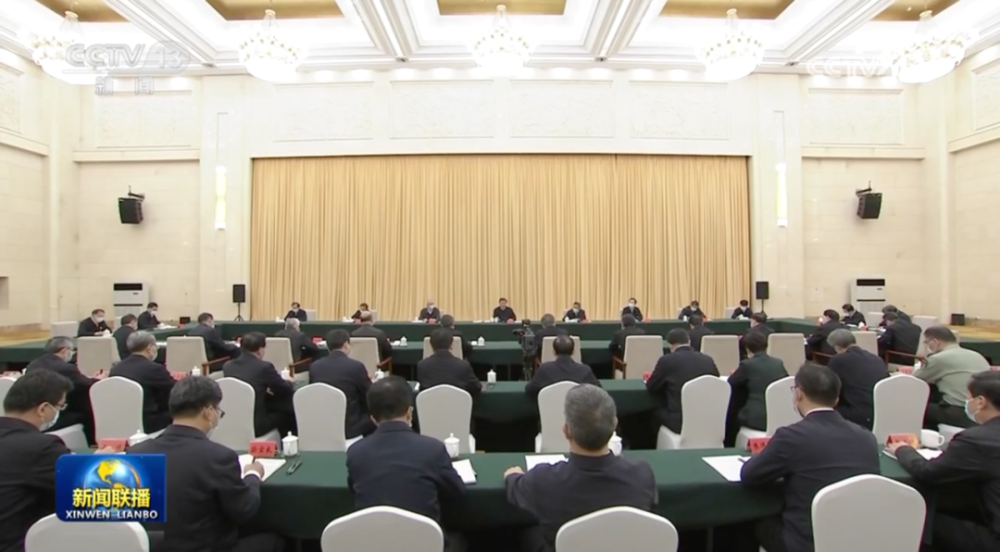

# 事关国家战略！《新闻联播》头条披露的重磅座谈会，有新信号

**撰文 | 蔡迩一**

今天的《新闻联播》头条，有重磅！

据报道，中共中央总书记、国家主席、中央军委主席习近平近日在河北考察。5月12日下午，习近平在石家庄市主持召开了“深入推进京津冀协同发展座谈会”。

**多次布局**

十八大以来，区域发展布局备受外界关注。

十八大以来，习近平总书记亲自谋划、亲自部署、亲自推动了
**京津冀协同发展、长江经济带发展、粤港澳大湾区建设、长三角一体化发展、黄河流域生态保护和高质量发展** 等一系列具有全局性意义的区域重大战略。

其中，京津冀协同发展上升为国家战略始于2014年2月。

政知君注意到，中央层面曾多次召开京津冀协同发展的座谈会。在2014年、2019年，习近平都曾针对京津冀协同发展召开座谈会。

2014年2月26日，习近平在北京主持召开座谈会， **专题听取京津冀协同发展工作汇报** 。

2019年1月18日，在北京市委办公楼主楼会议室，习近平主持召开 **京津冀协同发展座谈会。**

2023年5月12日，习近平在石家庄市主持召开 **深入推进京津冀协同发展座谈会。**

每次座谈会都会对京津冀协同发展提出新的要求。

在2014年的座谈会上，习近平要求，要着力加强顶层设计、着力加大对协同发展的推动、着力加快推进产业对接协作、着力调整优化城市布局和空间结构等。

也是在那次座谈会上，习近平强调， **“京津冀协同发展意义重大，对这个问题的认识要上升到国家战略层面”。**

2019年的座谈会上，习近平提出了6个方面的要求，包括紧紧抓住“牛鼻子”不放松，积极稳妥有序疏解北京非首都功能；高质量高标准推动雄安新区规划建设；以北京市级机关搬迁为契机，高质量推动北京城市副中心规划建设；促进基本公共服务共建共享等。

与之前的两次会议不同，这次的座谈会，地点放在了河北省石家庄市。另外，从名称上也有差异，这次的座谈会，多了“深入”两个字。

**高规格**

政知君注意到，这次座谈会规格极高。

在座谈会上，习近平发表了重要讲话。另据央视报道，中共中央政治局常委、国务院总理李强，中共中央政治局常委、国务院副总理丁薛祥出席座谈会。中共中央政治局常委、中央办公厅主任蔡奇陪同考察并出席座谈会。

画面还显示，中共中央政治局委员、中组部部长李干杰，中共中央政治局委员、国务院副总理何立峰等陪同考察并出席座谈会。国务委员、国务院秘书长吴政隆等也在座谈会现场。

在座谈会现场，河北省委书记倪岳峰、天津市委书记陈敏尔先后发言，北京市委书记尹力提交了书面发言。

听取大家发言后，习近平发表了重要讲话。

习近平肯定了京津冀协同发展的成果，称京津冀协同发展 **“取得新的显著成效”。**

他还提到，疏解北京非首都功能 **初见成效** ，雄安新区建设取得 **重大阶段性成果** ，北京城市副中心高质量发展 **步伐加快，** 轨道上的京津冀
**加速形成** ，美丽宜居京津冀取得丰硕成果，科技创新和产业融合发展水平持续提升。

实践证明， **党中央关于京津冀等重大区域发展战略是符合我国新时代高质量发展需要的，是推进中国式现代化建设的有效途径。**

**几个细节**

在这次座谈会现场，习近平对京津冀协同发展提出了新的要求。

几个细节值得关注。

第一，习近平再度强调，要“接续谋划第二批启动疏解的在京央企总部及二、三级子公司或创新业务板块”。

在这次座谈会召开之前，5月10日，在河北，习近平主持召开了“高标准高质量推进雄安新区建设座谈会”。

在这次座谈会上，习近平指出，要扎实推动疏解北京非首都功能各项任务落实，
**接续谋划第二批启动疏解的在京央企总部及二、三级子公司或创新业务板块等，着手谋划金融机构、科研院所、事业单位的疏解转移。**

这一问题在今天的座谈会再度被强调。

习近平强调， **要着力抓好标志性项目向外疏解，接续谋划第二批启动疏解的在京央企总部及二、三级子公司或创新业务板块等。**

他还提到，要进一步从源头上严控北京非首都功能增量。

第二，习近平提到，第二批北京市属行政企事业单位迁入副中心要“加快推进”，并对腾出的空间作出了具体安排。

他强调，北京城市副中心建设要处理好同雄安新区的关系，“两翼”要协同发力，有效解决北京“大城市病”问题。

**“要加快推进第二批北京市属行政企事业单位迁入副中心，腾出的空间主要用于加强对首都核心功能的服务保障。”**

2021年，国务院发布了《关于支持北京城市副中心高质量发展的意见》。

上述意见中提到， **到2025年**
，城市副中心绿色城市、森林城市、海绵城市、智慧城市、人文城市、宜居城市功能基本形成。北京市级党政机关和市属行政事业单位搬迁基本完成，承接北京非首都功能疏解和人口转移取得显著成效。

在座谈会现场，习近平还提到，要处理好同周边地区的关系， **带动周边交界地区高质量发展。**

第三，广大百姓关心关切的利益问题也是这次座谈会关注的焦点。

习近平强调，要切实解决广大百姓关心关切的利益问题。

要加快推进公共服务共建共享，强化 **就业优先政策** ，促进京津冀地区更加充分更高质量就业；

**要推动京津优质中小学基础教育资源同河北共享** ，深化区域内高校师资队伍、学科建设、成果转化等方面合作；

要推进医联体建设， **推动京津养老项目向河北具备条件的地区延伸布局。**

另外，这次座谈会还提到，要巩固壮大实体经济根基，把 **集成电路、网络安全、生物医药、电力装备、安全应急装备**
等战略性新兴产业发展作为重中之重，着力打造世界级先进制造业集群。

**北京天津要持续深化对河北的帮扶，带动河北有条件的地区更好承接京津科技溢出效应和产业转移。**

习近平还强调，北京天津河北三省市党委要认真贯彻落实党中央的部署和要求，切实抓好主题教育，进一步增强各级党组织的政治功能和组织功能，为推进京津冀协同发展提供坚强保证。

**资料 ｜ 央视 新华社 人民网等**

**【版权声明】本文著作权归政知新媒体独家所有，未经授权，不得转载。**

