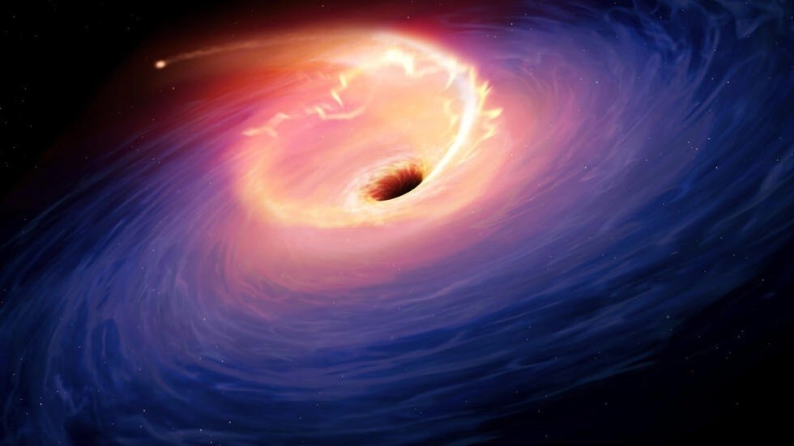

# 天文学家观测到有记录以来最大规模宇宙爆炸，亮度为太阳的2万亿倍

（观察者网讯）据英国《卫报》5月12日报道，近日发表在顶级天文学术期刊《皇家天文学会月刊》上的一项研究表明，天文学家观测到了有记录以来释放能量最大的一次宇宙爆炸，其亮度可达到太阳的2万亿倍。天文学家推测，爆炸可能源于巨大的气体云坠入超大质量黑洞。

_《卫报》报道截图_

报道称，这次爆炸被命名为AT2021lwx，发生在大约80亿光年之外，迄今已持续3年多。观测结果表明，AT2021lwx的亮度是任何已知超新星的10倍以上，也是有记录以来能量最高的一次爆炸。

领导观测项目的英国南安普顿大学天文学家菲利普·怀斯曼（Philip
Wiseman）表示，“我们估计这个火球的大小是太阳系的100倍，亮度是太阳的2万亿倍。在三年里，这次爆发释放的能量大约是太阳在100亿年生命周期中释放能量的100倍。”

《卫报》称，位于美国加利福尼亚州的兹威基瞬变源观测设施（Zwicky Transient
Facility）在2020年首次观测到这次爆炸。但在最初的一年时间里，这一发现没有引起注意，直至天文学家获取进一步的观测数据之后，才意识到这是一个极其罕见的发现。

怀斯曼的研究团队对AT2021lwx提出了三种可能的解释。一是超新星爆发，但AT2021lwx的亮度远远超出了超新星的合理范围。另一种可能性是类星体，但怀斯曼指出，类星体的亮度会随时间推移发生闪烁，AT2021lwx则是在三年前被突然观测到，且至今依然明亮。

第三种解释是潮汐瓦解事件（tidal disruption
event），即恒星被超大质量黑洞撕裂时释放出能量的过程。不过怀斯曼表示，从模拟结果来看，AT2021lwx的形成需要一颗15倍太阳质量的恒星，“这样巨大的恒星并不多见，因此我们认为这更有可能是一团巨大的气体云。”

_潮汐瓦解事件的想象图 图自法新社_

法新社称，研究团队推测，这或许是一个规模比太阳大5000倍的巨大气体云正在被超大质量黑洞缓慢吞噬。怀斯曼说，研究小组正在进行模拟，以验证这一理论的合理性。

AT2021lwx并不是人类迄今在宇宙中观测到的最明亮现象。2022年10月，各国天文学家观测到了编号为GRB
221009A的伽马射线暴，这是有记录以来最为明亮的闪光。不过，怀斯曼指出，伽马射线暴仅持续了十多个小时，相比之下，AT2021lwx已经持续了三年多，这意味着它整体释放的能量要大得多。

**本文系观察者网独家稿件，未经授权，不得转载。**

