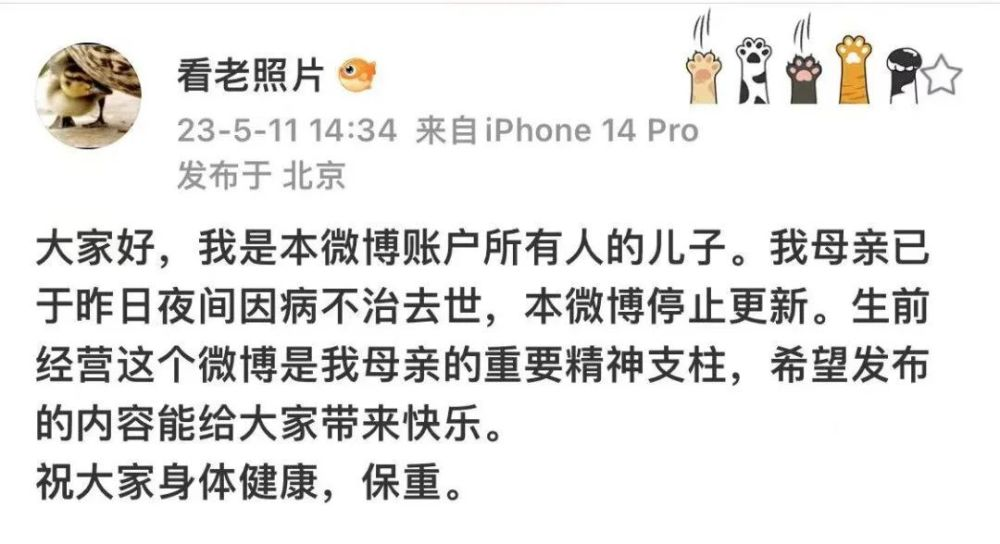
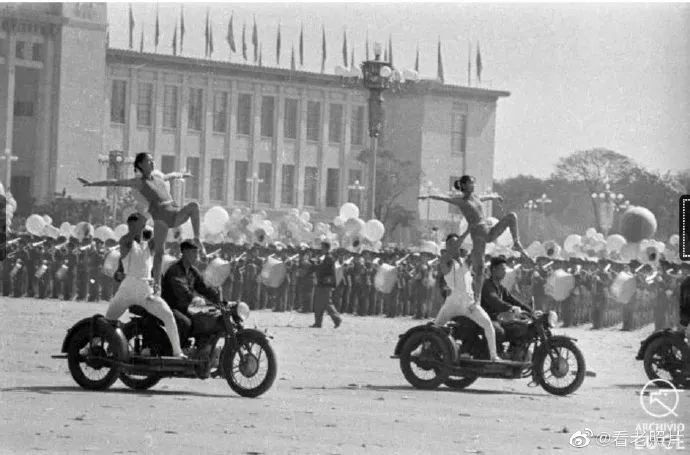
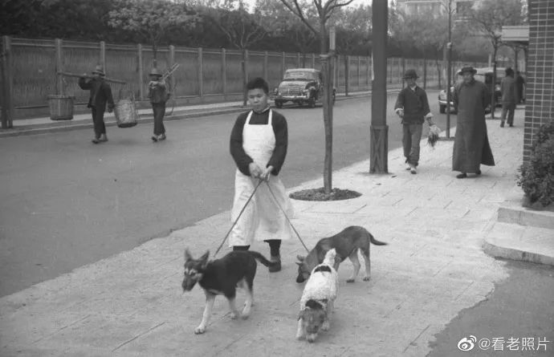
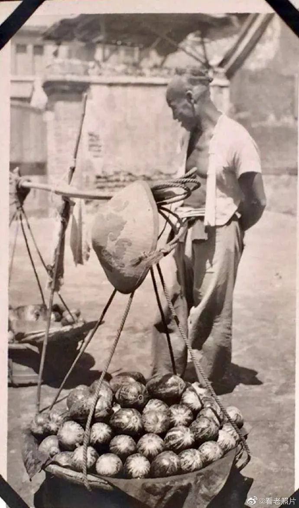
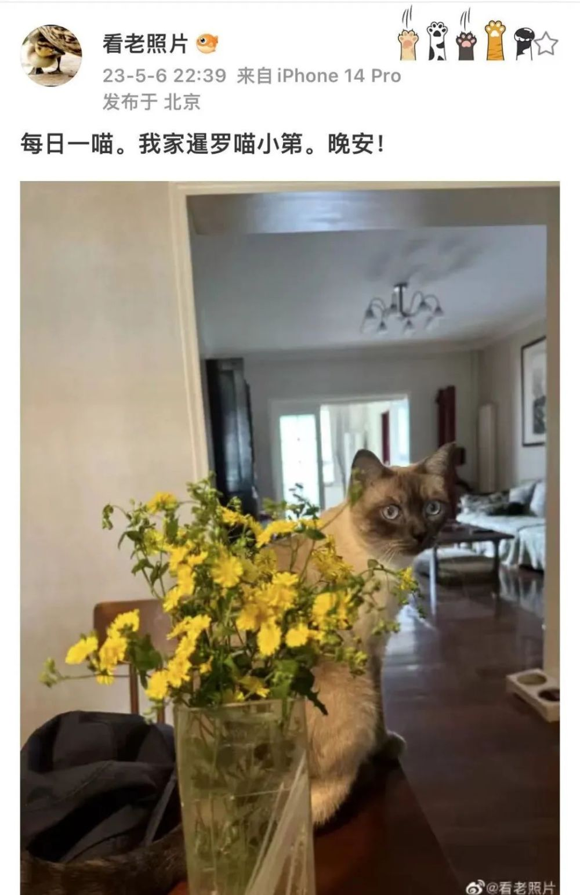
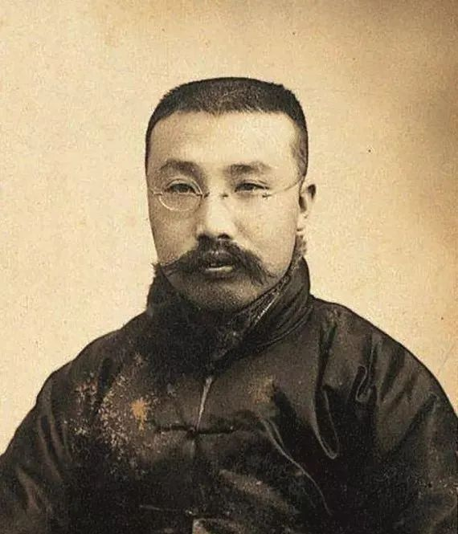

# 李大钊孙女离世，谢谢您让我们看到历史

**她认真考据，画风治愈。**

作者：仗义姐

今天，“李大钊孙女”“看老照片
停更”同时冲上各个平台热搜，背后是同一件事：李大钊的孙女李虹女士去世了。她的家人登录其微博账号“@看老照片”公布了这一消息，并表示生前经营账号是她的“重要精神支柱”。

这条消息目前的点赞量已超过30万。为何李虹老人引来网友的纪念热潮？

首先，她认真考据，画风治愈。“通过真相看历史 感谢博友支持点赞留言纠错互动”，是李虹的微博简介。

_1959年，庆祝新中国成立十周年国庆游行中的体育方队。图自李虹微博。_

她以专业的态度运营业余的爱好，挖掘并提供稀缺、真实的信息，在信息爆炸、拼贴横行的网络环境里难能可贵。

她分享的许多老照片，兼具趣味和温情，于细节处折射出时代的面貌与人性的关怀。

_20世纪30年代的专业遛狗师傅。图自李虹微博。_

_小贩售卖河北大花甜瓜。图自李虹微博。_

她也经常晒出家中的小猫，用它们的口吻与网友对话，给大家带来许多欢乐。

其次，她朴素温和，低调做人。她是李大钊次子李光华的女儿，曾任中共中央党校图书馆研究员。然而，账号的超百万粉丝中，知晓李虹真实身份的人寥寥可数。

据梳理，她发布了将近1.49万条内容，没有一条的关键字是“李大钊”。家人透露，老人的后事也将低调处理。

_李虹最后一次在微博上分享小猫照片。_

此外，在李虹老人身上，我们看到：以李大钊为代表的中国共产党人，清廉家风代代相传。

“黄卷青灯，茹苦食淡，冬一絮衣，夏一布衫”，是李大钊一生的真实写照。他的收入大多用于党组织的活动经费和资助青年学生，“为庶民求解放，一生辛苦艰难”。

_李大钊。_

自诞生之日起，为人民谋幸福、为民族谋复兴就成为党的初心所在、使命所系。正是在先辈们的努力下，我们才有了今天的中国。

一些年轻人动情表示：“如果在那个世界碰到您的爷爷，请让他放心，我们的祖国，今天很强大！”

艰苦朴素，坚守初心。给李虹老人的每一个赞，都是我们对初心的肯定。

**事件回顾：5月11日晚，李大钊孙女李虹去世，家人在其微博账号上分享了这一消息，无数网友留言表示感谢和纪念。李虹从2010年3月19日加入微博，累计发布了1.49万条内容。长期以来，她凭借兴趣分享历史照片，吸引起了众多粉丝关注。如果因为事情忙没来得及更新，她还会向粉丝道歉。**

总监制： 吕 鸿

监 制： 张建魁

主 编： 许陈静

编 审： 苏 睿

