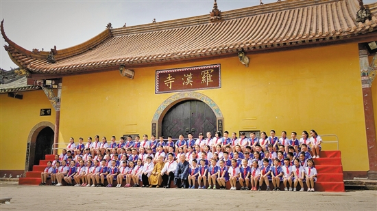
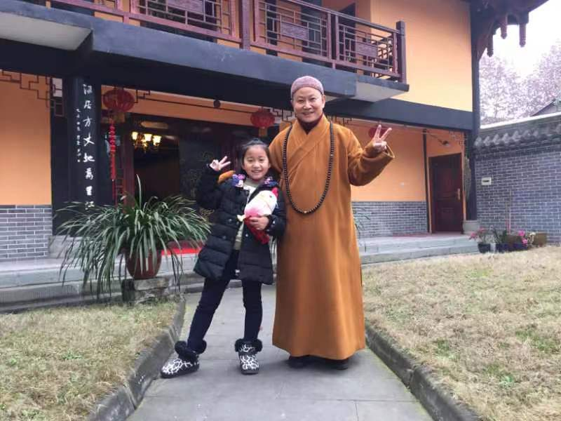
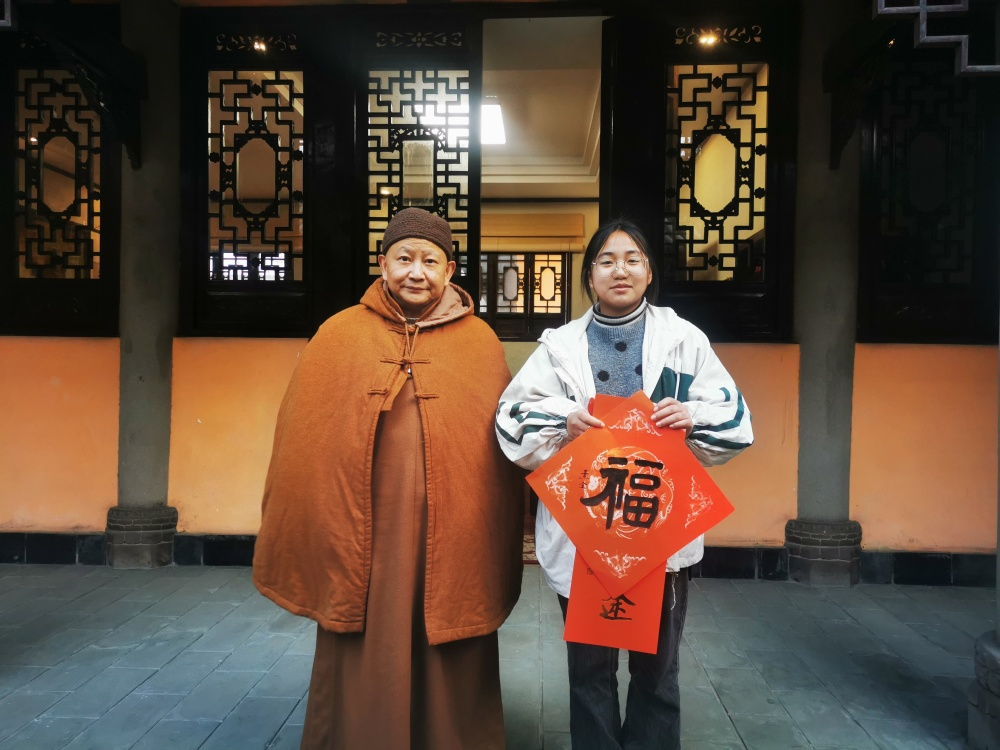

# 汶川震后“破戒”在震区古刹出生的108个“罗汉娃”，现状如何

“见死不救才是最大的忌讳”，15年前，面对突然袭来的8.0级大地震，以及随后赶来的即将崩溃的妇幼保健院医护人员和产妇们，四川什邡罗汉寺住持素全法师做出了一个决定：他命人打开寺门，冒着他人提出的“破戒”质疑，将产妇们请进寺庙，将一座座禅房变为临时诊室。将近3个月的时间里，先后有108个孩子在寺内出生。这些在罗汉寺诞生的娃娃又被称为“罗汉娃”。

15年过去了，这些“罗汉娃”已经成为了少年少女，他们这15年来是如何成长的呢？现状又如何呢？

**“见死不救才是最大的忌讳” 震后佛门古刹敞开大门迎来108个新生命**

如今，在罗汉寺门前竖立着一块石碑，上面刻有108名“罗汉娃”的名字。这些名字中，不少都有“震”“振”“贞”等字样，无声地记录着他们出生时所面临的艰难环境。不少家长也会在孩子的名字中留下对生命的期许，“罗汉娃”中排行第9的罗明贞溪就是如此，她的父亲罗文松告诉北京青年报记者，地震发生时他正在距离什邡30多公里的地方出差，感受到大地的剧烈震动后，他立即启程赶回家乡。

地震时，罗文松和妻子开了一家服装厂，当罗文松赶到厂子时，发现厂房已经倒塌，机器设备等都被压垮了，万幸的是包括怀孕的妻子在内，厂内的工作人员几乎都没有受伤。

罗文松回忆说，那时已经是妻子的预产期，他没有时间思考地震给厂子造成的损失，5月15日，他带着妻子到什邡市妇幼保健院做产检，却发现妇幼保健院在地震中严重受损，已搬迁到了附近的罗汉寺。

罗文松至今还记得，那一天妻子是在罗汉寺的一间禅房里产检的，“那里平时是僧侣们念佛的地方，曾经的禅桌变成了病床，寺院和妇幼保健院在有限的条件下尽可能给产妇们提供了方便。”

住持素全在此后接受媒体采访时曾坦言，要不要让产妇进寺庙生产，他也有过犹豫。“觉得要在寺院生孩子，很不妥当。但是看到那么多产妇情况危急，也就顾不了那么多了。”素全召集起寺内僧人，告诉大家“见死不救才是我们出家人最大的忌讳”。

就这样，一个个新生命在千年古刹内出生了。罗文松回忆说，相比现在的硬地面，2008年时罗汉寺观音堂前还都是裸露的泥土，5月16日妻子就住进这处广场上搭起的一顶帐篷内待产。5月17日凌晨4、5点钟的时候，在一顶被用作手术室的帐篷里，罗文松的妻子生下了小女儿。

经过商量，夫妻两人给女儿取名“罗明贞溪”，“‘罗’是孩子的姓，‘明’是班辈，‘贞溪’是希望孩子能够珍惜生命，这也是那场灾难给我们带来的启示。”

同样在罗汉寺内生下儿子的龙沙沙回忆说，她生产时原本想要顺产，最后临时改为剖腹产。“当天我低血压，脑子晕晕的，生下孩子后第二天才醒过来，发现找不到我的拖鞋了。”龙沙沙说，她询问了家人，得知自己生孩子时，天降暴雨，“我的帐篷那里水很大，盆、拖鞋都被冲走了。”

罗文松的妻子产后，家里买了鸡，想给她补补身子。由于条件有限，罗文松向寺庙里的僧侣询问，是否能够在寺庙内烹调鸡肉。“当时我就觉得要尊重寺庙，相比其他产妇家属，我之前来过罗汉寺，跟寺里的师父也更熟悉一些，就去问了。没想到寺里问过住持后告诉我，可以在寺庙里烹制这些食物。”

就这样，产妇家属们在有限的条件下，互相分享炖鸡汤、炖猪蹄，熬过了那段艰难的时光。

**家长捐出孩子衣服 做出最为“花哨”的百衲衣**

5·12地震后，罗文松时不时会到罗汉寺内当义工。2008年8月，什邡市妇幼保健院离开罗汉寺，迁到了附近的临时板房中。有一天，罗文松在当义工时从寺庙工作人员处得知，从5月12日罗汉寺接收产妇到8月份完成临时产房的使命，在罗汉寺内出生的孩子正好是108名。“这个数字正好对应了108罗汉，当时大家都说真巧合，后来大家就开始管这些孩子叫‘罗汉娃’。”

对于龙沙沙和罗文松来说，那段艰辛又罕见的经历成了家长与孩子们彼此链接的契机，不少家长和孩子至今都保持着联系。

龙沙沙说，地震后一周年、两周年、三周年、五周年和十周年，不少“罗汉娃”家长都会带着孩子们回到罗汉寺，一起纪念那段时光。

地震三周年将要来临之时，龙沙沙等家长聚在一起，思考要如何感谢素全法师和罗汉寺僧众们当年的仗义之举，“大家商量了好久，都没有想出好办法，这时有一位熟悉寺里情况的人提出建议说，可以给素全法师送一件‘百衲衣’。”

龙沙沙和罗文松等人联系到“罗汉娃”的家长们，希望大家把孩子穿剩下的一件衣服捐出来。“每位家长听说后，都非常支持我们的想法，很多人主动来找到我们捐出衣服，还有一些家庭在山区里，出入不便，罗文松他们就进到山里，取回了衣服。”龙沙沙回忆说，罗文松家之前经营服装生意经验最足，最终由罗文松的妻子亲手将孩子们的衣服做成了百衲衣，送给了素全法师。

相比一般的百衲衣，素全法师收到的百衲衣颜色明显“花哨”得多，有的是粉红色的布片上印着白色的花朵，有的是绿色的布片上印着外语单词，大花格子、艳丽的条纹遍布在这件百衲衣上，但当素全法师穿上这件百衲衣时，不少家长都为之落泪。“我到现在都能很快找到百衲衣上我孩子衣服裁出来的那一块，上面有明显的红格子，那原本是我家孩子的一件衬衣。”龙沙沙说。

**当年的“罗汉娃”渐渐长大 很多人已居住到国内其他城市**

15年过去了，曾经的“罗汉娃”们还有一个月就要中考了。龙沙沙说，其实自从10周年之后，“罗汉娃”以及家长们之间的联系少了很多，但近期偶尔和一些比较熟悉的“罗汉娃”家长相聚时，大家也会一起聊聊孩子的学习、孩子适合就读哪些高中等。

相比家长，孩子们的变化更加明显。龙沙沙说，不少“罗汉娃”小时候会在同一所学校甚至同一个班级读书，由于都被叫做“罗汉娃”，很多孩子也会从小就在一起玩。但随着孩子一点点长大，有了更多自己交往中认识的好朋友，部分“罗汉娃”之间的关系和小时候相比就显得淡一些了，“有时候我们家长们在一起聚餐聊天，孩子们虽然也坐在一个桌子上，却不会怎么聊天了。”

随着孩子的成长，一些“罗汉娃”开始主动脱离“罗汉娃”的标签。此前有媒体记者表示，一名“罗汉娃”委婉地拒绝了记者的采访，其母亲坦言孩子“不想让自己在人群中显得那么特殊”。

与此同时，不少原有为守护“罗汉娃”成长的计划也随着时光调整了方向。曾几何时，罗文松等“罗汉娃”的家长还曾经开设了一家培训机构，希望为“罗汉娃”们提供一些口才等方面的训练，随着时光的流逝，培训机构也已经转手他人，“如今的培训机构已经和‘罗汉娃’没什么关系了。”此外，北青报记者了解到，2009年时“罗汉娃”们收到一笔捐款，家长将这笔钱作为“108成长基金”，用于帮助有困难的“罗汉娃”。当年就有一名患有先天性心脏病的“罗汉娃”获得了资助，但此后孩子们基本都健康成长，直到震后10年才有“罗汉娃”患上肾病，大家商量后将剩下的钱一次性分给了一些相对困难的“罗汉娃”家庭。

不过这些孩子和罗汉寺的缘分是剪不断的。龙沙沙表示：“我家孩子就曾说过，有时候去一个地方可以走好几条路，他会不自觉地选择路过罗汉寺的路，走过罗汉寺时还会特意向罗汉寺那边看一眼。”此外，包括罗文松在内的一些家长也会时不时带孩子回罗汉寺看看，走亲戚一般地见见素全法师等人。罗文松说，几乎每年家里都会带着女儿去罗汉寺，“这对于我们来说形成了一种‘刚需’。我们会带着孩子，去给她讲讲她在哪个地方出生的，当年都发生了什么，告诉她应该如何感谢这个社会。”

2021年，讲述地震中罗汉寺故事的电影《一百零八》上映，不少家长带着“罗汉娃”去观看了这部讲述孩子们出生故事的电影，很多家长一边看电影一边流下了眼泪，“孩子看了电影，也更明白了该如何感恩，该如何去回报社会。”一名家长表示。

15年过去了，如今的“罗汉娃”，已经走向了国内多地，龙沙沙多年来一直承担着“罗汉娃”家长们联络人的角色，据她了解，当年108名“罗汉娃”中目前还在四川省的大约有七八十人，有些孩子随着家人生活到了四川省的其他城市，还有的孩子到了外省生活。

“今年5·12正是孩子们忙着中考的时候，我们暂时没计划举行什么活动，也许等孩子中考结束之后，我们一些熟识的家长会带着孩子们聚一聚，回忆一下那段时光和这份来之不易的缘分。”龙沙沙说。

（北京青年报记者 屈畅）

