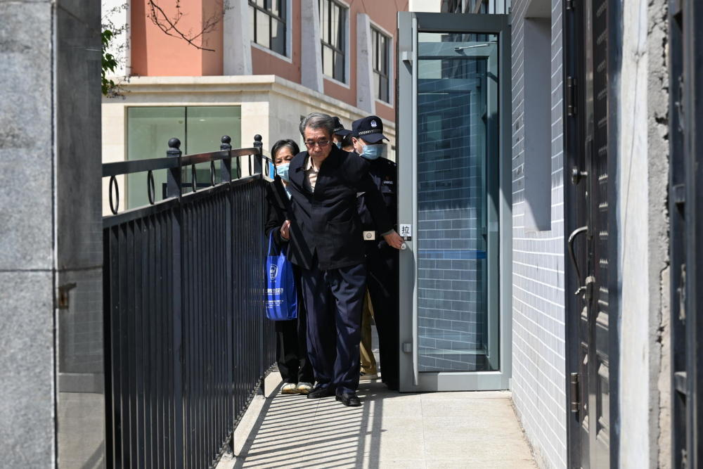
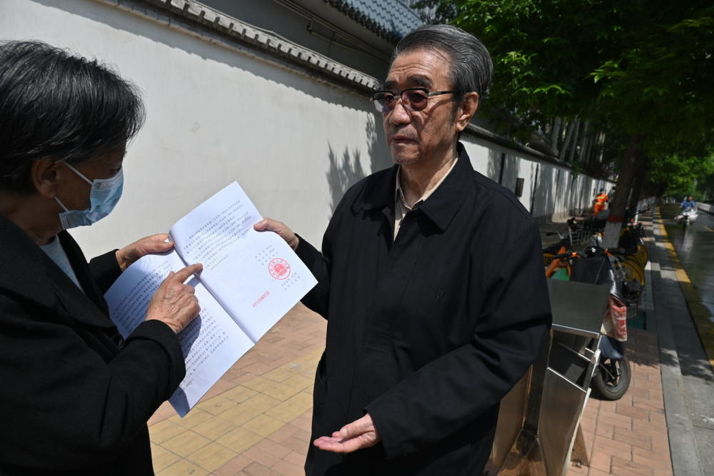

# 申诉33年后，山西“张军律师案”再审宣判！维持定罪部分，量刑“3年改2年”

备受社会关注的山西“张军律师案”有了新进展。

5月12日，山西省高级人民法院对该案进行再审宣判。山西高院审理认为，张军仍构成犯拒不执行判决罪，但量刑不当，由此前的有期徒刑3年，改判为有期徒刑2年(已执行完毕)。

5月12日，85岁高龄的前律师张军走出山西省高院后对红星新闻记者表示，他对山西高院作出的判决结果非常意外，他还将继续申诉，直至无罪平反的那一天。

_↑5月12日张军走出山西省高级人民法院_

**▍案情回顾**

**30多年前代理村民土地纠纷案，律师因3罪获刑15年**

张军出生于1938年，曾在山西省政协等部门任职。同时，他也是我国1979年恢复律师制度后的首批律师。至1990年被抓前，他办了1000多个案子。

1989年，张军卷入山西省昔阳县农民与当地政府的一起土地纠纷案中。

据案卷记载，当时，该县昔安坪乡政府指控安坪乡庞家峪村委会“抢占”位于庞家峪河滩的约500亩土地，将庞家峪村委会诉至法庭。昔阳县法院当庭宣判这块地为国有，交安坪乡政府。庞家峪村村民坚决不服，上诉到晋中地区中级人民法院。1989年7月，晋中中院终审裁定，讼争土地归国家所有，庞家峪村将所占土地交归安坪乡政府，由26个村共同协商共管。

土地纠纷案败诉后，1989年7月24日，庞家峪村村民依法申诉到山西省“四大班子”。

时任山西省政协政法办公室主任的张军，在1990年接受政协指派，与同在山西省第二律师事务所任兼职律师的妻子郭章梅受庞家峪村村民委托代理此案。虽然张军做了大量调查取证工作，但最后庞家峪村村民还是败诉了。

在法院强制执行过程中，庞家峪村村民采取了一些阻止执行的行为。当时，司法机关认为这一切都是张军教唆的结果，于是将其逮捕。

1991年1月16日昔阳县人民法院认定，被告人张军犯受贿罪、诈骗罪、教唆拒不执行人民法院判决罪，判处其有期徒刑15年，并退还索贿、受贿、诈骗的全部赃款。

对此，张军不服上诉。1991年6月6日，山西省晋中市中级人民法院裁定，驳回上诉，维持原判。

此后，昔阳县公安部门以“涉嫌受贿罪”将张军妻子郭章梅逮捕。郭章梅因包庇罪被昔阳县人民法院判处有期徒刑3年。

1993年，郭章梅因在狱中“积极改造，表现良好”被提前释放。1997年4月，郭章梅被宣告无罪，同年恢复公职，重新拿回律师资格证。

**85岁前律师申诉33年，不断发回、重审，4级法院循环往复**

从1991年入狱服刑开始，张军不断申诉。1994年6月，在狱中病重的张军被批准保外就医。

2001年3月2日，山西省高级人民法院再审后作出判决，撤销受贿罪、诈骗罪，但维持教唆拒不执行人民法院判决罪有期徒刑3年的判决。

判决生效后，张军对此仍旧提出申诉。2003年，最高法院决定提审该案。

2005年，最高人民法院以事实不清、证据不充分为由，将案件发回山西省高院重审。

2007年，在未补充任何新证据的情况下，昔阳县人民法院仍以拒不执行人民法院判决罪判处张军有期徒刑3年，张军不服提出上诉。2008年晋中中院以原判认定事实不清、证据不充分为由，撤销原判，发回重审。

2009年，昔阳县法院再审，再次作出与原审一样的刑事判决。2010年晋中中院维持原判。

对此，张军不服，提出申诉。晋中中院2014年将其申诉驳回。

此后，张军申诉至山西高院。2021年2月1日，他收到山西高院的再审决定。

张军告诉红星新闻记者，至今33年来，自己一直没有停止申诉，仅向有关部门寄出的申诉状就有4000多次。

**山西高院再审开庭一年多后作出判决：维持定罪部分，量刑3年改2年**

2022年3月31日，山西省高级人民法院公开审理张军拒不执行判决罪再审一案。当日开庭持续了10个小时，并未当庭宣判。

在再审开庭一年多后，该案在2023年5月12日进行宣判。

山西高院审理认为，原审被告人张军身为省政协政法办公室主任，在其与妻子曾代理的庞家峪村耕地权属纠纷案败诉后，基于对判决不服的主观认识，在明知法律规定申诉不停止执行生效判决的情况下，利用其行使政协民主监督权利之便，在履职过程中超越职权，教唆、鼓动庞家峪村村民抗拒执行法院生效判决，致使该村部分干部群众产生严重对立情绪，拒不执行法院生效判决，严重损害法律尊严和人民法院裁判权威，造成恶劣社会影响。张军的行为已构成拒不执行判决罪，且在共同犯罪中起主要作用，系主犯，应依法从重处罚。

据此，山西高院对张军及其辩护人关于原判认定张军犯拒不执行判决罪错误、应改判无罪的意见不予采纳；对检察机关关于张军的行为已构成拒不执行判决罪的意见予以支持，对认为张军在共同犯罪中起帮助作用、系从犯的意见不予支持。

山西高院认为，鉴于庞家峪村部分村民后期聚众阻挠邻村种地及罢耕罢种并非张军直接教唆所致，且张军在实施教唆犯罪过程中行为有所节制，对其可从轻处罚，原判以拒不执行判决罪顶格判处张军有期徒刑3年，量刑不当。综上，原判认定原审被告人张军犯拒不执行判决罪的主要事实清楚，证据确实、充分，定罪准确，审判程序合法，但量刑不当。

据此，山西高院判决，维持山西省晋中市中级人民法院2010年作出的刑事裁定和山西省昔阳县人民法院1991年刑事判决中对原审被告人张军的定罪部分，认定原审被告人张军依然构成犯拒不执行判决罪。但撤销上述判决中的量刑部分，由上述原判决中的有期徒刑3年，改为有期徒刑2年(已执行完毕)。

红星新闻记者注意到，该判决为本案再审的终审判决。

张军的申诉代理律师，北京市京师律师事务所律师王殿学、北京泽亨律师事务所律师张雪峰对红星新闻记者表示，山西高院在此前的再审决定书中指出“原判据以定罪量刑的证据不确实、不充分，原判决、裁定适用法律确有错误”，而此次再审判决中写道“原判认定原审被告人张军犯拒不执行判决罪的主要事实清楚，证据确实、充分，定罪准确”，两个文书的表述明显有矛盾，而且差距过大。

张军则表示，对于山西高院作出的再审判决感到非常意外，也非常失望。“我是奉指示依法履行民主监督职能，履行律师职务。”

张军表示，他还将继续申诉，直至无罪平反的那一天。

_↑5月12日张军与妻子郭章梅在山西省高级人民法院外_

红星新闻首席记者 张炎良 山西太原报道

责编 邓旆光 编辑 彭疆

