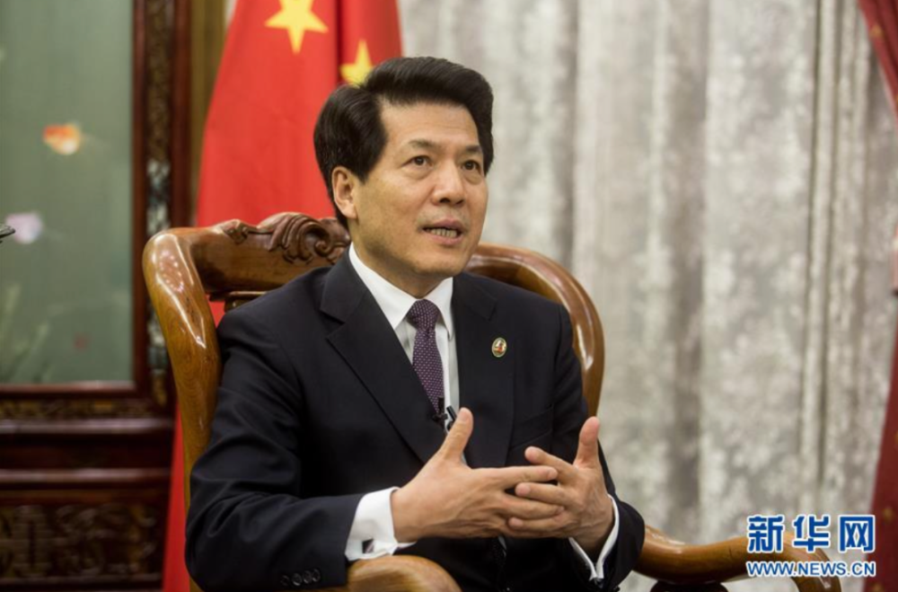

# 赴乌克兰等五国访问的中国政府特别代表，是他

**撰文 | 董鑫**

乌克兰危机仍在延宕升级，国际社会对停火止战缓和局势呼声越来越高。

**5月12日，外交部发言人汪文斌在例行记者会上发布消息，5月15日起，中国政府欧亚事务特别代表李辉大使将赴乌克兰、波兰、法国、德国和俄罗斯五国访问，就政治解决乌克兰危机同各方进行沟通。**

汪文斌表示，此次中方代表赴有关国家访问，是中方致力于劝和促谈的又一体现，充分表明中方坚定站在和平一边。

**资深外交官**

公开简历显示，李辉出生于1953年2月，黑龙江人，今年70岁。

他在外交工作战线已有近50年的工作经验，经历了中苏关系复苏，苏联解体、中俄关系发展及上海合作组织创立发展以及中俄两国关系多次提升的过程。

自上世纪70年代后期进入外交部之后，李辉长期在原苏联东欧司、驻苏维埃社会主义共和国联盟大使馆工作，李辉曾先后在中国驻苏联使馆、外交部苏欧司、中国驻俄罗斯使馆、中国驻哈萨克斯坦使馆、外交部欧亚司工作过，担任过中国驻哈萨克斯坦大使、外交部欧亚司司长、外交部部长助理等职。

2008年，李辉升任外交部副部长，次年8月，他出任中国驻俄罗斯大使。

此后，李辉担任了10年中国驻俄罗斯大使，是历任中国驻前苏联及俄罗斯联邦大使中任职时间最长的。

驻俄10年，李辉分别在2012年2月、2013年、2018年10月获得了俄罗斯科学院远东研究所、莫斯科国立语言大学、俄罗斯外交学院授予的荣誉博士学位。

卸任前夕，他还获得了俄罗斯总统普京颁授友谊勋章。

“友谊勋章”是俄罗斯联邦国家级勋章，专门授予为加强各民族友谊与合作、推动各民族文化交流、促进世界和平、发展国家间友好关系作出杰出贡献的人士。

2019年9月，李辉被正式免去驻俄大使的职务，3个月之后，他以中国政府欧亚事务特别代表的身份出席了清华大学俄罗斯研究院成立仪式暨新时代中俄战略协作高峰论坛。

**中方始终站在和平一边**

**在乌克兰危机问题上，中方始终站在和平一边，核心立场就是劝和促谈。**

今年4月26日，中方领导人应约同乌克兰总统泽连斯基通电话。

中方领导人表示，中方将坚持劝和促谈，为尽快止战停火、恢复和平作出自己的努力，中方将派中国政府欧亚事务特别代表赴乌克兰等国访问，就政治解决乌克兰危机同各方进行深入沟通。

根据中方发布的行程，5月15日起，李辉将赴乌克兰、波兰、法国、德国和俄罗斯五国访问。

汪文斌表示，乌克兰危机爆发以来，中方始终秉持客观公正立场，积极劝和促谈。
**此次中方代表赴有关国家访问，是中方致力于劝和促谈的又一体现，充分表明中方坚定站在和平一边。**

当前乌克兰危机仍在延宕升级，外溢效应持续显现，国际社会对停火止战缓和局势的呼声越来越高。

**中方愿继续发挥建设性作用，在停火止战、开启和谈，避免局势升级等方面凝聚更多国际共识，为推动乌克兰危机政治解决作出中国贡献。**

**特使**

无论特使还是特别代表，都是中国“特使外交”的组成人员。

补充一下背景。

中国特使外交首次走入公众视野是在2002年9月，在当时巴以冲突升级之际，中国政府引人瞩目地首次派出了中东问题特使——时年66岁的退休外交官王世杰，积极推动中东和谈进程。

被任命为常任特使的外交官一般都对相关地区和事务较为熟悉，具有相对丰富的地区外交经验和解决问题的能力，精通当地语言和风俗文化，其长期以来建立的地区和国际社会人脉关系更是优势。

首任非洲问题事务特别代表的刘贵今在接受记者专访时表示，特使的立场代表中国官方，但是语言和方式可以是自己的，这样便于沟通，不仅仅传达外交口径，还要用外国人听得懂的“外语”，让他们了解中国的立场。

据《南华早报》计算，自2002年首次派特使赴中东以来，中国至少任命了18名特使。

包括但不限于：

中国政府欧洲事务特别代表吴红波、中国政府中东问题特使翟隽、中国政府朝鲜半岛事务特别代表刘晓明、中国政府非洲事务特别代表刘豫锡、中国政府太平洋岛国事务特使钱波、中国政府拉美事务特别代表邱小琪、中国气候变化事务特使解振华、外交部中国一中东欧国家合作事务特别代表姜瑜、外交部阿富汗事务特使岳晓勇、外交部亚洲事务特使邓锡军、外交部非洲之角事务特使薛冰、外交部人权事务特别代表李笑梅等。

新华社此前报道指出，外界普遍认为，专职特使制度的发展，标志着中国承担国际责任、积极主动参与解决国际热点问题的机会逐渐增多。

**资料 | 新华社、北京青年报等**

**【版权声明】本文著作权归政知新媒体独家所有，未经授权，不得转载。**

