# 降低官兵战场伤亡率！多位将军、院士出席东部战区总医院重要活动

**撰文 | 李岩**

东部战区微信公号5月11日推文披露，东部战区总医院承办有关学术交流活动近日举行。

资料显示，院址设在南京市的原南京军区总医院，在军改中更名为东部战区总医院。

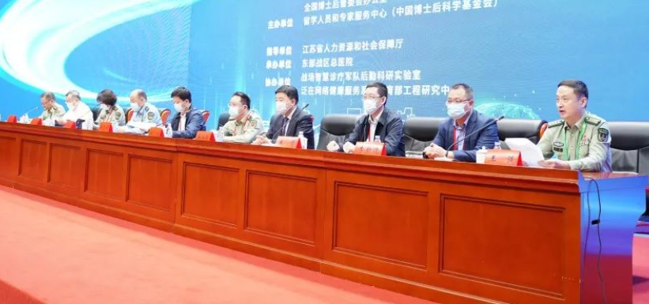

活动以“战创伤智慧诊疗发展”为主题开展理论探讨、技术交流。消息指此次活动系东部战区总医院 **紧贴应急应战医疗保障需求**
，进一步提升卫勤保障智能化水平和战场救治综合保障能力的又一重大举措。

文章介绍称，活动中，中国工程院院士刘志红、王红阳、付小兵、王广基、张英泽、李兆申，中国科学院院士滕皋军，俄罗斯自然科学院外籍院士、东南大学教授李新德分别作主题报告。

根据政知君梳理——

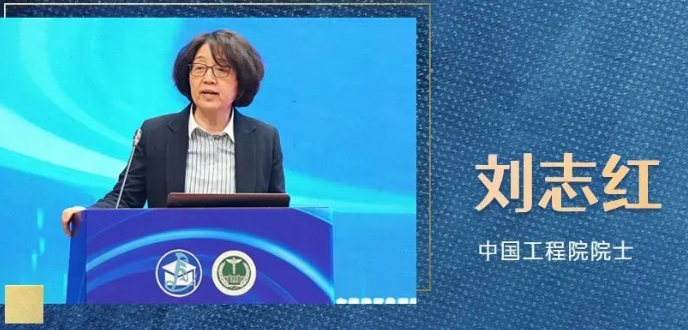

刘志红2003年当选中国工程院院士，主要从事肾脏病学临床和基础研究。

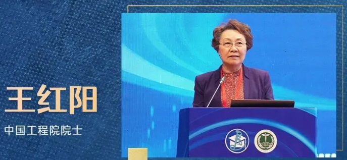

王红阳2005年当选中国工程院院士，肿瘤分子生物学与医学科学家。

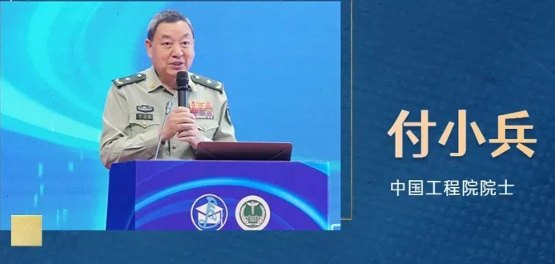

付小兵2009年当选中国工程院院士，主要从事创伤和创伤后的组织修复与再生医学研究。

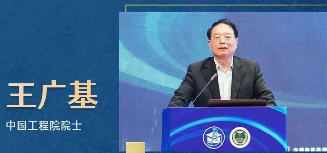

王广基2013年当选中国工程院院士，主要从事药理学、药物代谢动力学与毒理学研究。

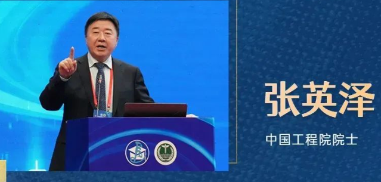

张英泽2017年当选中国工程院院士，是中国骨科创新与骨折微创治疗的首倡者，是骨科创伤领军人之一。

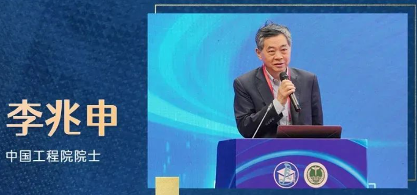

李兆申2017年当选中国工程院院士，是中国消化内镜学和胰腺病学专家。

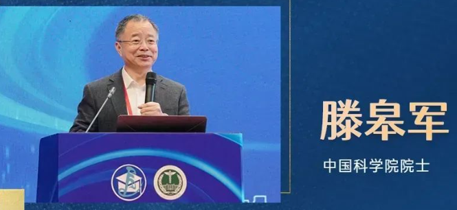

滕皋军2021年当选中国科学院院士，介入放射学与影像学家，从事医学影像与介入治疗临床与科研工作。

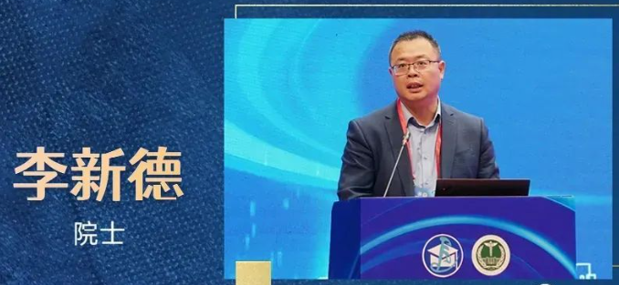

李新德2021年当选俄罗斯自然科学院外籍院士，主要从事人工智能、智能机器人、机器视觉感知、学习与理解、人机自然交互、智能信息处理等方面的研究。

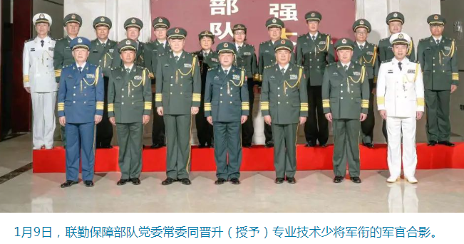

政知君注意到，上述8位院士中，刘志红、王红阳、付小兵等人出身解放军系统，系“戎装院士”。另据公开报道，
**2022年初，刘志红、付小兵被晋升专业技术少将军衔。**

此外，东部战区文章披露，上述大会设七个分组讨论会场，来自全国的30位医疗高级专家，各高校、科研院所和医疗单位的160余名博士后，针对论坛各个主题进行深入交流。

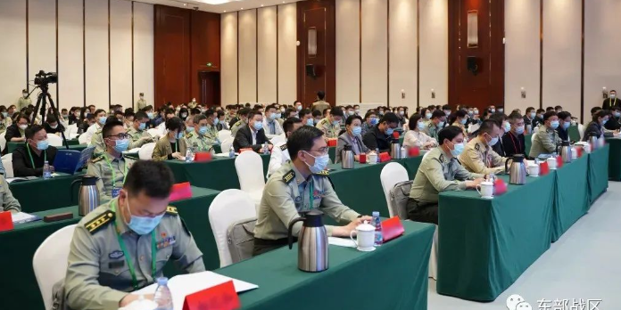

与会专家形成共识认为——

一是 **适应应急应战智能化卫勤保障新需求，形成具有军民深度融合特色的军队区域医联体模式**
，应在联合组织机构、运行机制、人才培养、资源配置、智能化服务等方面狠下功夫；

二是运用大数据、移动物联网、5G+通信等先进技术，以“医疗数据云中心”为核心，推动战创伤智慧诊疗新发展，是提高智能化战争卫勤保障质效的不二选择；

三是加快研发和应用多智能体紧急救治装备如系列化医疗、护理、康复机器人等， **可大大提升战场分级阶梯救治水平，最大限度减少官兵伤亡率、残疾率**
，实现伤病员安全后送和快速康复；

四是加强和促进医工交叉融合，是现代军事医学创新不可逆转的趋势。当下和今后应着重在解决中医药关键核心技术发展瓶颈、医学工程颠覆性技术临床应用等方面，进行更广度、更深度的观察和思考,在思维、范式和认知上有所突破。

文章评价称，此次活动 **紧贴应急应战医疗保障需求** ，对于努力开创一体化国家战略体系和能力建设新局面，进一步巩固发展新形势下的军政军民关系，
**提升我军现代卫勤保障能力和战创伤救治智慧化水平** 具有重要意义。

**资料 ｜东部战区公号 中国工程院官网 澎湃等**

**【版权声明】本文著作权归政知新媒体独家所有，未经授权，不得转载。**

