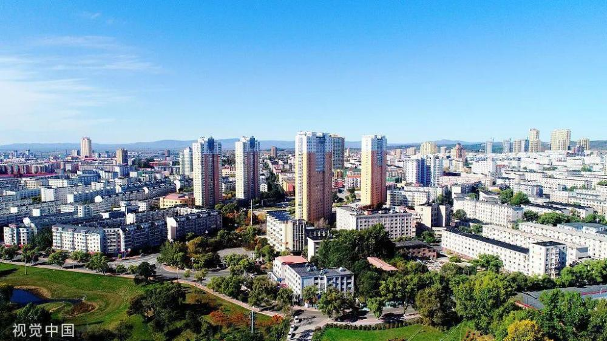

# 鹤岗翻身：一季度GDP增速达到8.5%，高于全国平均增速

鹤岗“翻身”了？

今年一季度，鹤岗GDP增速达到8.5%，在黑龙江13个地级市中位列第一，高于黑龙江全省的平均增速（5.1%）和全国的平均增速（4.5%）。

最近几年，由于“白菜价”的房子，鹤岗这座边陲小城，也一跃成为“网红”城市。

但当不少购房者涌入鹤岗后，由于就业机会和气候等原因，“4万在鹤岗买房3万卖出”、“第一批到鹤岗买房的人已经逃离”等话题，再度引发热议。

鹤岗此轮的经济增长，似乎让外界看到了这座资源枯竭型城市“翻身”的可能。

据了解，2022年，鹤岗GDP增速为4.5%，同样明显高于黑龙江全省的平均增速（2.7%）。

_鹤岗 图/视觉中国_

**转折**

在此之前，鹤岗近年来的经济形势，一路向下。

2011年，鹤岗被确定为国家第三批资源枯竭型城市。这意味着鹤岗的煤矿资源开发已经进入后期。全国这样的城市，有69座。

曾经，鹤岗拥有大大小小300多家煤矿，但随着资源枯竭，目前已经关停到只剩十几家。

伴随着资源枯竭，和同类的城市一样，鹤岗常住人口不断流失。第七次全国人口普查数据显示，2020年鹤岗全市人口为89万人，相比2010年第六次全国人口普查的105万人，下降了15.81%。

鹤岗一中是全国百强中学，也是本地人的骄傲。鼎盛时期鹤岗一中在校学生过万人，而近几年人数逐年减少。

资源枯竭、常住人口减少，又从财政领域为鹤岗带来更严重的问题。

2021年12月，鹤岗市人力资源和社会保障局发布通知称，因该市政府实施财政重整计划，财力情况发生重大变化，决定取消公开招聘政府基层工作人员计划。鹤岗也成为全国第一个实施财政重整的地级市。

财政重整指的是地方政府在面临债务高风险时，采取一系列措施使债务规模和偿债能力相一致，恢复财政收支平衡的一种方法。

2016年11月，国务院发布《地方政府债务风险应急处置预案》规定：市县政府年度一般债务付息支出超过当年一般公共预算支出10%，或专项债务付息支出超过当年政府性基金预算支出10%的，债务管理领导小组或债务应急领导小组必须启动财政重整计划。

鹤岗财政重整，意味着其债务付息支出占比已经超过10%的红线。

因“白菜价”的房子而成为“网红”城市后，鹤岗发生了不小的变化。

鹤岗市统计局发布的《鹤岗市2022年固定资产投资运行情况分析》显示，2022年鹤岗市房地产开发投资同比增长20.4%，较前三季度增加32.1个百分点，拉动全市投资增长1.2个百分点。

商品房销售方面，在2022年全国商品房销售面积下降24.3%的情况下，鹤岗商品房销售面积6.4万平方米，同比增长37.9%，其中住宅增长66.4%；商品房销售额2.2亿元，同比增长28.4%，其中住宅增长57.2%。

这也是连续两年鹤岗商品房销售面积实现较大幅度增长。2021年鹤岗商品房销售面积4.6万平方米，比上年增长21.1%，商品房销售额1.7亿元，比上年增长23.7%。

2020年至2022年三年间，外地迁入鹤岗落户的共有7286人，这对常住人口仅80多万且多年人口负增长的鹤岗而言，虽然杯水车薪，但也属不易。

到2022年底，鹤岗地方政府债务余额共计243亿元，其中，法定债务111亿元，隐性债务132亿元，债务风险等级也由最高的“红区”降低到“橙区”。

不过，商品房销售领域的大幅增长，可能只是鹤岗此轮经济增长的部分原因，更为关键的是，鹤岗在产业发展方面取得较大进展。

**爆发**

鹤岗市统计局数据显示，今年第一季度，鹤岗第二产业增加值32亿元，增长12.7%，对GDP增长贡献率为59.8%，正向拉动GDP5.1个百分点。

同时，鹤岗的固定资产投资同比增长17.8%，比黑龙江全省的平均水平高出了9.4个百分点，其中第二产业投资增长32.6%。

2022年鹤岗市工业增加值增长9%，高于全省平均水平8.2个百分点，位列全省第一位。

这其中，不得不提鹤岗的石墨产业。

鹤岗已探明矿石储量达17.31亿吨，以晶质石墨为主，矿石平均地质品位10.2%，储量大、品位高、易开采，用浮选方式可一次性生产出含碳量95%以上的石墨精矿。

石墨产业已发展成为鹤岗仅次于涉煤产业的第二大产业。全市共有石墨企业37户，有中国五矿、国信通、海达、华升、溢祥、奥星、帝源、贝特瑞为代表的多家知名企业。

2022年7月，中国石墨集团在香港上市，成为鹤岗首家上市公司。

长期专注新能源电池领域的真锂研究首席研究员墨柯告诉中国新闻周刊，鹤岗石墨矿品质优良，早在10多年前，石墨行业龙头企业贝特瑞就进入鹤岗。

但为何近一两年，鹤岗的石墨产业才迎来爆发？

在墨柯看来，这与近两年新能源汽车爆发式增长息息相关。

天然石墨产品的应用市场主要包括电子、新材料、冶金等领域。其中，电子行业应用最广泛，主要用于锂电池负极材料、导电膜、石墨电极等。

“相比过去石墨广为应用的消费电子领域，在新能源汽车领域的用量明显更多。”墨柯说。

根据中国汽车工业协会统计，2022年，我国新能源汽车产销分别完成705.8万辆和688.7万辆，同比分别增长96.9%和93.4%。

今年一季度，我国在出口商品中，汽车、蓄电池分别出口1474.7亿、1163.4亿元，增长96.6%和84.8%。电动汽车又承包了汽车出口增量中的大部分。

在墨柯看来，未来天然石墨的需求量还会不断增长。

据了解，纯电动汽车的“三电”成本，即电池、电机和电控系统的成本，占整车的成本超过50%。而负极材料又是电池成本中重要组成部分。

“从需求量出发，电动车市场发展很快，导致对于天然石墨的需求，也在不断增长。此前电池领域的负极材料，多用人造石墨，但因为天然石墨比人造石墨成本更低，目前用量在逐步加大，随着车企对锂电池成本以及整车成本的控制，未来天然石墨的用量将进一步扩大。”墨柯说。

**竞争**

那么，石墨产业能帮助鹤岗摆脱资源枯竭型城市的“帽子”，彻底转型吗？

在中国社科院城市发展与环境研究中心研究员牛凤瑞看来，一个大城市可能需要多个支柱产业支撑，才能获得较好发展。

他说，“鹤岗本身‘因煤而兴’，是依靠资源兴起的城市。如果石墨产业能形成完备的上下游产业链和规模效应，对于支撑一座小城的发展有一定助益。”

鹤岗市石墨产业发展中心主任孔萍此前对媒体表示，2015年，鹤岗就提出把石墨产业作为煤炭替代产业来发展。石墨的附加值比较高，将来技术上突破了，产业形成了规模效应，附加值非常大，到时候城市就能实现真正的转型。

目前，我国天然石墨资源中，晶质石墨储量过半，主要分布在黑龙江、山东、内蒙古、山西、河南等地。其中黑龙江晶质石墨矿石储量占比为47%，是最大的晶质石墨矿石资源分布区；内蒙古储量占比为19%，两省占全国储量的66%。

除了鹤岗，山东青岛的莱西、吉林吉林市的磐石、内蒙古的乌兰察布等地，也在大力发展石墨产业链。

而在黑龙江省内，多个城市探明品质较高的天然石墨矿，都在发力石墨产业。

比如，同属黑龙江的牡丹江市，正精心打造的石墨精深加工百亿级产业链。进入今年4月中下旬，其重点项目建设的石墨产业项目步伐明显加快。

在牡丹江桦林化工园区，总投资达43亿元的奥丰高性能碳基新材料产业基地项目建设正在加紧推进，该项目是省重点项目，预计三条球形石墨生产线将于5月投产，计划年产1.1万吨天然石墨负极材料。

临近鹤岗的鸡西市也在布局。早在2014年，鸡西就被中国矿业联合会授予“中国石墨之都”称号。

鸡西是世界优质鳞片石墨主产区，全市探明资源储量9.76亿吨，远景储量20亿吨以上。目前，鸡西石墨企业已达60家，深加工占比从28%跃升至80%，最近几年产值实现每年27%的增长率。早在2020年，鸡西石墨精粉产量35万吨，占全国产量40%。

在不少行业人士看来，要想借助石墨产业实现更高水平发展，实现深加工并逐步打通产业链上下游，引进电池乃至整车企业，非常关键。目前，北汽集团已经落户鸡西，并在鸡西重点打造新能源项目。

有行业人士认为，与竞争对手相比，鹤岗并没有明显优势。

墨柯表示，石墨产业发展最为关键之处，是当地天然资源和电力价格。他说，“对鹤岗而言，自身城市规模有限，未来发展石墨产业较好方法之一，就是与周边城市结成产业同盟，实现错位发展。”

作者：赵越

