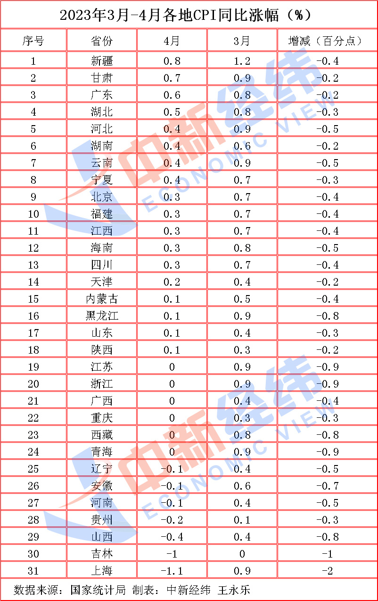

# 31省份4月CPI出炉：13地涨幅低于全国，上海等7地物价降了

中新经纬5月13日电
(王永乐)日前，国家统计局公布了31省份2023年4月居民消费价格指数(CPI)。中新经纬梳理发现，4月，31省份CPI同比涨幅全部回落。其中，上海、吉林等7地同比下降。

_图源：国家统计局网站_

**13地同比涨幅低于全国**

**上海等7地同比下降**

国家统计局数据显示，2023年4月，全国CPI环比下降0.1%，同比上涨0.1%。CPI同比增速低于市场预期，且连续三个月回落。

中新经纬梳理发现，31省份4月CPI同比"涨平跌"共存。其中18省份同比上涨，6省份同比持平，7省份同比下降。从涨幅来看，31省份涨幅均低于上月。

具体来看，新疆、甘肃、广东、湖北、河北、湖南、云南、宁夏、北京、福建、江西、海南、四川、天津等14省份涨幅高于全国水平，且均处于“0时代”；内蒙古、黑龙江、山东、陕西等4省份涨幅与全国水平持平；江苏、浙江、广西、重庆、西藏、青海等6省份涨幅为0%；辽宁、安徽、河南、贵州、山西、吉林、上海等7省份同比下降，其中上海降幅最大为1.1%。

另外，从增减幅来看，最小降幅为0.2个百分点，上海降幅最大为2个百分点。

中新经纬注意到，上次有省份CPI同比出现下降是在2022年2月，彼时西藏同比下跌0.2%。

财通宏观陈兴团队分析称，CPI增速下滑很大程度上受去年同期高基数影响，去年4月多地受到疫情因素影响，食品采收和物流成本上升，叠加去年年初强寒潮天气导致的供应下降，食品以及CPI环比增速都曾在当时创下历史同期新高，一定程度上压制了今年4月CPI同比的表现。从环比增速上来看，其实4月CPI处在历年同期中等水平，并没有体现出很弱的季节性。

**未来CPI怎么走？**

展望下阶段物价走势，机构普遍预计CPI同比涨幅有望触底反弹，但幅度温和。

国金宏观赵伟团队认为，CPI底部已现。与线下消费相关的服务业涨价或带动核心CPI回升，叠加基数影响、食品拖累环比降幅收窄等，或带动CPI触底回升。

陈兴团队表示，从高频数据来看，5月以来，猪肉、鲜菜价格环比价格增速由负转正，鸡蛋价格降幅走扩，预计CPI环比涨幅继续改善，同比增速稳中有升。

在中信建投证券首席经济学家黄文涛看来，5月，CPI翘尾因素将回升，而新涨价因素按季节性规律可能仍为负，CPI同比或将基本持平。下半年在新涨价因素的带动下，CPI同比有望进入上行通道。

中国民生银行首席经济学家温彬等分析称，由于食品价格大体稳定、输入型通胀压力继续减弱、核心CPI回升偏慢，再加上下半年翘尾因素低于上半年，2023年后半段CPI或仍将保持在低位水平，预计上半年CPI同比上涨0.8%，全年约为1.3%左右。(中新经纬APP)

**(文中观点仅供参考，不构成投资建议，投资有风险，入市需谨慎。)**

**中新经纬版权所有，未经书面授权，任何单位及个人不得转载、摘编以其它方式使用。**

