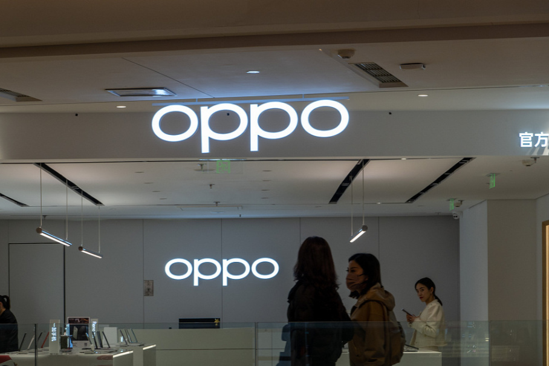

# OPPO挥泪斩哲库，中国折戟造芯？

_来源：视觉中国_

作者 ｜张睿

编辑 ｜ 康晓

出品 ｜ 深网·腾讯小满工作室

一石惊起千层浪，5月12日，OPPO突然对外宣布终止ZEKU（哲库）业务。

哲库科技（上海）有限公司（以下简称哲库）是OPPO旗下涉及芯片业务的公司，于2019年8月成立，法定代表人为刘君。刘君也是哲库CEO及OPPO公司的CTO。截至目前，OPPO已经推出两款自研芯片，MariSilicon
X（影像芯片）及MariSilicon Y（协处理芯片）。OPPO推出的旗舰手机 Find X5及 Find X6都搭载了MariSilicon X芯片。

对于大部分哲库员工来说，一切都毫无征兆。有员工在社交平台上感慨，“昨晚还在设计电路，然后通知今天在家办公，今天上午原地失业。”而据《深网》了解，4月底，哲库还在发布社会招聘信息，涉及系统构架、数字设计、软件开发、芯片验证等多个职位。消息显示，目前哲库有近两三千名员工。

对于突然终止ZEKU业务，OPPO官方对《深网》回复：面对全球经济、手机市场的不确定性，经过慎重考虑，公司决定终止ZEKU业务。这是一个艰难的决定，我们会妥善处理相关事宜，并将一如既往做好产品，持续创造价值。谢谢各位朋友的关心与支持。

**除了华为，OPPO是国内唯一有勇气真正投入自研芯片的智能手机企业。**

在2019年决定自研芯片时，创始人陈明永就明白这注定是一条坎坷之路。其曾在公司内部表态，“深知这条路（自研芯片）非常不易，也许要十年磨一剑。但我们绝非一时兴起，其中的风雨挫折都已考虑在内。”

有行业人士曾对《深网》透露，OPPO将芯片命名为作为马里亚纳，颇有深意。作为已知的海洋的最深处，马里亚纳海是地球上环境最恶劣的区域之一。如此命名，隐喻自研芯片是一条艰难的路。

**“OPPO挥泪斩哲库”**

业内人士普遍认为，OPPO终止哲库业务或与“造芯”太烧钱、又遭遇手机行业“寒冬”相关。有消息称，为了吸引有经验的芯片设计人才，哲库给出的薪资水平高于同行。

眼下，“OPPO挥泪斩哲库”或许是最好的选择。

从芯片研发整个产业链来看，人力成本高或许不会成为哲库“关门”的主要原因，因为与购买EDA设计工具、流片等工序所需要的成本看，人力成本并不算高。

要研发芯片，首先要“烧钱”购买EDA设计工具。EDA软件是芯片设计必需的软件工具，有“芯片之母”之称。目前，全球芯片设计的高端软件EDA基本被美国Synopsys、Cadence、Mentor三大公司所垄断。

其次，每次的流片成本就要花费大几千万甚至上亿元。哲库的两款芯片采用的都是台积电的6nm制程工艺。

OPPO的MariSilicon Y采用的N6RF射频工艺制程，是除苹果之外全球第2个采用该工艺的公司。据供应链信息显示，MariSilicon
X芯片单次流片试验费用高达约1亿元人民币。

此前有传闻，OPPO基于台积电4nm工艺制程的自研手机AP应用处理器或将在今年年末量产。如果消息属实，这意味着，OPPO将成为华为之后第二个自研SoC芯片（系统级芯片）的国内手机厂商。

不过，曾有行业人士对《深网》透露，自华为被美国制裁后，国内头部手机厂商对谈论自研SoC芯片讳莫如深。

有种说法是，为了自研芯片，OPPO需要投入500亿。这个数据出自陈明永之口，但并非全部用来“造芯”。其在2019年首届OPPO未来科技大会上的原话是，“未来三年将投入500亿，构建底层硬件技术以及软件工程和系统架构能力。”

OPPO造芯三年的投入或在100亿元左右，如今又遭遇手机行业寒冬，市场大盘不断下滑，所以行业推测哲库业务被终止与“造芯”太烧钱有关。

**坎坷的中国手机造芯路**

从长远看，自研手机芯片确实是一条艰难但正确的路。芯片不仅是核心技术的象征，苹果和华为在高端手机市场的成功已经向行业证明了先进自研芯片的重要性。

国内头部手机厂商都不同程度的走上过自研芯片之路，但最后都选择观望或放弃。

系统级芯片是手机的主芯片，由CPU、GPU、NPU和存储等部分组成。由于操作系统和系统级芯片的研发高度协同，不做系统芯片的手机厂商只能对芯片表面的UI层、CPU、GPU、大核小核去做精细化的调度，这直接影响主芯片性能的调教和手机的性能。

华为很早就意识到自研芯片的重要性。

2004年，华为成立海思半导体，研发SIM卡芯片，随后扩展到安防监控和机顶盒芯片等领域。2009年，华为推出首款手机芯片K3V1，主要面向山寨机市场，2012年，华为第二款手机芯片K3V2芯片搭载到其P6系列手机上。

华为手机芯片的性能最初并不理想，但经过几年迭代，2014年6月发布的麒麟920达到了当时主流SoC的性能水平，搭载麒麟920的华为荣耀6获得大卖，同年下半年推出的麒麟925则让华为Mate7站稳了高端市场。2014年之后，华为陆续推出了7款手机芯片，最新的麒麟9000已能媲美高通和苹果的同类产品。

华为之外，最先投入“造芯”是小米。

2014年，小米宣布造芯，并成立了独资子公司松果电子。2017年小米首款自研SoC澎湃S1推出，搭载在小米5C手机上。但澎湃S1遭遇了发热、耗电速度快等问题，继任者澎湃S2在设计和流片阶段存在重大Bug需要推倒重来。

此后小米自研芯片计划一度沉寂，甚至爆出松果电子已被拆分重组的消息。

不过，小米在2021年的春季新品发布会上发布了自研ISP芯片澎湃C1。雷军在发布会上强调称，澎湃芯片研发还在继续。

有消息称，后来小米于2022年推出芯片澎湃C2，并搭载到小米12S Ultra中。但在发布会上，小米完全没有提及澎湃C2。

与小米相比，OPPO、vivo入局自研芯片较晚，二者都是从2019年开始酝酿“造芯”事宜，都选择从ISP芯片切入。

与OPPO此前下定决心自研芯片不同，vivo对于自研芯片极其谨慎。

vivo副总裁、OS产品副总裁周围曾对《深网》表示，“芯片定制特别是系统级的芯片定制周期较长，要在2024甚至2025年以后，vivo或许有重大突破。目前在硬件资源定制已经固定的情况下，提升底层系统的基础能力更为重要。”

在芯片的研发方面，vivo集中攻克专业影像芯片。自2021年以来，vivo 已经推出了 V1、V2等芯片，并将其用在X70系列、X80系列、X90系列。

有行业人士对《深网》透露，“vivo主攻影像芯片，并没有打算自己流片做SoC。”

从眼下的市场环境看，不做自研系统级芯片对于国内手机厂商来说是明智之举。

不可否认的是，止步于系统级芯片的研发，造芯的“卡脖子”的问题待解。“很遗憾在半导体制造方面，华为没有参与重资产投入型的领域、重资金密集型的产业，我们只是做了芯片的设计，没搞芯片的制造。”华为终端BG
CEO、智能汽车解决方案BU CEO余承东曾在“中国信息化百人会2020年峰会”上如此感慨。

海思能设计出覆盖华为主营业务的核心芯片，但7nm及以上先进制程只能交由台积电等少数几家晶圆厂代工。只要头部晶圆厂商被美国左右，国内还无法大规模量产14nm以下的先进制程芯片，手机厂商的“造芯”梦就布满荆棘。

