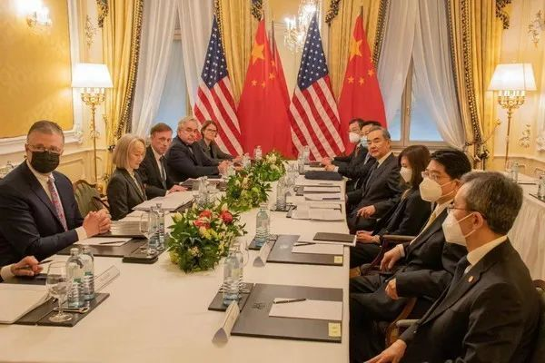

# 中美高官会晤受瞩目，欧盟对华表态很复杂，美欧试探性调整对华关系

【环球时报综合报道】当地时间5月10日至11日，中共中央政治局委员、中央外事工作委员会办公室主任王毅同美国总统国家安全事务助理沙利文在奥地利维也纳举行会晤。这一双方事先没有公布但意义重大的会晤迅速吸引全球目光。不少美国媒体分析认为，在中美关系位于历史低点的当下，此次会晤是双方紧张局势可能正在缓和的一个小迹象。

近期，美方持续释放寻求与中方对话的信号，但与此同时，美方又试图拿台湾等问题向中方施压，并在经贸领域打压遏制中国。美国财长耶伦11日在七国集团（G7）财长会上敦促G7成员对中国“经济胁迫”采取协调行动。12日接受《环球时报》记者采访的中国专家认为，考虑到美国当前的对华政策以及前后不一的言行，两国关系能否得到进一步修复还有待观察。作为全球最重要的双边关系之一，中美关系也在欧洲产生影响。据彭博社报道，欧盟将在当地时间12日举行的成员国外长非正式会议上，就调整对华政策展开讨论。美国“政治新闻网”称，在华盛顿和北京之间的紧张关系不断加深之际，欧盟最高领导层呼吁欧洲各国政府继续与中国对话。当前，欧盟正处于处理与中国日益复杂关系的关键时刻。

**10个多小时，多轮讨论**

王毅10日至11日同沙利文的会晤消息发布后，引发美联社、美国有线电视新闻网、法新社、路透社、卡塔尔半岛电视台、香港《南华早报》等国际媒体广泛关注。熟悉会晤情况的中方高级官员12日向《环球时报》记者透露，双方就包括中美关系、台湾问题、亚太局势、乌克兰危机等重要问题进行了多轮讨论，长达10个多小时。会晤是坦诚、深入、实质性和建设性的。

中方强调，中美元首巴厘岛会晤是成功和建设性的，为中美关系发展指明了方向，但美方在无人飞艇事件中过度反应、滥用武力，其中的教训必须汲取。

王毅全面阐述了中方在台湾问题上的严正立场，强调台湾问题是中国核心利益中的核心，是中美关系政治基础中的基础，是第一条不可逾越的红线。当务之急是，美方应切实恪守一个中国原则和中美三个联合公报规定，停止干涉中国内政。美方表示美国的一个中国政策没有改变，不支持“台独”，不支持“两个中国”“一中一台”。

该官员透露，中方要求美方取消对中美人文交流不合理的限制和干扰，与中方一道，开展更多两国各界交往，增进人民间相互理解。双方还就乌克兰问题交换了看法。

美国白宫发布的新闻稿称，双方就美中双边关系中的关键问题、全球和地区安全问题、俄乌冲突、台海问题等进行了坦诚、实质性和建设性的讨论。此次会晤是为保持沟通渠道畅通和负责任地管理竞争而进行的持续努力之一。

据美联社报道，一位不具名的美国政府官员称，双方均寻求“重新建立标准和正常的沟通渠道”。该官员还表示，“在我看来，双方都认为尝试进行新一次国家安全顾问主任级别的对话是有益的。”上述官员称，沙利文在此次会晤中向中方表示，拜登政府正寻求为2月无人飞艇事件引发的美中紧张局势翻篇。2022年6月，时任中央外事工作委员会办公室主任杨洁篪曾与沙利文在卢森堡举行会晤。

曾在奥巴马政府担任美国国家安全委员会中国事务主任的何瑞恩以及美国“政治新闻网”负责中国报道的记者凯恩等人认为，此次美中高级官员会晤或为两国领导人以及其他政府官员的会面做铺垫。

北京外国语大学国际关系学院教授宋微12日对《环球时报》记者表示，在当前形势下，中美双方保持高层沟通对于将双边关系推向正轨具有积极作用。路透社援引美国前助理国务卿丹尼尔·罗素的评论称，这种会晤可能会让双方找到一些共同点，帮助稳定动荡的双边关系。

**改善关系，美方须拿出诚意**

在报道此次会晤时，多家国际媒体均提到近期中美之间的互动有所增加。本月8日，中国国务委员兼外长秦刚在北京会见美国驻华大使伯恩斯。11日，商务部部长王文涛应约会见伯恩斯。

美联社认为，有迹象表明，双方正在使外交沟通重回正轨。白宫表示，有兴趣重新安排美国国务卿布林肯访华。此前，美国曾单方面宣布布林肯于今年2月访问中国，但由于无人飞艇事件，美方又宣布推迟这一行程。此外，白宫新闻发言人近期表示，财长耶伦和商务部长雷蒙多可能访问北京。在本月初的一次活动上，伯恩斯表示，美国已“准备好与中国对话”。

然而，在释放寻求与中国进行更多对话、稳定中美关系信号的同时，美国正试图给中国扣上一顶拒绝沟通的“帽子”。《澳大利亚金融评论报》称，美国正在实施一项战略，即从较低级别的对话开始，层层向上施压。一旦中国表示拒绝，就会遭到美国的批评。《环球时报》记者注意到，今年以来，五角大楼就频频对外界声称中国军方拒绝与其沟通。

一些专家对《环球时报》记者表示，虽然美方不断渲染华盛顿“渴望”与北京对话，但其诚意仍需考量。目前，美国在对华问题上言行不一，在经贸、台湾等问题上频繁对华打压遏制，这是中美关系出现问题的根本原因。“如果美国始终说一套、做一套，那么很多沟通合作就无从谈起。”

据报道，拜登预计于近期签署行政命令，限制美国对中国某些高科技领域的投资。与此同时，下个月将在广岛举行的G7峰会也可能会将矛头指向中国。耶伦11日声称，美国担心中国对其他国家使用“经济胁迫”，G7许多发达经济体成员也有一样的担忧，正思考如何应对这种行动。

宋微认为，美国想把中美关系波折的责任甩给中国，显示出美国正在面临国际和国内的双重压力。改善对华关系对美国的政治和经济利益都至关重要，但美方必须拿出真诚和务实的态度。

**欧盟或调整对华战略**

受美国政策影响深远的欧洲也在尝试调整对华政策。德新社12日称，欧盟国家外长当天在瑞典举行非正式会议，议题之一是欧盟与中国的关系。为此，欧盟外交与安全政策高级代表博雷利领导的欧盟外交政策部门准备了一份文件。文件阐述了欧盟的“去风险”战略，称欧盟必须准备好应对中国造成的任何影响，但欧盟不应认同零和博弈的想法，即在美中之间的二元竞争中只能有一个赢家。同时，文件认为，在对华接触、管理对华关系风险上，“与美国的协调仍至关重要”。彭博社称，在随这份文件发给各国外长的一封信中，博雷利敦促各国外长坚持将中国作为“合作伙伴、竞争者和系统性对手”的战略。《南华早报》12日解读说，欧盟认为应在对华战略上进行表面调整，而不是全面改革，对中国采取“清醒”但“不对抗”的态度。

中国社会科学院欧洲研究所研究员赵俊杰12日对《环球时报》记者表示，欧盟的对华政策目前存在矛盾：一方面，绝大多数欧盟国家认为应该与中国加强合作以获得实际利益；另一方面，欧盟依然认为需要加强与美国的安全合作，并且对中国日益扩大的影响力存在担忧。赵俊杰认为，在欧盟对中国的三重定位中，依然更强调竞争对手的角色，这也说明中欧之间的政治互信依然需要增强。近期，中国高级别官员密集访问欧洲，希望可以解释清楚中方的政策，打消欧方的一些误解和顾虑，同时针对一些抹黑和攻击阐明立场，整体上实现增强中欧合作信心的效果。

《南华早报》称，在12日的欧盟外长会议结束后，欧盟成员国领导人预计将在6月举行的峰会上讨论中国战略。

【环球时报驻美国、德国特约记者 郑可 青木 环球时报记者 赵觉珵 白云怡 张晗环球时报特约记者 任重】

