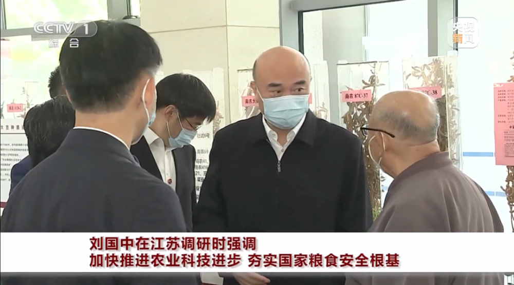
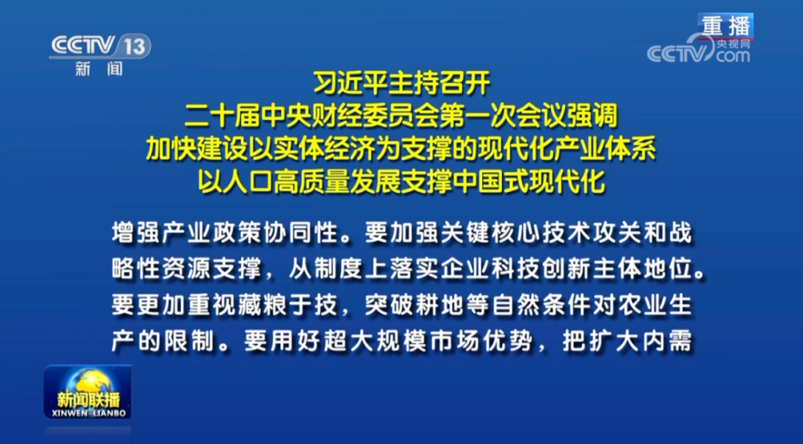
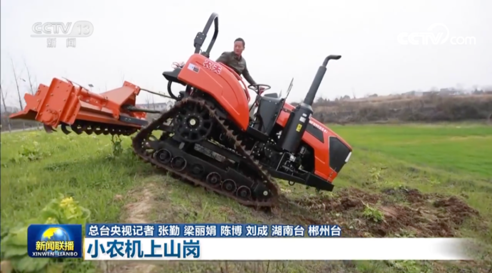

# 事关中央部署！国务院副总理刘国中离京南下，背后有深意

**撰文 | 余晖**

据央视5月12日晚报道，近日，中共中央政治局委员、国务院副总理刘国中到江苏调研。

政知君注意到，此次调研与农业科技有关。

在调研期间，刘国中强调，要“更加重视藏粮于技，坚持农业科技自立自强”。

此前（5月9日），2023年中国－太平洋岛国农渔业部长会议9日在南京举行，刘国中出席开幕式并致辞。

**3个月内到六省份调研**

“三农”问题，一直是中央高度关注的大事。

2022年12月23日至24日，中央农村工作会议在北京举行。在那次会议上，习近平强调，全面推进乡村振兴、加快建设农业强国，是
**“党中央着眼全面建成社会主义现代化强国作出的战略部署”。**

在这次会议上，习近平还强调，“保障粮食和重要农产品稳定安全供给始终是建设农业强国的头等大事。 **要实施新一轮千亿斤粮食产能提升行动**
，抓紧制定实施方案。”

政知君注意到，今年以来，中共中央政治局委员、国务院副总理刘国中聚焦农业生产等问题，到河南、山东、四川、安徽、浙江、江苏等省份外出调研。

3月，刘国中先后到 **河南、山东和四川** 的春季农业生产工作一线进行调研，并在四川出席全国春季农业生产工作会议。

4月，刘国中到 **安徽、浙江** 调研。

5月，刘国中到 **江苏** 调研。

调研的主题各不相同。

在四川参加全国春季农业生产工作会议时，刘国中强调，“坚决完成今年农业生产各项目标任务”“确保粮食产量保持在1.3万亿斤以上”。

刘国中强调，要以实施新一轮千亿斤粮食产能提升行动为重要抓手，聚焦耕地和种子两个要害，大力强化藏粮于地、藏粮于技，加快提升粮食产能，全方位夯实粮食安全根基。

在安徽、浙江调研时，他强调，“毫不放松抓好春季农业生产”。

而这次在江苏调研，他强调的主要是藏粮于技、农业科技自立自强。

**二十届中央财经委首次会议强调了这一问题**

科技创新自立自强是建设农业强国的根本动力。

在去年底的中央农村工作会议上，习近平分析了农业科技创新的现状和重要性：

当前，我国农业科技创新整体迈进了世界第一方阵，但 **农业科技进步贡献率同世界先进水平相比还有不小的差距。**

我们的资源就那么多，超大规模市场对农产品的需求又不断增长，现在比以往任何时候都更加需要重视和依靠农业科技创新，不仅要立志补上短板弱项，还要立志发挥后发优势、实现“弯道超车”。

农业科技创新要着力提升创新体系整体效能， **解决好各自为战、低水平重复、转化率不高等突出问题。**

就在前几天（5月5日），二十届中央财经委员会第一次会议强调， **要更加重视“藏粮于技”，突破耕地等自然条件对农业生产的限制。**

外界认为，“如此表述，鲜明地传递出中央层面高度重视农业科技的强烈信号。”

此次在江苏调研时，刘国中也提到， **要更加重视藏粮于技。**

他说，“坚持农业科技自立自强，加快关键核心技术攻关、成果转化和推广应用，夯实国家粮食安全根基，为加快建设农业强国提供有力支撑”。

据央视披露，刘国中先后到南京、徐州等地考察了 **农业科研院所、涉农高等院校、农机研发机构、种业企业、农业科技服务组织**
，详细了解农业科技研发和成果推广应用等情况。

**细节**

在江苏调研期间，刘国中提到：

**聚力攻关农业“卡脖子”技术** ，深入实施种业振兴行动，加快推进高标准农田建设，补上短板弱项。

**要发挥新型举国体制优势** ，整合资源力量，健全创新体系，支持创新平台和人才队伍建设，强化产学研协同攻关，提升农业科技创新整体效能。

聚焦 **粮油、畜禽水产等重点领域** 突破新品种新技术，提升质量、效益和竞争力。

几个细节值得关注。

第一，在调研期间，刘国中强调，要适应农业产业个性化要求， **加紧研发丘陵山区适用小型机械和园艺机械。**

一个背景是，在我国，丘陵山区耕地面积占到了全国的三分之一，也是保障粮食产量的重要来源。如何把这些分布零散、耕作不易的土地利用起来？

今年3月15日，《新闻联播》播发了《小农机上山岗》新闻。

新闻中提到， **由于普通农机很难爬上落差大的山坡，使得作业条件不好的丘陵地存在撂荒的风险。**
但种粮大户李开勇今年有信心流转这些耕地正是因为国家不断加大小农机的推广应用，让它们不仅可以耕耘在广袤的平原，也能爬坡过坎，开展全地形作业。

李开勇说，“以前耕一亩地，光耕地的成本就要四百块钱，现在用机械，一亩地四五十块钱成本就够了。现在丘岭地块的小农机越来越多了。”

值得一提的是，《“十四五”全国农业机械化发展规划》明确提出，到2025年，丘陵山区县（市、区）农作物耕种收综合机械化率达到55％。

目前，各地正在出台政策支持企业研发，让更多的小农机翻山越岭，助力丘陵山区每一亩耕地的收获。

第二，刘国中强调， **小农户数量众多是我国基本农情，必须做好面向千家万户的农业科技成果推广应用，助力小农户走上现代农业发展轨道。**

建设农业强国，必须立足“大国小农”基本国情农情。

近期，江苏大学中国农业装备产业发展研究院教授、研究员张宗毅在《如何发挥好农业装备在农业强国中的支撑作用》文章中提到，现代农业不仅需要良种、良法、良机、良田和信息化技术，还需要掌握这些先进生产要素的高素质农民。

文中还写道：

“当前我国传统小农户从数量上还占绝大多数，全国2.07亿农户户均经营规模不足10亩，规模农业经营户只占1.92%；同时，农业生产经营人员中，35岁及以下的占比不到20%，小学、初中教育程度占85.4%。这样经营规模结构、年龄结构和受教育程度结构的农户群体，他们在新技术、新装备的学习掌握能力上受到一定限制，在市场规律把握和扩大再生产投资方面存在局限。”

就在5月12日，农业农村部办公厅发布了 **《关于做好2023年高素质农民培育工作的通知》** 。

通知中提到，组织开展重点区域产业带头人培训行动。积极推进全国农业科技现代化先行县人才振兴，为每县培养100—200名产业发展带头人。

**资料 ｜ 新华社 人民网 央视 农民日报等**

**【版权声明】本文著作权归政知新媒体独家所有，未经授权，不得转载。**

