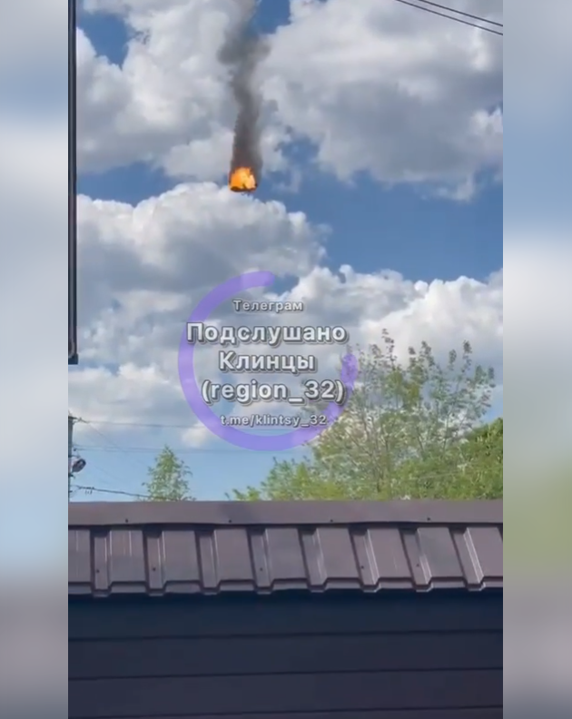

# 俄媒：一直升机在靠近俄乌边境的俄布良斯克州坠毁，已致2人死亡

【环球网报道】据“今日俄罗斯”（RT）网站消息，当地紧急情况部门13日称，一架身份不明的直升机在靠近俄乌边境的俄罗斯布良斯克州克林茨市郊区坠毁。塔斯社称，目前该事故已造成2人死亡。

_RT援引社交媒体上的事故现场图_

报道称，初步信息显示，该直升机在引擎起火后坠毁。社交媒体上的视频显示，直升机在半空中爆炸，然后变成一个火球急速坠落。

_RT援引社交媒体上的事故现场视频截图_

RT还称，一名51岁的女性在事故中受伤，她被直升机碎片击中并烧伤。目前，当地紧急情况部门正在事故现场灭火。

