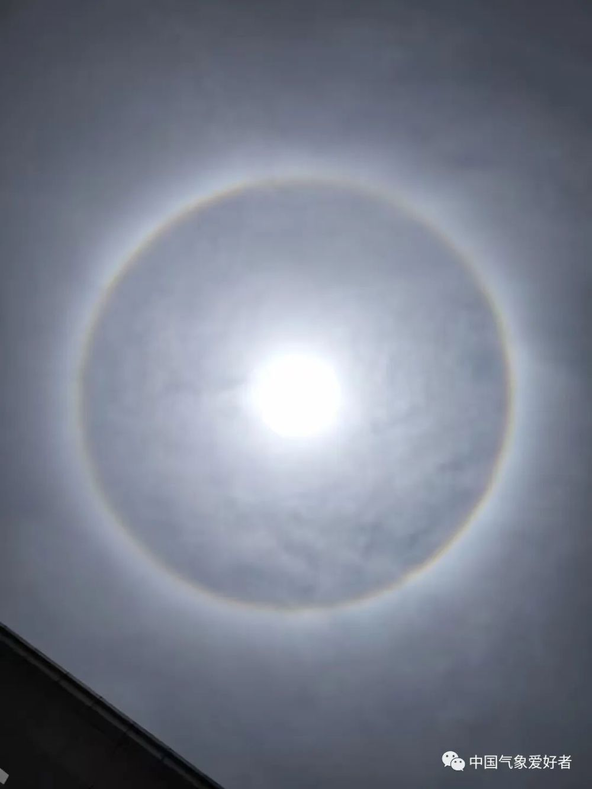
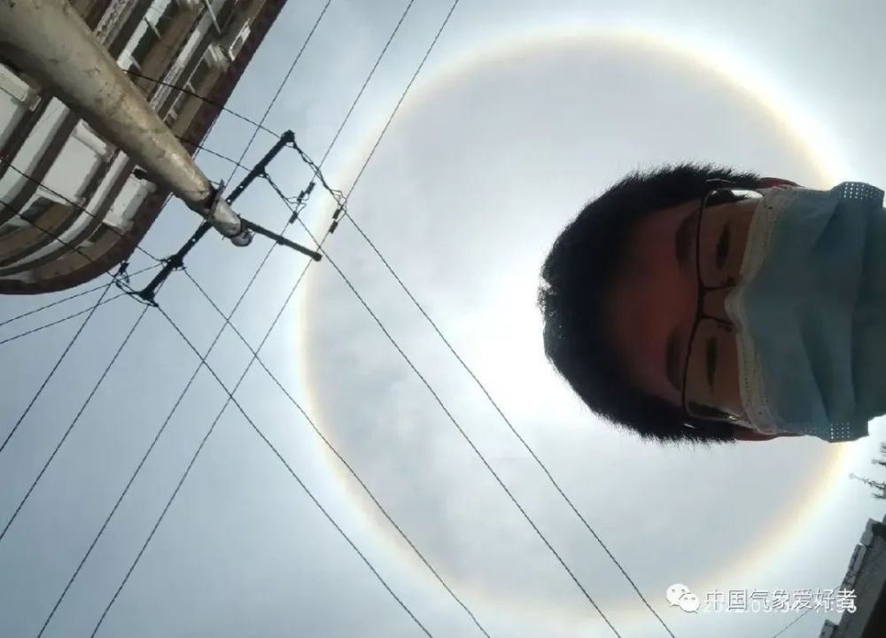
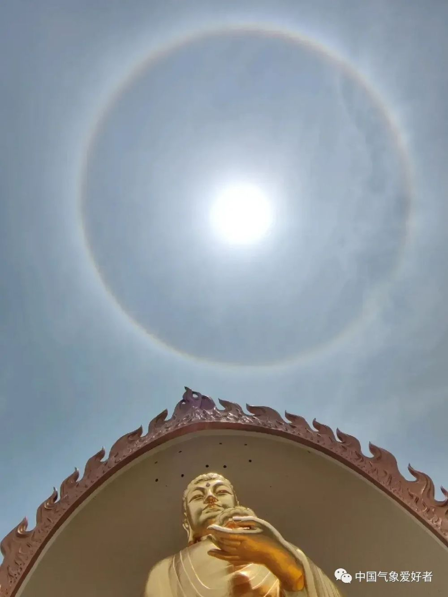
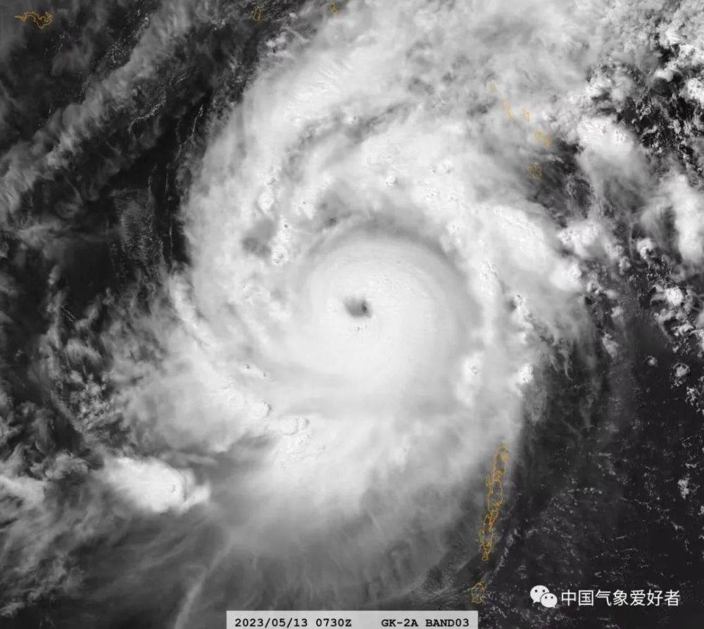
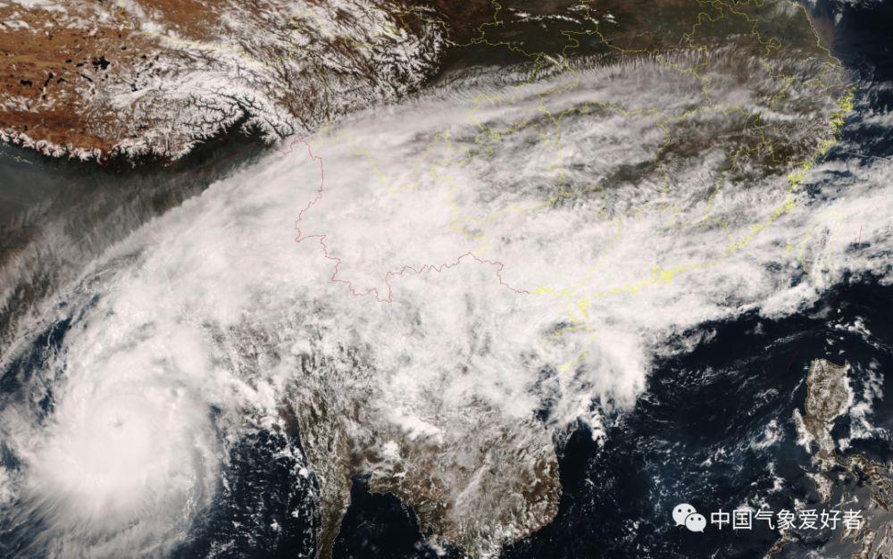
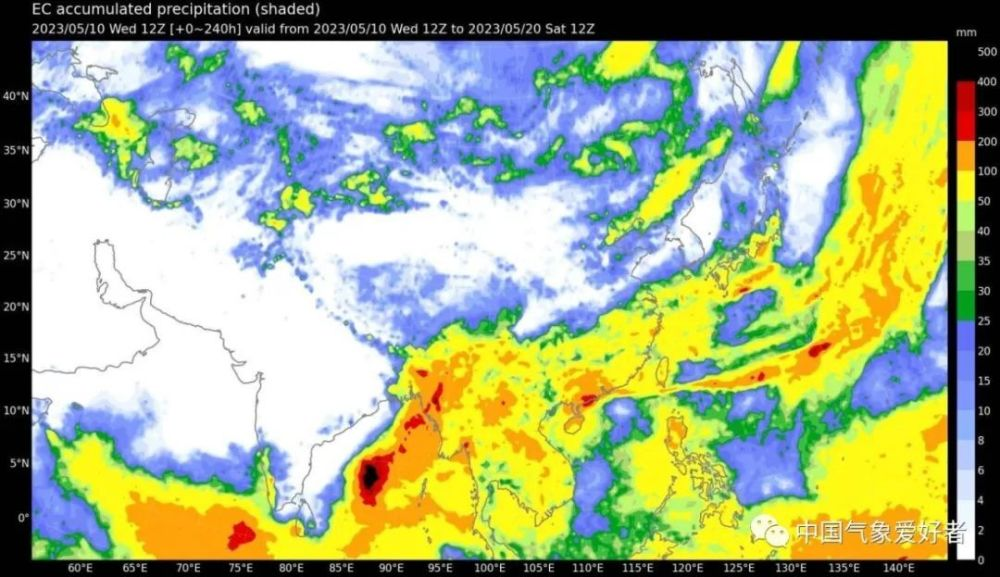

# 南方多省出现日晕大光圈，是印度洋超强风暴影响前兆

5月13日白天，我国南方多省以及河南省晴空中，太阳四周出现了一个圆形的大光圈，尤其是在湖北武汉，安徽合肥等地，光圈巨大圆润，持续时间很长，而且从内到外呈现彩虹般的七彩色。这是一种正常的大气光学现象，学名叫日晕。

_来自中气爱摄影群向横_

日晕的发生需要三个条件，首先需要一个太阳，其次需要天空中有大量微小冰晶组成的高层卷云，这些微小冰晶变成了漫天的棱镜，来折射反射太阳光，第三在高层卷云发达的同时，低层还不能其他云系，保证阳光能照射到地面。

_来自中气爱摄影群Sam
Sentshi_

很显然，5月13日的长江流域和淮河流域，就具备这种条件。因为一方面，这里的低空，还是5月12日北方冷涡甩下来的偏北风，因此空气干燥，没有其他厚云来阻挡阳光。

_来自b站平戸幸墨_

但另一方面，孟加拉湾气旋性风暴摩卡正在快速发展，它的高空针状云系被西风急流拉扯，形成了一道长发飘飘，穿越北印度洋、孟加拉国、缅甸和我国南方，直通太平洋的漫长云带。这个云带刚刚抵达长江流域、淮河流域时，还是以卷云为主，高空冰晶为主，因此和太阳、低空北风打了个完美的配合，制造了大范围的日晕。

_来自b站镇岳丨尚方_

而这些日晕，也是摩卡即将大规模影响我国的前兆。因为摩卡并不是一个普通的风暴，它是体型庞大，强度极强的风暴，是即将开启西南季风爆发的风暴，也是一个要在江南刮风下雨的风暴。5月13日下午，摩卡已经开出清晰的风眼，达到超强台风级别，中心附近最大风力有16级。

它还将继续发展，在13日夜间和14日早晨加强到17级以上，随后登陆缅甸和孟加拉国交界处。随后，摩卡的底层旋转中心将被缅甸高山截留，在原地释放所有能量消散；但高层中心将跨过一座座山川进入我国。

5月13日起，云南就要降温降雨，5月15日起，贵州、重庆、湖南、湖北、江西、安徽、江浙沪、福建以及广东广西北部也要先后刮风下雨，其中5月17日前后，江浙沪的大风大雨还真的很像弱台风登陆，请大家要提前做好准备。

不过，正在下雨的广东、广西和海南，这雨和摩卡没什么关系，这雨是台风胚胎带来的。5月13日的卫星云图可见，一个很微弱但很顽强的小漩涡正在海南岛附近旋转，它就是在经历副高重压、摩卡抢水和冷空气入侵等多重不利因素后，还顽强生存，并给海南带来大暴雨的台风胚胎93W。不过，随着摩卡的环流赶到，5月15日起93W将彻底消散，华南将重回正常的炎热天气。

