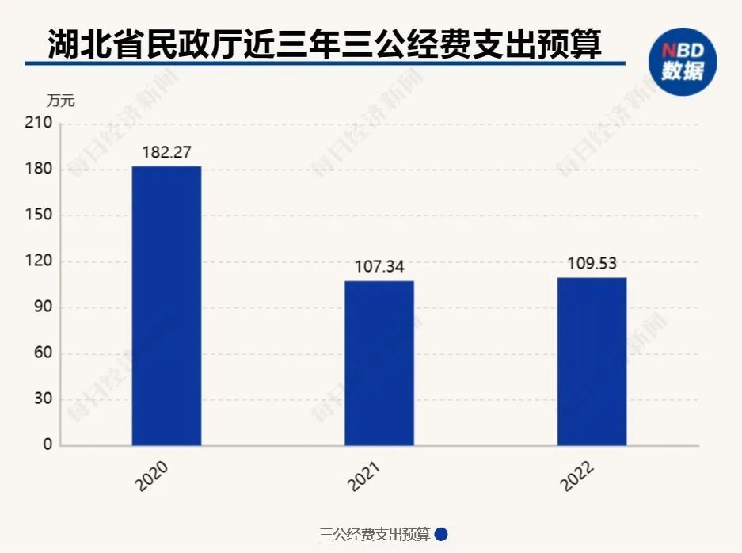

# 县财政局长讲“过紧日子”：财政局住三四十年老房子，木头门、没装修

“花钱必问效、无效必问责”“精打细算，才能油盐不断”“粮收万石，也要粗茶淡饭”……

在《每日经济新闻》记者随财政部到湖北调研近一段时间财政政策落实情况期间，围绕“政府如何过紧日子”这一话题出现的上述高频词，给记者留下了深刻的印象。

在更多地方的财政掌舵人看来，过“紧日子”“苦日子”不是权宜之计，而是长久之策。

事实上，过去五年来，各级政府都在坚持过紧日子，中央部门带头压减支出，盘活存量资金和闲置资产，腾出的资金千方百计惠企裕民。

湖北咸宁市通山县财政局党组书记、局长金汉南直言，
**目前当地财政收入还没有恢复到2019年的水平，但是财政支出一直是逐年增长，不过紧日子一定是难以支撑的。**

有地方财政局局长坦言，“过紧日子”关键在行动，贵在持之以恒。要把“紧日子”过成一种常态，让百姓的“好日子”长长久久，让群众的获得感越来越强。

_从近3年情况看，湖北全省一般公共预算累计支出持续高于累计收入_

**“过紧日子”要强化制度约束**

通山县位于幕阜山连片特困地区，2018年摘掉省级贫困县帽子，经济总量小、可用财力少，是典型的“吃饭财政”。

不过金汉南坦言，近年来受减收增支等因素影响，虽然当地压力大，但通过采取措施仍然确保了“三保”支出，基本做到了当年财政收支平衡或跨年度收支平衡，未出现政府债务风险、国库现金支付风险。

“谁都想过好日子，但要过紧日子是没办法。”金汉南说，当地从去年开始就出台和修订了关于规范会议费、差旅费、培训费等一系列管理办法，制定了《党政机关公务支出正面清单》。

“去年底，我们县里还出台了落实过紧日子的25条措施，包括进一步强化预算管理、大力压缩行政运行成本、规范政府投资项目实施等6个方面，内容非常具体。”

值得一提的是，现在很多单位为了规避责任，以政府购买服务的名义，把很多应该由本单位承担的职责工作委托给第三方来开展，委托给第三方就可能需要由财政来拿钱。

针对这种情况，通山县在上述25条措施中明确规定“单位自主开展的部门规划、调研课题、可研报告、申报方案、实施方案等工作，一律由本单位人员自行组织实施。单位承担的评估、考评验收等工作，一律不得委托第三方实施”。

**“这样下来，我们算下来起码节约两三千万元的财政资金。”** 金汉南认为，25条措施非常管用，从进人、用钱方面都作出了很明确的规范。

落实“过紧日子”确实要有制度保障。襄阳市谷城县财政局党组书记、局长刘勇介绍，当地制定出台了多项制度，从严规范财政资金审批程序，主动算好“财力大盘账”“刚性支出账”“资金缺口账”，从严从紧编制预算，从源头上拧紧过紧日子的水龙头。

**一般性支出、三公经费“压缩再压缩”**

压减一般性支出、三公经费是过紧日子的必要举措。

《每日经济新闻》记者在调研中了解到，湖北省民政厅每年按不低于5%的比例压减会议费、培训费等一般性支出，统筹保障“三保”任务等重要支出。

湖北省民政厅规划财务处处长程良波给出一组数据：2020-2022年，省民政厅累计压缩财政一般性支出775.3万元，其中2020年473.98万，2021年237.94万，2022年63.38万。其中三公经费的支出预算，从2020年的182.27万元压缩到2022年的109.53万元。

谷城县坚持“无预算，不支出”。刘勇表示，当地完善公用经费定员定额标准，大力压减办公费、会议费、培训费等一般性支出，全力保障工业转型、城市提档升级等重大项目和重点领域支出。“2023年，压减单位经费类项目支出3800余万元，压减率达17%。”

**“我们财政局现在都还是上世纪80、90年代的老房子，木头门，没有装修。”**
刘勇略感无奈，这几年的三公经费持续下降，就谷城县财政部门来说，疫情以前三公经费约有25万元，近两年每年只有4万-5万元，降幅是非常大的。

“但我们在民生方面还是很舍得花钱。”他说，比如在殡葬改革方面，花了1亿多元建立殡葬服务中心，现在基本看不到散埋乱葬现象；
**在教育方面，当地建高中也投入了5亿多元……**

麻城市则全面实行“大财政、大预算、大统筹”管理理念，打破瓶瓶罐罐以及“撒胡椒面”的粗放式资金管理，加大统筹、盘活、压减、调整力度，把有限资金用在刀刃上。

麻城市财政局党组书记、局长鲍斌介绍，2022年，当地分别按5%、20%对“三公”经费和工作经费类本级专项进行全面压缩清理，累计压缩支出3000万元。同时，严把预算支出关口，除特殊情况外，一律不再追加部门预算。

_咸宁市压减一般性支出并持续用于民生项目建设 图为建设中的咸宁市妇幼保健院新院区 图片来源：咸宁市财政局_

**财政部门要当“黑包公”“铁算盘”**

在金汉南看来，光靠压缩5%、10%的三公经费、公用经费，还远远达不到过“紧日子”的要求。

以通山县为例，全县三公经费加起来不到1000万元。“ **我们已经至少5年没有公费出国支出，公务接待现在也很少**
，主要就是公车运行，再怎么压缩，这个空间也是比较有限的。”

基于此，金汉南认为，加强政府投资项目管理是过紧日子的关键所在。他告诉记者，工程建设类项目投资大、周期长，对政府“钱袋子”影响很大。“特别是现在一些项目贪大求洋，或者不考虑财政的承受能力盲目上马，这样造成的损失和浪费就更大了。”

2022年，通山县成立投资决策委员会，出台《政府投资项目管理办法》，加强对政府投资项目从谋划、申报、入库、审批到建设实施、项目验收的全流程管控。

换句话说，所有的政府投资项目都要接受投资决策委员会的“审判”。超过预算10%的项目，必须要跟政府说清楚为什么超了，并要加以改进；超过20%的项目，就要推倒重来；没有落实资金来源的项目一律不予投资评审，不准进入政府采购、招投标程序。

金汉南举了个例子。 **比如有个小学要建地下停车场，计划投入1600多万元**
，“我们到现场一看，一个镇里的小学为什么需要建这么大的地下停车场？我们就把它砍掉了。如果没有投资决策委员会，这个项目一旦通过，那财政就要出1600万元。”

财政部门就是要当“黑包公”“铁算盘”。“这1600万元要从三公经费、公用经费中压缩，要压好多年可能都压不出来。”金汉南说。

再如一个河道治理项目，此前申报要维修河道，还要建亭子、古桥，同时要搞个管理服务用房，一算开支又是上千万元。我们认为修河道就把河道修好就行，不需要又修亭子又建古桥，就把这部分预算砍下来。
**“这一砍就砍了700多万元，这种压缩我认为才是真的过紧日子。”**

锱铢必较出真招，控成本才能见实效。金汉南坦言，投资决策委员会成立一年多以来，效果非常好，有效防范无效、低效、重复投资和非必要投资，同时杜绝了“未批先建”“少批多建”等行为。

**过紧日子要坚持“节流”与“开源”并重**

在过好“紧日子”的同时，各地也都坚持“节流”与“开源”并重。

其中，谷城县积极争资金、争项目，不断做大财政“蛋糕”，先后成功引进吉利集团、兴发集团、潘达尔集团等行业龙头企业。2022年，全县固定资产投资335亿元，同比增长19%；争取政策性资金24.6亿元，同比增长8%；争取29个省级项目，总投资46.45亿元。

鲍斌表示，麻城市也持续加大对石材行业、建筑行业、汽配行业等重点税源、重点企业、主体税种征管力度，确保做到应收尽收，不断壮大财政实力。

同时，麻城市持续助力企业高质量发展，大力实施积极财政政策，今年安排产业资金2亿元，充分发挥财政资金撬动作用，全力招商引商安商稳商，积极促进产业园区建设和优势特色产业发展，真正做到“放水养鱼”、涵养税源。

此外，麻城市还持续大力度盘活存量资金，始终坚持全市财政“一盘棋”，全面盘活国有资源，切实增加可用财力。“去年以来，已收回历年结转结余存量资金0.82亿元。”

**记者|** 张蕊 **编辑|** 陈旭 卢祥勇 杜恒峰

**校对|** 何小桃

