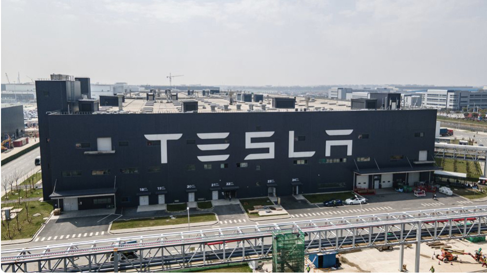

# 召回中国超百万辆车，特斯拉：将远程升级让车辆可选能量回收制动强度

特斯拉中国5月13日表示，为提升消费者用车体验和用车安全，特斯拉将通过汽车远程升级（OTA）技术，让特斯拉车辆可以选择能量回收制动强度；在驾驶员长时间深度踩下加速踏板时发出提醒。

这一升级是在特斯拉发出中国最大规模的召回后作出的。5月12日，中国国家市场监管总局网站消息称，特斯拉备案了召回计划，自2023年5月29日起，召回生产日期在2019年1月12日至2023年4月24日期间的部分进口Model
S、Model X、Model 3及国产Model 3、Model Y汽车，共计1104622辆。

特斯拉中国方面向第一财经记者解释称：“最新作出的技术升级简单来说就是两条，第一，把驾驶模式的选择权给到消费者，车主可以决定标准使用能量制动回收，也可以像开传统油车一样开特斯拉；第二，如果油门（电门）当刹车踩，车辆会提醒你。”

特斯拉还称，能量回收制动是个新技术，同时也是个充满争议的话题。“工信部明确表态它不是特斯拉独有，很多新能源汽车品牌都广泛配备。”

目前特斯拉在中国已经销售的大部分电动车都没有允许驾驶员选择能量回收制动策略；同时，对驾驶员长时间深度踩下加速踏板的情况可能没有提供足够提醒。这些因素叠加可能增加长时间误踩加速踏板的概率，可能增加碰撞的风险，存在安全隐患。

特斯拉方面指出，此次OTA召回后，能量回收制动功能用户可以选择用或者不用。“喜欢能量回收制动的车主，可以继续选择标准模式，靠脚感控制车速，同时提升车辆10%-20%的续航能力，降低刹车盘、刹车片磨损；不习惯该功能的车主，现在也可以先选择低模式来过渡。”特斯拉方面表示。

所谓能量回收制动，是指车辆带动电机发电，从而在降低车速的同时回收能量。这项功能让车辆将原本会被刹车片转化为热量的能量转换成电能储存起来，以节约电量、优化续航、减轻驾驶疲劳，同时提供满足大部分驾驶场景的减速效果。

特斯拉方面明确：“能量回收制动不等于刹车，驾驶员需保持良好的驾驶习惯，遇到紧急情况，需踩刹车踏板来实现制动。”

特斯拉近期已在中国进行多次召回。国家市场监管总局消息显示，今年3月，特斯拉在中国召回了2600多辆进口Model
S电动车，这些车辆的引擎盖在行驶过程中可能会意外弹出，给车辆和其他车辆带来安全隐患。

