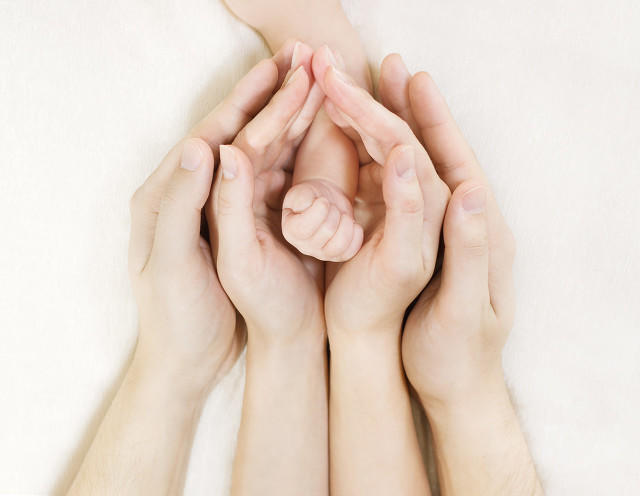

# 学者回应“建议给生孩子的人发薪水”争议：初衷是缓解生育率过低

5月12日，一条名为“专家建议给生孩子的人发薪水”的短视频登上热搜榜。视频中，全球化智库特邀高级研究员、人口学者黄文政提出“生孩子养孩子本身就是一份工作，应是有收入的”“生育率低的根源在于没有建立有效的生育激励机制”等观点，视频迅速引发大量讨论。

_↑资料图
据图虫创意_

有网友认为物质奖励确实有利于鼓励生育，但也有许多人质疑把生孩子视为工作的观点存在伦理问题——给生孩子的人发薪水是否意味着不生育者在缴纳“单身税”，以及更为关键的经济基础——薪水从哪里来？

黄文政在接受红星新闻记者专访时表示，网上流传的视频是他在接受媒体采访时回答中印人口问题的一个片段，希望网友等完整版视频放出以后更加全面地了解自己的观点。

**回应争议：**

**提出建议的初衷**

**是缓解当前生育率过低的问题**

黄文政说，自己提出这一建议的初衷是缓解当前生育率过低的问题。在他看来，解决生育率过低最重要的是调整分配结构，对生育子女者实行分配补偿。

“过去的观念是养儿防老，现在养老则要靠养老金，养老金不考虑被发放者生了几个孩子，但养老金要靠年轻人来赚，所以生育更多孩子的人实际上对养老金的贡献更多，得到的却和其他人一样。”因此，在黄文政看来，当前的养老金分配制度对于生育子女的人来说是不公平的，发放生育津贴则是一种补偿。

在黄文政眼中，他把生育视为工作、把生育津贴视为工资，在他看来，“生育比绝大多数的工作要有意义。”

对于政策执行方面的问题，黄文政回应道，自己只是提出一个由国家对生育者进行激励和补偿的思路，并没有做出更加细致的政策模型，需要全社会各方面来共同努力。

对于网友们“发放生育津贴就是变相收单身税”的担忧，黄文政提出：“生育率提高了，经济活起来了，对全社会都是有好处的。”

**观点：**

**社会必须作出整体性改变**

**提高对生育的重视程度**

2023年1月，国家统计局发布数据显示，2022年年末全国人口(包括31个省、自治区、直辖市和现役军人的人口，不包括居住在31个省、自治区、直辖市的港澳台居民和外籍人员)141175万人，比上年末减少85万人。全年出生人口956万人，人口出生率为6.77‰；死亡人口1041万人，人口死亡率为7.37‰；人口自然增长率为-0.60‰。

红星新闻记者查询国家统计局公开数据发现，1961年，我国人口总数比1960年有所下降，而从1961年开始，便一直处于连年增长。61年来，2022年我国人口首次出现了负增长。

在黄文政看来，在如此严峻的生育问题之下，社会必须作出整体性改变，提高对生育的重视程度，以此来应对当前的生育问题，实行生育激励机制就是其中非常重要的一环。在改变的过程中，观念的冲突是不可避免的，但冲突可以慢慢解决，绝不能裹足不前。“现在最大的伦理问题就是不认可生育养育的价值。”

生育养育的价值应当得到认可，那么生育是否应当成为正职？

对此，黄文政表示，从个人、家庭和社会发展角度来说，生育养育甚至是比物质生产更基础性的工作。这点对比人类和其他物种更加明显。但生育能否真的成为正职工作，取决于基本经济制度。生养后代虽然具有基础性意义，但并非人生的全部。只有确保年轻人投入时间精力养育后代能够获得稳定且足够的直接回报，养育才能成为社会普遍认可的正职工作。

**生育津贴对提高生育率影响几何？**

**黄文政认为效果取决于津贴发放力度**

**也有专家认为作用不应被夸大**

生育津贴是国家法律、法规规定对职业妇女因生育而离开工作岗位期间，给予的生活费用，也有国家将其称为生育现金补助。

发钱鼓励生育是否有效？对此，黄文政表示：“当然有效。”

黄文政认为，效果多大取决于力度多大。“根据我们针对其他国家的数据研究发现，GDP中投入家庭辅助的金额占比高出一个百分点，生育率会高0.1。像鼓励措施到位的法国和北欧，其本土人口生育率(不包括外来移民)接近更替水平。而投入强度大的以色列生育率则大大高于更替水平。在东亚工业化国家，投入强度最大的日本，其生育率显著高于中国大陆，虽然因为结婚率太低，生育率依然还是远低于更替水平。”

黄文政认为，合理的做法是提升津贴发放力度，直到生育率回升到更替水平，这是因为只要生育率低于更替水平，人口就会不断减少，最终消亡。“在此过程中，整个社会的经济发展和民众生活水平也不相对下降（相对更替水平的生育率而言），而且太低的生育率一定伴随极度的老化。”

黄文政强调，发放给养育家庭的津贴金额或者经济产出，对社会整体来说并不是成本或代价，因为受益者是本国国民和他们的后代。即使是不婚不育者，也会因为经济向上，社会欣欣向荣带来生产力进步和财富保值而受益。

“让养育者获得收入只是让社会产出的分配更加公平，社会也更具有可持续性。工业化时代，生育率反映的是社会的希望。提升生育率，归根结底就是给予年轻人希望。”黄文政说道。

而对于生育激励问题，中国人口学会会长、中国人民大学社会与人口学院教授翟振武认为，发放生育津贴对于提高生育率具有一定的积极作用，但这个作用不应该被夸大。

“因为现在大家不生孩子有很多原因，经济收入只是原因之一，要系统、全面、综合地实行生育支持政策，这样才能有效果。”翟振武指出，较高的房价、托育体系不健全、生育对女性工作的负面影响等问题，都是导致当前生育率较低的因素，而这些仅靠发放生育津贴是无法解决的。

中国人民大学社会与人口学院教授宋健则从人口学理论的角度，解释了当前生育率低的原因。他认为，根据人口转变理论，在现代化进程中，人口出生率下降是必然的（人口转变理论是指人口发展由高出生率、高死亡率、低自然增长率的传统模式，经过高出生率、低死亡率、高自然增长率，向低出生率、低死亡率、低自然增长率的现代模式转变的过程）。当前，我国和很多其他国家面临着的，是在完成现代化后出生率继续下降的问题，这也被称为“第二次人口转变”。根据欧美国家的经验，这一问题可能与传统家庭观念的式微有关。

根据宋健自己的研究成果来看，在中国，他认为影响人口出生率最大的因素或许是时间分配问题。“现代社会生活节奏紧张，拼命爬坡中的年轻人没时间谈恋爱，没时间生孩子，有闲暇时间也被刷剧什么的占据了。现在生育率下降跟人们生活的安排是密切相关的。当然，这也是现代化带来的。”宋健认为，相比之下，经济因素对很多家庭来说仍然很重要，但需要看得更细致一些。

红星新闻记者 王辰元 吴阳 实习生 李天一 北京报道

责编 邓旆光 编辑 彭疆

