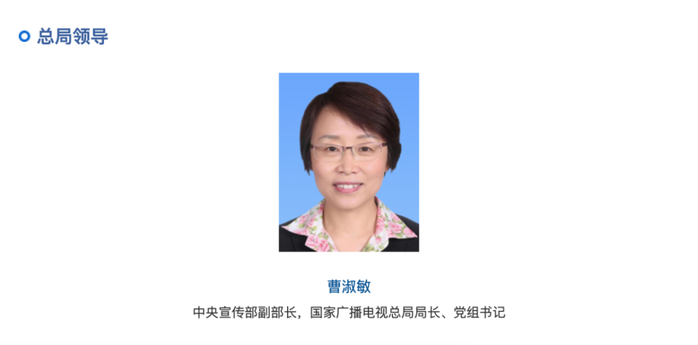
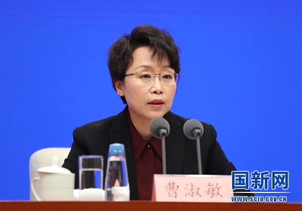

# 曹淑敏已任中央宣传部副部长、国家广播电视总局局长

据国家广播电视总局官网“总局领导”一栏最新信息显示， **曹淑敏已任中央宣传部副部长，国家广播电视总局局长、党组书记。**

_来源：国家广播电视总局官网截图_

公开信息显示，曹淑敏出生于1966年7月，河北辛集人。她曾任中国信息通信研究院院长、江西省鹰潭市市长、鹰潭市委书记等职，2017年12月任北京航空航天大学党委书记。2018年11月起，兼任全国妇联副主席。

2021年12月，她任中央网络安全和信息化委员会办公室副主任，2022年1月被任命为国家互联网信息办公室副主任，至此番履新。

_曹淑敏（资料图
来源：国新网）_

曹淑敏是第十八届、十九届、二十届中央候补委员。

原任中央宣传部副部长，国家广播电视总局局长、党组书记徐麟，现任贵州省委书记。

