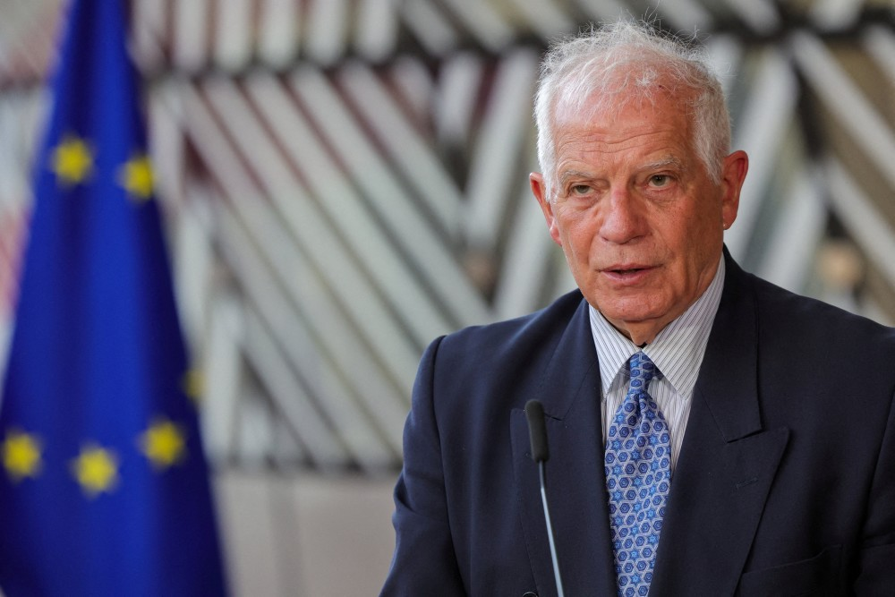

# 欧盟外长讨论中欧关系，立陶宛外长又来“碰瓷”台湾问题

【文/观察者网 周弋博】

当地时间5月12日，欧盟27国外长非正式会议在瑞典首都斯德哥尔摩举行，与会的各国外长将讨论俄乌冲突与欧盟对华政策等问题。

据路透社报道，立陶宛外长兰茨贝尔吉斯在会议期间再次“碰瓷”台湾问题，声称欧盟需要为与中国关系恶化的潜在后果做好准备，例如“台海冲突”的爆发。同时，他还将台湾问题与乌克兰危机作类比，并认为即便没有人呼吁与俄罗斯“脱钩”，欧盟也已与俄罗斯决裂。

然而，媒体早已披露，欧盟对外行动署在会议前所分发的一份意在引导会议讨论的立场文件指出，欧盟各国不要与中国断绝联系，必须对华采取“清醒”但“不对抗”的态度，并表现出实事求是的期望。

_路透社报道截图_

据报道，瑞典目前担任欧盟轮值主席国，12日举行的欧盟27国外长非正式会议由瑞典外相比尔斯特罗姆及欧盟外交与安全政策高级代表博雷利主持。

《南华早报》报道称，12日当天上午，欧盟各国外长在讨论完乌克兰问题后，因担心泄密和安全漏洞，决定乘坐大巴前往斯德哥尔摩郊区一座17世纪的城堡，并在一个没有电话或其他电子设备的房间里，围绕“如何重新调整与中国的关系”闭门讨论了四个小时。

值得一提的是，欧盟对外行动署11日向欧盟各国分发了一份意在引导会议讨论的立场文件，该文件建议就欧盟对华战略进行表面上的修改，而非全方位的彻底变革。新的侧重点将被放在乌克兰和台湾等热点问题上，并以经济现实主义取代此前期望，即中国可能愿意改革其市场以适应欧洲企业。

该文件还敦促成员国外长坚持欧盟2019年将中国视为合作伙伴、竞争者、制度性对手的认定——即欧盟对华政策的指南针，“即使这些不同要素之间的权重可能因中国的行为而有所不同”，而“近年来（中国作为）对手的方面变得更加重要”。

与此同时，该文件还建议欧盟成员国继续与中方接触。其写道：“需要向中国领导层发出公开、明确的信息，同时要有现实的期望，以确保可信度和影响力。”

文件补充说，“如果我们要在我们复杂的关系中建立新的稳定局面，欧盟及其成员国应该保持坚定但不对抗的态度。我们应该对这种关系的性质保持清醒的认识。”

据报道，一位参与起草该文件的欧盟高级官员表示，这些文本措辞是经过精心编写的，“每个词都有意义，每个句子都被放在正确的结构中”。

不过，也有欧盟外交官对“27国立场一致”的说法持保留态度。

“似乎有人在装聋作哑。”一位官员表示，这份文件传达了一种“道歉的语气”，表明布鲁塞尔并没有认真致力于改善与中国的关系。

另一位官员则将这份文件的形容为“弯弯绕绕的”（meandering），但也承认这是欧盟为试图容纳拥有如此相互竞争利益的成员国而付出的代价。“这是就像一顶大帐篷，这必须适合从立陶宛到匈牙利的所有国家。”

在12日晚间的新闻发布会上，博雷利谈及中国与俄乌冲突的关系。他认为，若中国真的能在政治解决乌克兰危机中发挥作用，欧中关系将向好发展。“生活是复杂的，”博雷利说，“如果我不喜欢你的行为，你就不能指望我们能成为好朋友，事情就是这么简单。”

_欧盟外交与安全政策高级代表博雷利_

路透社报道称，会议期间，立陶宛外长兰茨贝尔吉斯再次碰瓷台湾问题，声称欧盟需要为与中国关系恶化的潜在后果做好准备，例如“台海冲突”的爆发。

尽管兰茨贝尔吉斯强调自己并非主张与中国“脱钩”，但他仍将台湾问题与乌克兰危机作类比，并认为即便没有人呼吁与俄罗斯“脱钩”，欧盟也已与俄罗斯决裂。

“必须有人想出一种脱钩可能发生的可能性——不是因为我们希望这样做，而是因为形势变化，例如台湾问题。”兰茨贝尔吉斯在抵达斯德哥尔摩参会后向记者称，欧洲将不得不对这种发展做出反应，“而这种反应将导致某种程度的‘脱钩’。”

事实上，对于欧中关系，中国外交部发言人汪文斌在今年4月17日在记者会上就曾表示，希望欧盟恪守一个中国原则，履行中欧建交时作出的“不同台湾保持官方关系或缔结任何协定”的郑重承诺，真正维护台海和平稳定和国际正义。希望欧方反对“台独”分子挑衅生事，劝劝个别政客不要拉帮结伙打“台湾牌”。

另据彭博社报道，博雷利11日在布鲁塞尔欧洲防务与安全峰会上也就涉华议题表态称，欧盟不应该阻止中国成为世界大国，但需要关注如何去管理“中国如何运用自身新的实力”。在欧盟努力调整对华态度之际，博雷利声称，中国在许多领域仍然是欧盟的合作伙伴和竞争对手，但又强调，欧盟与中国并不存在“系统性竞争”关系。

“如果中国按照国际法使用这种力量，如果不危及我们的利益和价值观，我们就必须在世界舞台上与中国共存。”博雷利说道。

此外，在12日的会议前致欧盟各国外长们的一封附信中，博雷利表示，欧盟“欢迎来自中国的所有旨在寻找解决方案的真正积极行动”，欧盟不应寻求“阻止新兴国家的崛起”。报道分析称，这是对成员国不愿意接受美国对华的更强硬态度的一种暗示。

**本文系观察者网独家稿件，未经授权，不得转载。**

