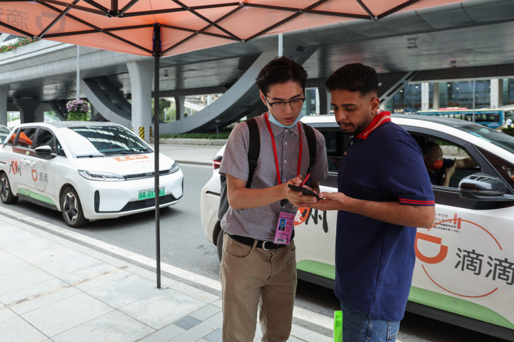

# 每天接单不足10单！多地发布网约车饱和预警 提醒谨慎“入场”

穿越三年疫情寒冬，网约车行业终于迎来“小阳春”。

交通运输部公布的数据显示，2023年第一季度，全国网约车订单数一直处于上涨状态，前三月环比分别上涨14.1%、13.30%、9.70%；3月网约车行业的订单量为7.16亿单，同比增长32.8%。

然而，行业回暖的同时，风险也在浮现——

**5月5日，三亚市交通运输局发布通告，决定暂停受理网约车经营许可及运输证核发业务。**

此外，近一个月内，济南、温州、东莞、遂宁等地也纷纷发布网约车饱和预警，提醒从业者谨慎“入场”。

4月6日，济南市城乡交通运输局发布风险预警，该市网约车市场运力已基本饱和，单车日均接单量不足10单。

4月中旬，温州市交通运输部门发布信息，2022年该市9000余名新增持证驾驶员未实际上岗。

4月19日，东莞交通运输网提示，该市网约车司机接单量日益下降、工作强度增加，近八成车辆每天接单不足10单。

5月初，遂宁市交通运输局发布预警，提醒当地拟从事网约车的人员，当地网约车运力已经饱和，谨慎入行。

多地政府部门频发预警、加强管控，释放了什么信号？开网约车，还能挣钱吗？面对管控和行业内卷，网约车行业下半场又会走向何处？

_图源：ICphoto_

**和三年前赚一样的钱，要多跑2小时**

从早上7点到晚上10点，28个单子，流水620元，这是42岁杭州网约车司机何利一天的收获。

何利是杭州本地人，干网约车已8年，像他这样一天出车14-15个小时的司机，算是“劳模”。他还有一项“绝技”，那就是熟悉杭州市区大街小巷，能在高峰期尽量避开拥堵，因此比一般人挣得多。尽管如此，要挣到和三年前一样的钱，他现在每天必须多出车2小时。

“打开一个平台，上面就有50来家网约车公司，太卷了。”何利深感现在竞争激烈，竞争对象不乏不合规车辆和司机。
**据他估算，现在跟三年前比，收入每小时要下滑10元，按出车14小时计就少了140元。**

在电影《我和我的家乡》中，葛优大爷的愿望是成为一名网约车司机，因为他觉得“开网约车赚不少钱吧”。何利说，2018年前在杭州这样的大城市，勤奋一点的司机月入过万不是梦想。

然而，随着越来越多的人涌入这个行业，分到的蛋糕开始变少。何利告诉潮新闻记者，他加的一个网约车司机群，400多人有本地的，也有来自湖北、江西、安徽等外省的，其中一个月流水能达到10000元的，约占一半；达到12000元以上的，估计只有30%。
**扣除25%-30%的平台抽成和第三方信息服务费等成本后，每月净收入过万的已是凤毛麟角。**

“以前我还劝朋友来开网约车，现在心里就想着他们不要来抢我的生意。”何利坦白地说。

开得累、挣得少，一些司机选择了逃离。去年7月，在金华开网约车的沈女士因为“身体吃不消，也没挣到多少钱”，在加入网约车大军不到一年就退出了。

“除了节假日，平时只有早晚高峰有单子，一天跑10小时，也就10多个单子，拿到手200多，一个月下来，扣掉车贷根本不剩多少。”最让她难以忍受的是，一天到晚坐在车里，腰背都落下毛病。沈女士感叹，不久前刷到一则滴滴女司机哭诉工作现状的新闻，很是心酸，庆幸自己已离开。

有人坚守，有人离开，还有人不断进来。

_网约车。图源：新华社_

**据交通运输部发布的数据，截至2023年3月31日，全国共有307家网约车平台公司取得网约车平台经营许可，同比增加40家；各地共发放网约车驾驶员证522.9万本、车辆运输证225.0万本，同比分别增加115.6万本、61.6万本。**

这意味着过去一年，超过百万的持证网约车司机还在涌入这个赛道。

仅今年1-3月，就新增发网约车驾驶员证13.9万本，车辆运输证13.2万本。

为什么有这么多人去开网约车？在某头部网约车平台企业从事运营工作多年的许星告诉潮新闻记者，一是这个行业门槛低，基本上只要会开车就行；第二，大部分网约车司机没有太多技能，在体力劳动中，网约车司机算是待遇不错的工作，“不能挣大钱，起码能解决一家老小温饱”。

另外，网约车司机群体以中年以上为主。根据今年2月宁波市公路运输中心公布网约车的调查报告，网约车驾驶员平均年龄43岁。这也意味着，他们在择业上面临年龄、素养等方面的制约。

**网约车数量激增，多地运力饱和**

5月5日，三亚市停发网约车“两证”，引发关注。

当地交通运输管理局一位工作人员表示，采取这一管控措施，主要是近年来三亚网约车平台及网约车数量激增，运力趋于饱和，同时导致了违规经营现象突出。

其实早在两年前，三亚市交通局就曾发布网约车客运市场投资预警通告，但收效甚微。
**截至2020年10月，三亚全市网约车保有量为5100辆。到了2022年6月，车辆数已经到了10709辆，两年内翻了一番。**

据该工作人员透露，过去一年，这一数据又有了大幅增长，目前已达到1.6万辆左右。这也是三亚此次“祭出重招”的原因。

不仅是三亚，网约车运力饱和已成为不少城市的“新烦恼”。

潮新闻记者梳理各地普遍存在问题， **首先是网约车数量激增**
。比如济南，自2019年开始，网约车数量及从业人员大幅快速增加，目前网约车已突破18000辆，与巡游出租车8643辆的数据相比，已达到当地“警戒值”。

2022年下半年，东莞巡游出租车共有1492辆，比上半年减少113辆，网约车共有40083辆，比上半年激增9476辆，同时网约车司机数量增长近万人。

**行业内卷，导致司机接单越来越难。**
比如今年一季度，东莞网约车单车日均订单量仅为9.07单，比2022年底下降了19.45%；济南的单车日均接单量也不足10单。

**订单下滑的同时，司机的工作强度却在加大。**
比如东莞一季度网约车单车日均收入只有260.83元，比2022年底下降了3.2%，但单车日均在线时长增加了1.45%，达8.39小时。

离场者不在少数。温州交通部门测算，2022年新增持证司机1.1万名，但9000余人未实际上岗，呈现出考证驾驶员多、真正上岗驾驶员少的状态。

“大部分新增驾驶员在对行业了解不深的情况下，参加从业资格证考试，后又由于收入不及预期、无法适应工作等各种原因退出了网约车行业。”温州交通部门相关负责人此前接受媒体采访时分析。

综合来看，来自政府层面的预警信息，对正在从业的，以及有意向在预警城市从事网约车经营的企业和个人，都是必要的。

不少业内人士表示，随着运力饱和，会加剧行业内卷，司机收入下降，最终影响到服务质量，出现违规运营、超载行驶、强行拼车等乱象；而为了抢占市场、扩大流量，平台也会陷入“补贴”“低价”泥淖，引发恶性竞争。

除此之外，网约车激增对城市交通管理也是一大挑战。

“目前国内不少城市网约车数量以及运载量，已经影响到了正常的交通出行结构。”长期从事交通问题研究的专家、浙江工业大学公共管理学院教授吴伟强告诉潮新闻记者，如果一座城市网约车过多，加上采用低运价竞争的方法，就会直接抢夺公交出行的市场。其结果就是减少地铁加公交车出行在全出行结构中的比例，最终导致城市交通拥堵。

以杭州为例，目前杭州市区有9万多辆注册网约车，每天客运量150万人次，已经超过了公交车的日均客运量。地铁加公交车出行在全出行结构中不到20%。针对这一现状，吴伟强认为“政府应及早介入加强监管”。

_网约车。图源：新华社_

**网约车“下半场”：该驶向何方？**

那么，一个城市到底需要多少网约车，才是合适的？

潮新闻记者查询到，2016年国务院办公厅关于深化改革推进出租汽车行业健康发展的指导意见指出：
**“要根据大中小城市特点、社会公众多样化出行需求和出租汽车发展定位，综合考虑人口数量、经济发展水平、城市交通拥堵状况、出租汽车里程利用率等因素，合理把握出租汽车运力规模及在城市综合交通运输体系中的分担比例，建立动态监测和调整机制，逐步实现市场调节。”**

已有城市建立了监测模型。比如2022年底，深圳市就开始探索建立网约车运力规模动态调整机制，一旦网约车日均订单量变化幅度低于-10%，单车日均订单量低于11，巡游车里程利用率低于60%，满足3个条件中的2个，就会触发预警，供政府决策参考。

网约车市场“风起云涌”，能否对网约车行业的动态及时作出反应，又能否为行业发展留下空间，考验着城市治理的智慧。

近年来，对网约车实施总量控制的声音越来越多，但大部分城市更倾向于通过市场调节的方法来寻找平衡点。或者通过市场预警，提醒“网约车市场有风险，进入需谨慎”。

**政府直接停止发证的做法算是比较“激进”的。**

其实这不是三亚首创。早在2018年4月，南京就发布通告，暂停受理出租汽车(含网约车)新增运力许可事项，是全国首个对网约车进行数量管控的城市。2020年7月，武汉市也曾下发通知，暂停受理网约车平台、车辆经营许可。

东南大学交通法治与发展研究中心执行主任顾大松此前接受媒体采访时分析，类似于三亚等地的管控举措，实际上反映出当地在新业态的监管层面水平与能力的适应情况。“可先通过政策性的手段，将过于饱和的网约车市场降温。在此期间，修订相关政策，后续再通过市场的调节，进一步地完善当地网约车市场。”

浙江工业大学公共管理学院教授吴伟强告诉潮新闻记者，政府在政策调控时要“打开天空，管住底线”。

在他看来，总量调控，并不是简单的数量控制，而是要在明确城市交通出行战略目标的前提下，用各种手段调整网约车的供给量，完善政府规制，包括准入和退出机制、评价制度、奖惩制度、监管机制等等。

“政府做的主要是规范平台的运行，提高服务水平和服务质量。其他的事情，就交给市场。”

**也有业内人士建议，解决网约车行业内卷，政府有形之手除了加强行业管控，还应当为低技能人群开展更多技能培训，让他们有更多灵活就业的机会。**

从2012年滴滴、快的展开“补贴大战”拉开网约车序幕，到2016年交通部联合工信部等七个部委共同发布《网络预约出租汽车经营服务管理暂行办法》承认网约车“合法身份”，网约车经历了十年“狂飙”式发展。可以肯定的是，网约车“野蛮生长”的土壤已经越来越少，合规化发展、精细化监管已成大势所趋。

对于网约车行业来说，进入下半场，专注于改善行业的服务、用户体验、以及模式的创新、变革，或许才能迎来真正的“春天”。毕竟，为大众打造优质出行服务，才是网约车该驶往的最终目的地。

“转载请注明出处”

